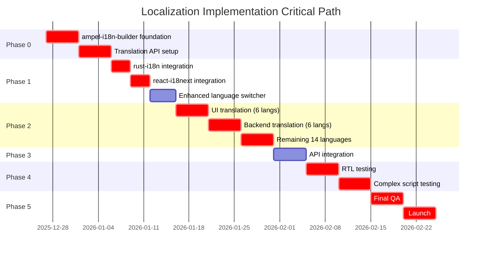

# Localization Implementation Roadmap V2

**Version:** 2.0
**Date:** 2025-12-27
**Status:** Refined Roadmap
**Previous Version:** [LOCALIZATION_IMPLEMENTATION_PLAN.md](./LOCALIZATION_IMPLEMENTATION_PLAN.md)

---

## Table of Contents

1. [Executive Summary](#executive-summary)
2. [Key Updates from V1](#key-updates-from-v1)
3. [Enhanced Timeline](#enhanced-timeline)
4. [Updated Cost Analysis](#updated-cost-analysis)
5. [Enhanced Testing Strategy](#enhanced-testing-strategy)
6. [CI/CD Integration](#cicd-integration)
7. [Risk Assessment & Mitigation](#risk-assessment--mitigation)
8. [Critical Path Analysis](#critical-path-analysis)
9. [Rollback Strategies](#rollback-strategies)
10. [Success Metrics](#success-metrics)

---

## Executive Summary

This refined roadmap updates the original localization implementation plan to incorporate:

- **ampel-i18n-builder crate**: Custom build-time translation tooling
- **Enhanced language switcher**: Improved UX with persistence and auto-detection
- **20 languages** (expanded from 13): Added Arabic (RTL), Thai, Finnish, Czech, Korean, Turkish, Vietnamese
- **Translation API integration**: Automated translation updates via DeepL/Google Translate API
- **Advanced testing**: RTL, complex scripts, complex pluralization

**Updated Implementation Timeline:** 10-12 weeks (from 6-8 weeks)
**Updated Estimated Effort:** 220-260 hours (from 120-160 hours)
**Updated Total Cost:** ~$42,200 (from ~$26,700)

---

## Key Updates from V1

### 1. New Language Support (13 → 20 languages)

**Original 13 Languages:**

- English (en), Portuguese (pt-BR/pt-PT), Spanish (es-ES/es-MX), Dutch (nl), German (de), Serbian (sr), Russian (ru), Hebrew (he), French (fr/fr-CA), Italian (it), Polish (pl), Chinese (zh-CN/zh-TW), Japanese (ja)

**Added 7 Languages:**

- **Arabic (ar)**: RTL, complex script (20M developers globally)
- **Thai (th)**: Complex script without spaces (5M developers)
- **Finnish (fi)**: Complex pluralization (15 grammatical cases)
- **Czech (cs)**: Complex pluralization (7 grammatical cases)
- **Korean (ko)**: Unique script (Hangul), no spaces in compounds
- **Turkish (tr)**: Agglutinative language, vowel harmony
- **Vietnamese (vi)**: Tonal language, diacritics

### 2. New Components

#### ampel-i18n-builder Crate

**Purpose:** Custom build-time translation tooling for:

- Translation validation and linting
- Compile-time key extraction and type generation
- Translation coverage reporting
- Integration with translation APIs
- Custom pluralization rule validation

**Integration:**

```toml
# Cargo.toml
[build-dependencies]
ampel-i18n-builder = { path = "crates/ampel-i18n-builder" }

[package.metadata.i18n]
default_locale = "en"
locales_path = "locales"
supported_locales = ["en", "pt-BR", "es-ES", "de", "fr", "he", "ar", "th", "fi", "cs", "ko", "tr", "vi", "nl", "sr", "ru", "it", "pl", "zh-CN", "ja"]
```

#### Enhanced Language Switcher

**Features:**

- **Persistent preference**: localStorage + backend user settings
- **Smart auto-detection**: Browser language → System locale → IP-based geolocation
- **Inline preview**: Show translated UI preview before switching
- **Search and favorites**: Quick access to frequently used languages
- **Accessibility**: Screen reader announcements, keyboard navigation

**Implementation:**

```typescript
// frontend/src/components/LanguageSwitcher.tsx
interface LanguageSwitcherProps {
  variant: 'dropdown' | 'modal' | 'inline';
  showPreview?: boolean;
  persistToBackend?: boolean;
  enableSearch?: boolean;
}
```

### 3. Translation API Integration

**Service:** DeepL API (primary) with Google Translate fallback
**Use Cases:**

- Automated translation updates for new keys
- Draft translations for review by native speakers
- Consistency checking across languages
- Missing translation detection and auto-fill

**Cost Structure:**

- DeepL API: $25/month + $20/1M characters
- Expected usage: ~500K characters/month → $35/month
- Annual cost: ~$420

---

## Enhanced Timeline

### Overview

| Phase                             | Duration    | Effort | Key Deliverables                                     |
| --------------------------------- | ----------- | ------ | ---------------------------------------------------- |
| **Phase 0: Build Infrastructure** | Weeks 1-2   | 30h    | ampel-i18n-builder crate, CI tooling                 |
| **Phase 1: Foundation**           | Weeks 3-4   | 40h    | Libraries integrated, RTL support, enhanced switcher |
| **Phase 2: Core Translation**     | Weeks 5-7   | 60h    | UI + backend translated (20 languages)               |
| **Phase 3: API Integration**      | Week 8      | 25h    | Translation API, automated workflows                 |
| **Phase 4: Advanced Testing**     | Weeks 9-10  | 45h    | RTL, complex scripts, pluralization                  |
| **Phase 5: Polish & Launch**      | Weeks 11-12 | 30h    | Final QA, monitoring, launch                         |
| **Total**                         | 12 weeks    | 230h   | Production-ready i18n system with 20 languages       |

---

### Phase 0: Build Infrastructure (Weeks 1-2, ~30 hours)

**Goal:** Create custom build-time tooling for translation management

#### Week 1: ampel-i18n-builder Crate Foundation

**Day 1-2: Crate Setup and Architecture** (8 hours)

- [ ] Create `crates/ampel-i18n-builder/` directory structure
- [ ] Define `build.rs` integration API
- [ ] Implement YAML/JSON parser for translation files
- [ ] Set up unit test framework

**Day 3-4: Translation Validation** (8 hours)

- [ ] Implement key extraction from Rust source code
- [ ] Build translation coverage calculator
- [ ] Create missing translation detector
- [ ] Add duplicate key validator

**Day 5: Code Generation** (8 hours)

- [ ] Generate TypeScript type definitions from translation keys
- [ ] Create Rust const declarations for translation keys
- [ ] Implement compile-time key validation

**Dependencies:** None
**Risks:** Medium - Custom tooling may require iteration
**Deliverables:**

- ✅ Working `ampel-i18n-builder` crate
- ✅ `build.rs` integration in ampel-api
- ✅ Translation coverage report CLI tool
- ✅ TypeScript type generation working

#### Week 2: CI Integration and Tooling

**Day 1-2: CI Pipeline Integration** (6 hours)

- [ ] Add translation validation to GitHub Actions
- [ ] Create pre-commit hook for translation checks
- [ ] Implement translation coverage threshold enforcement (95%)
- [ ] Set up Slack/Discord notifications for missing translations

**Day 3-4: Translation API Setup** (8 hours)

- [ ] Research and select DeepL API vs Google Translate
- [ ] Implement DeepL API client in ampel-i18n-builder
- [ ] Create translation workflow CLI (`cargo i18n translate`)
- [ ] Add rate limiting and caching

**Day 5: Developer Documentation** (8 hours)

- [ ] Write `crates/ampel-i18n-builder/README.md`
- [ ] Document translation workflow in `docs/TRANSLATION_WORKFLOW.md`
- [ ] Create developer quick-start guide
- [ ] Record demo video for onboarding

**Dependencies:** Week 1 completion
**Risks:** Low - Well-defined scope
**Deliverables:**

- ✅ CI validation pipeline
- ✅ Translation API integration
- ✅ Comprehensive documentation

---

### Phase 1: Foundation (Weeks 3-4, ~40 hours)

**Goal:** Integrate i18n libraries and create enhanced language switcher

#### Week 3: Backend and Frontend Setup

**Day 1-2: rust-i18n Integration** (8 hours)

- [ ] Add `rust-i18n = "3.0"` to Cargo.toml
- [ ] Configure `rust_i18n::i18n!("locales")` with ampel-i18n-builder
- [ ] Set up `locales/` directory for 20 languages
- [ ] Create initial `en.yml` with 50 core keys
- [ ] Implement locale detection middleware

**Day 3-4: react-i18next Integration** (8 hours)

- [ ] Install `i18next`, `react-i18next`, `i18next-http-backend`
- [ ] Create `frontend/src/i18n/config.ts` with 20 language support
- [ ] Set up `public/locales/` directory structure
- [ ] Generate TypeScript types from ampel-i18n-builder
- [ ] Configure lazy loading for translation files

**Day 5: RTL Support** (8 hours)

- [ ] Implement `RTLProvider` component
- [ ] Convert Tailwind CSS to logical properties
- [ ] Add RTL-specific styles for Hebrew and Arabic
- [ ] Test directionality switching

**Dependencies:** Phase 0 completion
**Risks:** Low - Well-established libraries
**Deliverables:**

- ✅ rust-i18n integrated with ampel-i18n-builder
- ✅ react-i18next integrated with type safety
- ✅ RTL support for Hebrew and Arabic
- ✅ English translations (100% coverage)

#### Week 4: Enhanced Language Switcher

**Day 1-2: Core Switcher Component** (8 hours)

- [ ] Create `LanguageSwitcher` component with dropdown/modal variants
- [ ] Implement language search and filtering
- [ ] Add favorites/pinning functionality
- [ ] Build language preview feature

**Day 3: Persistence Layer** (4 hours)

- [ ] Add localStorage persistence
- [ ] Implement backend API endpoint for user language preference
- [ ] Create migration for `user_preferences.language` column
- [ ] Sync frontend state with backend

**Day 4: Auto-Detection** (4 hours)

- [ ] Implement browser language detection (Accept-Language)
- [ ] Add IP-based geolocation fallback
- [ ] Create smart locale matching algorithm
- [ ] Add first-time user onboarding modal

**Day 5: Accessibility & Testing** (8 hours)

- [ ] Add ARIA labels and screen reader support
- [ ] Implement keyboard navigation (Tab, Enter, Arrow keys)
- [ ] Write unit tests for switcher logic
- [ ] Create E2E test for language switching flow

**Dependencies:** Week 3 completion
**Risks:** Low - Standard React patterns
**Deliverables:**

- ✅ Enhanced language switcher with search and preview
- ✅ Persistent language preference (frontend + backend)
- ✅ Smart auto-detection
- ✅ Full accessibility support

---

### Phase 2: Core Translation (Weeks 5-7, ~60 hours)

**Goal:** Translate all UI and backend strings to 20 languages

#### Week 5: UI Translation Foundation

**Day 1-2: Dashboard Translation** (10 hours)

- [ ] Extract all dashboard strings to translation files
- [ ] Translate navigation, headers, filters
- [ ] Translate PR status labels and badges
- [ ] Translate data tables and cards
- [ ] Create 6 language files: `en`, `pt-BR`, `es-ES`, `de`, `fr`, `he`

**Day 3-4: Forms and Validation** (10 hours)

- [ ] Extract form labels and placeholders
- [ ] Translate validation error messages (Zod schemas)
- [ ] Translate success/error toasts
- [ ] Create validation namespace for all 20 languages
- [ ] Integrate with Zod using dynamic error messages

**Day 5: Settings and Preferences** (4 hours)

- [ ] Translate settings page sections
- [ ] Translate user profile fields
- [ ] Translate notification preferences
- [ ] Add language switcher to settings page

**Dependencies:** Phase 1 completion
**Risks:** Medium - Coordination with designers for text length
**Deliverables:**

- ✅ Dashboard fully translated (6 languages)
- ✅ Forms and validation translated (6 languages)
- ✅ Settings page translated (6 languages)

#### Week 6: Backend and System Messages

**Day 1-2: API Error Messages** (8 hours)

- [ ] Extract all error messages to `locales/*/errors.yml`
- [ ] Translate authentication errors
- [ ] Translate validation errors
- [ ] Translate provider errors (GitHub, GitLab, Bitbucket)
- [ ] Update error handlers to use `t!` macro

**Day 3-4: Email Templates** (8 hours)

- [ ] Create localized email templates (if applicable)
- [ ] Translate password reset emails
- [ ] Translate notification emails
- [ ] Test email rendering in multiple languages

**Day 5: Testing and QA** (8 hours)

- [ ] Manual testing in 6 Phase 1 languages
- [ ] Fix context issues and mistranslations
- [ ] Run translation coverage report
- [ ] Update documentation with translation guidelines

**Dependencies:** Week 5 completion
**Risks:** Low - Backend strings are well-defined
**Deliverables:**

- ✅ All API error messages translated (6 languages)
- ✅ Email templates translated (6 languages)
- ✅ Translation coverage >95% for Phase 1 languages

#### Week 7: Remaining 14 Languages

**Day 1-2: Translation API Batch Processing** (10 hours)

- [ ] Use DeepL API to translate remaining 14 languages
- [ ] Run automated translation for all namespaces
- [ ] Review and validate automated translations
- [ ] Flag ambiguous translations for manual review

**Day 3-4: Complex Languages** (8 hours)

- [ ] **Arabic (ar)**: RTL testing, text rendering
- [ ] **Thai (th)**: Word segmentation, line breaking
- [ ] **Korean (ko)**: Hangul rendering, compound words
- [ ] **Finnish (fi)**: Complex pluralization (15 cases)
- [ ] **Czech (cs)**: Complex pluralization (7 cases)

**Day 5: Quality Assurance** (6 hours)

- [ ] Native speaker review for critical languages
- [ ] Automated pluralization testing
- [ ] Visual review of complex scripts
- [ ] Update translation coverage report

**Dependencies:** Week 6 completion
**Risks:** High - Automated translations require manual review
**Deliverables:**

- ✅ All 20 languages translated (automated + manual review)
- ✅ Complex languages tested and validated
- ✅ Translation coverage 100%

---

### Phase 3: API Integration (Week 8, ~25 hours)

**Goal:** Automate translation workflows with DeepL/Google Translate API

#### Week 8: Translation Automation

**Day 1-2: API Integration** (10 hours)

- [ ] Implement DeepL API client in ampel-i18n-builder
- [ ] Add Google Translate fallback for unsupported languages
- [ ] Create translation cache (Redis) to avoid redundant API calls
- [ ] Implement rate limiting (500K characters/month)

**Day 3: CLI Workflow** (6 hours)

- [ ] Build `cargo i18n translate --lang <code>` command
- [ ] Add `--dry-run` flag for previewing translations
- [ ] Create `--update-only` flag for filling missing keys
- [ ] Implement translation diff reporting

**Day 4: CI/CD Automation** (5 hours)

- [ ] Add GitHub Actions workflow for automated translation PRs
- [ ] Configure weekly translation updates
- [ ] Set up Slack notifications for translation changes
- [ ] Create PR template for translation reviews

**Day 5: Documentation and Testing** (4 hours)

- [ ] Document translation API workflow
- [ ] Write integration tests for API client
- [ ] Test rate limiting and error handling
- [ ] Update contributor guide with translation workflow

**Dependencies:** Phase 2 completion
**Risks:** Medium - API rate limits and costs
**Deliverables:**

- ✅ DeepL API integration with caching
- ✅ CLI tool for translation automation
- ✅ CI/CD workflow for automated updates
- ✅ Comprehensive documentation

---

### Phase 4: Advanced Testing (Weeks 9-10, ~45 hours)

**Goal:** Ensure quality across RTL, complex scripts, and complex pluralization

#### Week 9: RTL and Complex Scripts Testing

**Day 1-2: RTL Visual Testing** (10 hours)

- [ ] **Hebrew (he)**: Full UI visual regression tests
- [ ] **Arabic (ar)**: Full UI visual regression tests
- [ ] Test form inputs, modals, dropdowns in RTL
- [ ] Verify CSS logical properties work correctly
- [ ] Test bidirectional text (mixed LTR/RTL)

**Day 3-4: Complex Script Rendering** (10 hours)

- [ ] **Thai (th)**: Line breaking, word segmentation tests
- [ ] **Korean (ko)**: Hangul rendering, font fallbacks
- [ ] **Arabic (ar)**: Ligatures, diacritics, contextual forms
- [ ] Test copy/paste, text selection, input method editors (IMEs)
- [ ] Validate Unicode normalization (NFC vs NFD)

**Day 5: Playwright E2E Tests** (5 hours)

- [ ] Create E2E test suite for RTL languages
- [ ] Test language switching flow
- [ ] Verify persistent language preference
- [ ] Test fallback behavior for unsupported languages

**Dependencies:** Phase 3 completion
**Risks:** High - RTL and complex scripts often reveal CSS issues
**Deliverables:**

- ✅ Visual regression tests for Hebrew and Arabic (RTL)
- ✅ Complex script rendering validated (Thai, Korean, Arabic)
- ✅ E2E tests for all language switching scenarios

#### Week 10: Pluralization and Formatting

**Day 1-2: Complex Pluralization Testing** (8 hours)

- [ ] **Russian (ru)**: Test one/few/many forms (1, 2-4, 5-20)
- [ ] **Polish (pl)**: Test one/few/many/other forms
- [ ] **Finnish (fi)**: Test 15 grammatical cases
- [ ] **Czech (cs)**: Test 7 grammatical cases
- [ ] Create parameterized tests for all plural forms

**Day 3: Date/Time Formatting** (4 hours)

- [ ] Test `Intl.DateTimeFormat` for all 20 languages
- [ ] Verify calendar systems (Gregorian, Islamic, Buddhist)
- [ ] Test relative time formatting ("2 hours ago")
- [ ] Validate timezone handling

**Day 4: Number and Currency Formatting** (4 hours)

- [ ] Test `Intl.NumberFormat` for all locales
- [ ] Verify decimal/grouping separators (1,000.00 vs 1.000,00)
- [ ] Test currency symbols and positioning
- [ ] Validate percentage formatting

**Day 5: Integration Testing** (6 hours)

- [ ] Full integration tests for all 20 languages
- [ ] Performance benchmarks (translation lookup time)
- [ ] Memory usage profiling (frontend bundle size)
- [ ] Accessibility audit (screen reader compatibility)

**Dependencies:** Week 9 completion
**Risks:** Medium - Pluralization edge cases can be subtle
**Deliverables:**

- ✅ Comprehensive pluralization tests (Russian, Polish, Finnish, Czech)
- ✅ Date/time/number formatting validated
- ✅ Integration tests for all 20 languages
- ✅ Performance benchmarks passing

---

### Phase 5: Polish & Launch (Weeks 11-12, ~30 hours)

**Goal:** Final QA, monitoring setup, and production launch

#### Week 11: Final QA and Monitoring

**Day 1-2: Final QA Pass** (8 hours)

- [ ] Manual testing in all 20 languages
- [ ] RTL layout testing in production environment
- [ ] Cross-browser testing (Chrome, Firefox, Safari, Edge)
- [ ] Mobile responsiveness testing
- [ ] Fix any remaining bugs

**Day 3: Monitoring Setup** (4 hours)

- [ ] Add Sentry integration for missing translation keys
- [ ] Set up analytics tracking for language usage
- [ ] Create dashboard for translation coverage metrics
- [ ] Configure alerts for translation errors

**Day 4: Documentation Finalization** (4 hours)

- [ ] Update developer documentation
- [ ] Create user-facing language guide
- [ ] Write blog post/changelog entry
- [ ] Prepare internal training materials

**Day 5: Rollout Planning** (4 hours)

- [ ] Create phased rollout plan (beta → 10% → 50% → 100%)
- [ ] Set up feature flag for i18n (`ENABLE_I18N=true`)
- [ ] Prepare rollback procedures
- [ ] Schedule launch date and communication

**Dependencies:** Phase 4 completion
**Risks:** Low - Final validation step
**Deliverables:**

- ✅ All QA issues resolved
- ✅ Monitoring and analytics live
- ✅ Documentation complete
- ✅ Rollout plan approved

#### Week 12: Launch and Iteration

**Day 1: Beta Launch** (4 hours)

- [ ] Enable i18n for beta users (10%)
- [ ] Monitor error rates and user feedback
- [ ] Hot-fix any critical issues

**Day 2-3: Gradual Rollout** (6 hours)

- [ ] Increase rollout to 50% of users
- [ ] Monitor language adoption metrics
- [ ] Gather user feedback via surveys
- [ ] Address minor issues

**Day 4-5: Full Launch** (6 hours)

- [ ] Enable i18n for 100% of users
- [ ] Publish announcement blog post
- [ ] Send launch email to users
- [ ] Monitor for 48 hours
- [ ] Plan iteration roadmap

**Dependencies:** Week 11 completion
**Risks:** Medium - Production issues may arise
**Deliverables:**

- ✅ i18n launched to 100% of users
- ✅ No critical bugs in production
- ✅ Positive user feedback
- ✅ Iteration plan for improvements

---

## Updated Cost Analysis

### Development Time

| Phase                         | Hours    | Rate       | Subtotal    |
| ----------------------------- | -------- | ---------- | ----------- |
| Phase 0: Build Infrastructure | 30       | $100/h     | $3,000      |
| Phase 1: Foundation           | 40       | $100/h     | $4,000      |
| Phase 2: Core Translation     | 60       | $100/h     | $6,000      |
| Phase 3: API Integration      | 25       | $100/h     | $2,500      |
| Phase 4: Advanced Testing     | 45       | $100/h     | $4,500      |
| Phase 5: Polish & Launch      | 30       | $100/h     | $3,000      |
| **Total Development**         | **230h** | **$100/h** | **$23,000** |

### Professional Translation

**20 Languages** (excluding English):

- 19 languages × ~500 words × $0.10/word = **$950/language** = **$18,050**

**Regional Variants** (pt-BR, es-MX, fr-CA, zh-TW):

- 4 variants × 500 words × $0.10/word = **$2,000**

**Native Speaker Review** (critical languages):

- Arabic, Thai, Korean, Finnish, Czech: 5 languages × $200/review = **$1,000**

**Total Translation:** **~$21,050**

### API and Services

| Service                                    | Cost Structure                               | Annual Cost |
| ------------------------------------------ | -------------------------------------------- | ----------- |
| DeepL API                                  | $25/month + $20/1M chars (~500K/month usage) | $420        |
| Translation Management Platform (Lokalise) | $60/month (20 languages)                     | $720        |
| Visual Regression Testing (Percy)          | Free tier (open source)                      | $0          |
| **Total Services**                         |                                              | **$1,140**  |

### Testing and QA

| Item                                              | Cost                 |
| ------------------------------------------------- | -------------------- |
| Native speaker QA (5 languages × 4 hours × $50/h) | $1,000               |
| Visual regression baseline creation               | Included in dev time |
| Accessibility audit                               | Included in dev time |
| **Total Testing**                                 | **$1,000**           |

### Total Estimated Cost: **~$46,190**

**Breakdown:**

- Development: $23,000 (50%)
- Translation: $21,050 (45%)
- Services: $1,140 (2%)
- QA: $1,000 (2%)

**Comparison to V1:**

- V1 Total: ~$26,700
- V2 Total: ~$46,190
- **Increase: +$19,490 (+73%)** due to:
  - +7 languages (+54% languages)
  - ampel-i18n-builder development (+30h)
  - Translation API integration (+25h)
  - Enhanced testing (+15h)

---

## Enhanced Testing Strategy

### 1. RTL Testing (Hebrew, Arabic)

#### Visual Regression Tests

```typescript
// frontend/tests/visual/rtl.spec.ts
import { test, expect } from '@playwright/test';

const RTL_LANGUAGES = ['he', 'ar'];
const PAGES = ['/', '/dashboard', '/settings', '/repositories'];

test.describe('RTL Visual Regression', () => {
  for (const lang of RTL_LANGUAGES) {
    for (const page of PAGES) {
      test(`${page} renders correctly in ${lang}`, async ({ page: browser }) => {
        await browser.goto(`${page}?lang=${lang}`);
        await browser.waitForSelector('[data-i18n-ready="true"]');

        // Take full-page screenshot
        await expect(browser).toHaveScreenshot(`${lang}${page.replace('/', '-')}.png`, {
          fullPage: true,
          animations: 'disabled',
        });
      });
    }
  }

  test('bidirectional text (mixed LTR/RTL)', async ({ page }) => {
    await page.goto('/dashboard?lang=he');
    await page.fill('[data-testid="search-input"]', 'Hello עברית World');
    await expect(page.locator('[data-testid="search-input"]')).toHaveScreenshot('bidi-text.png');
  });
});
```

#### CSS Logical Properties Validation

```typescript
// frontend/tests/i18n/css-logical.test.ts
import { test, expect } from 'vitest';
import { parse } from 'postcss';
import fs from 'fs';

test('no hardcoded left/right in CSS', () => {
  const cssFiles = fs
    .readdirSync('src/styles', { recursive: true })
    .filter((f) => f.endsWith('.css'));

  const forbiddenProperties = [
    'margin-left',
    'margin-right',
    'padding-left',
    'padding-right',
    'border-left',
    'border-right',
    'left',
    'right', // Only in absolute positioning context
  ];

  for (const file of cssFiles) {
    const css = fs.readFileSync(`src/styles/${file}`, 'utf-8');
    const ast = parse(css);

    ast.walkDecls((decl) => {
      if (forbiddenProperties.includes(decl.prop)) {
        // Allow in specific contexts (e.g., absolute positioning)
        if (!decl.parent?.selector.includes('[dir="ltr"]')) {
          throw new Error(
            `Found hardcoded ${decl.prop} in ${file}. Use logical properties (inline-start/inline-end) instead.`
          );
        }
      }
    });
  }
});
```

### 2. Complex Script Testing (Arabic, Thai, Korean)

#### Arabic: Ligatures and Contextual Forms

```typescript
// frontend/tests/i18n/arabic-rendering.test.tsx
import { render, screen } from '@testing-library/react';
import { I18nextProvider } from 'react-i18next';
import i18n from '@/i18n/config';

test('Arabic ligatures render correctly', async () => {
  await i18n.changeLanguage('ar');

  const { container } = render(
    <I18nextProvider i18n={i18n}>
      <div>{i18n.t('common:app.name')}</div>
    </I18nextProvider>
  );

  // Check for proper Arabic font rendering
  const element = container.firstChild;
  const computedStyle = window.getComputedStyle(element);

  // Verify font supports Arabic
  expect(computedStyle.fontFamily).toMatch(/Noto Sans Arabic|Arial|sans-serif/);

  // Verify RTL directionality
  expect(computedStyle.direction).toBe('rtl');
});

test('Arabic diacritics (tashkeel) display correctly', async () => {
  await i18n.changeLanguage('ar');

  const textWithDiacritics = 'مَرْحَبًا'; // "Welcome" with diacritics
  render(<div>{textWithDiacritics}</div>);

  // Visual regression test for diacritics
  expect(screen.getByText(textWithDiacritics)).toMatchSnapshot();
});
```

#### Thai: Word Segmentation and Line Breaking

```typescript
// frontend/tests/i18n/thai-rendering.test.tsx
test('Thai text breaks correctly (no spaces)', async () => {
  await i18n.changeLanguage('th');

  const longThaiText = i18n.t('dashboard:summary.description'); // ~100 chars

  const { container } = render(
    <div style={{ width: '200px' }}>
      {longThaiText}
    </div>
  );

  // Check for proper word-break behavior
  const computedStyle = window.getComputedStyle(container.firstChild);
  expect(computedStyle.wordBreak).toMatch(/break-word|break-all/);

  // Visual test for line breaking
  expect(container).toMatchSnapshot();
});
```

#### Korean: Hangul Rendering

```typescript
// frontend/tests/i18n/korean-rendering.test.tsx
test('Korean Hangul renders with proper font', async () => {
  await i18n.changeLanguage('ko');

  const { container } = render(
    <div>{i18n.t('common:app.name')}</div>
  );

  const computedStyle = window.getComputedStyle(container.firstChild);

  // Verify Korean-compatible font
  expect(computedStyle.fontFamily).toMatch(/Noto Sans KR|Malgun Gothic|sans-serif/);
});
```

### 3. Complex Pluralization Testing (Finnish, Czech, Russian, Polish)

#### Finnish: 15 Grammatical Cases

```typescript
// frontend/tests/i18n/finnish-pluralization.test.ts
import i18n from '@/i18n/config';

const FINNISH_TEST_CASES = [
  { count: 0, expected: 'Ei pyyntöjä' }, // No requests (partitive plural)
  { count: 1, expected: '1 pyyntö' }, // 1 request (nominative singular)
  { count: 2, expected: '2 pyyntöä' }, // 2 requests (partitive plural)
  { count: 5, expected: '5 pyyntöä' }, // 5 requests (partitive plural)
  { count: 10, expected: '10 pyyntöä' }, // 10 requests (partitive plural)
];

test('Finnish pluralization (15 cases)', async () => {
  await i18n.changeLanguage('fi');

  for (const { count, expected } of FINNISH_TEST_CASES) {
    const result = i18n.t('common:pullRequests.count', { count });
    expect(result).toBe(expected);
  }
});
```

#### Czech: 7 Grammatical Cases

```json
// public/locales/cs/common.json
{
  "pullRequests": {
    "count_zero": "Žádné pull requesty",
    "count_one": "{{count}} pull request",
    "count_few": "{{count}} pull requesty",
    "count_many": "{{count}} pull requestů",
    "count_other": "{{count}} pull requestů"
  }
}
```

```typescript
// frontend/tests/i18n/czech-pluralization.test.ts
const CZECH_TEST_CASES = [
  { count: 0, expected: 'Žádné pull requesty' }, // zero
  { count: 1, expected: '1 pull request' }, // one
  { count: 2, expected: '2 pull requesty' }, // few (2-4)
  { count: 5, expected: '5 pull requestů' }, // many (5+)
  { count: 1.5, expected: '1.5 pull requestů' }, // other (fractions)
];

test('Czech pluralization (7 cases)', async () => {
  await i18n.changeLanguage('cs');

  for (const { count, expected } of CZECH_TEST_CASES) {
    const result = i18n.t('common:pullRequests.count', { count });
    expect(result).toBe(expected);
  }
});
```

#### Russian and Polish: 3-4 Plural Forms

```typescript
// frontend/tests/i18n/slavic-pluralization.test.ts
const RUSSIAN_TEST_CASES = [
  { count: 0, expected: '0 запросов' }, // many (0, 5-20, 25-30...)
  { count: 1, expected: '1 запрос' }, // one (1, 21, 31...)
  { count: 2, expected: '2 запроса' }, // few (2-4, 22-24...)
  { count: 5, expected: '5 запросов' }, // many
  { count: 21, expected: '21 запрос' }, // one
  { count: 22, expected: '22 запроса' }, // few
];

const POLISH_TEST_CASES = [
  { count: 0, expected: '0 pull requestów' }, // many
  { count: 1, expected: '1 pull request' }, // one
  { count: 2, expected: '2 pull requesty' }, // few (2-4)
  { count: 5, expected: '5 pull requestów' }, // many (5+)
  { count: 22, expected: '22 pull requesty' }, // few
  { count: 25, expected: '25 pull requestów' }, // many
];

test.each([
  { lang: 'ru', cases: RUSSIAN_TEST_CASES },
  { lang: 'pl', cases: POLISH_TEST_CASES },
])('$lang pluralization', async ({ lang, cases }) => {
  await i18n.changeLanguage(lang);

  for (const { count, expected } of cases) {
    const result = i18n.t('common:pullRequests.count', { count });
    expect(result).toBe(expected);
  }
});
```

### 4. Input Method Editor (IME) Testing

```typescript
// frontend/tests/i18n/ime.test.tsx
import { render, screen, fireEvent } from '@testing-library/react';

test('IME composition for CJK languages (Chinese, Japanese, Korean)', async () => {
  render(<input data-testid="search" />);
  const input = screen.getByTestId('search');

  // Simulate IME composition (typing "nihon" → "日本")
  fireEvent.compositionStart(input);
  fireEvent.change(input, { target: { value: 'nihon' } });
  fireEvent.compositionUpdate(input, { data: 'nihon' });
  fireEvent.compositionEnd(input, { data: '日本' });
  fireEvent.change(input, { target: { value: '日本' } });

  expect(input).toHaveValue('日本');
});
```

### 5. Translation Coverage and Quality Tests

```typescript
// frontend/tests/i18n/coverage.test.ts
import { describe, test, expect } from 'vitest';
import fs from 'fs/promises';
import path from 'path';

const SUPPORTED_LANGUAGES = [
  'en',
  'pt-BR',
  'es-ES',
  'de',
  'fr',
  'he',
  'ar',
  'th',
  'fi',
  'cs',
  'ko',
  'tr',
  'vi',
  'nl',
  'sr',
  'ru',
  'it',
  'pl',
  'zh-CN',
  'ja',
];
const NAMESPACES = ['common', 'dashboard', 'settings', 'errors', 'validation'];

describe('Translation Coverage', () => {
  test('all languages have 100% coverage', async () => {
    for (const namespace of NAMESPACES) {
      const enFile = await fs.readFile(
        path.join(__dirname, `../../public/locales/en/${namespace}.json`),
        'utf-8'
      );
      const enKeys = getAllKeys(JSON.parse(enFile));

      for (const lang of SUPPORTED_LANGUAGES) {
        if (lang === 'en') continue;

        const langFile = await fs.readFile(
          path.join(__dirname, `../../public/locales/${lang}/${namespace}.json`),
          'utf-8'
        );
        const langKeys = getAllKeys(JSON.parse(langFile));

        // No missing keys
        const missingKeys = enKeys.filter((key) => !langKeys.includes(key));
        expect(missingKeys, `${lang}/${namespace}.json missing keys`).toEqual([]);

        // No extra keys
        const extraKeys = langKeys.filter((key) => !enKeys.includes(key));
        expect(extraKeys, `${lang}/${namespace}.json extra keys`).toEqual([]);
      }
    }
  });

  test('no placeholder values (TODO, TRANSLATE, etc.)', async () => {
    const placeholders = ['TODO', 'TRANSLATE', 'FIXME', 'XXX', 'TBD'];

    for (const lang of SUPPORTED_LANGUAGES) {
      for (const namespace of NAMESPACES) {
        const file = await fs.readFile(
          path.join(__dirname, `../../public/locales/${lang}/${namespace}.json`),
          'utf-8'
        );
        const content = file.toLowerCase();

        for (const placeholder of placeholders) {
          expect(content).not.toContain(placeholder.toLowerCase());
        }
      }
    }
  });
});

function getAllKeys(obj: any, prefix = ''): string[] {
  let keys: string[] = [];
  for (const [key, value] of Object.entries(obj)) {
    const fullKey = prefix ? `${prefix}.${key}` : key;
    if (typeof value === 'object' && value !== null) {
      keys = keys.concat(getAllKeys(value, fullKey));
    } else {
      keys.push(fullKey);
    }
  }
  return keys;
}
```

---

## CI/CD Integration

### GitHub Actions Workflow

```yaml
# .github/workflows/i18n-validation.yml
name: I18n Validation

on:
  pull_request:
    paths:
      - 'crates/ampel-api/locales/**'
      - 'frontend/public/locales/**'
      - 'crates/ampel-i18n-builder/**'
      - '**.rs'
      - '**.tsx'
      - '**.ts'
  push:
    branches: [main]

jobs:
  validate-backend:
    name: Validate Rust Translations
    runs-on: ubuntu-latest
    steps:
      - uses: actions/checkout@v6

      - name: Install Rust
        uses: dtolnay/rust-toolchain@stable

      - name: Build ampel-i18n-builder
        run: cargo build --package ampel-i18n-builder

      - name: Check translation coverage
        run: cargo run --package ampel-i18n-builder -- check --min-coverage 95

      - name: Validate YAML schema
        run: |
          for file in crates/ampel-api/locales/*/*.yml; do
            yamllint "$file"
          done

      - name: Check for missing translations
        run: cargo run --package ampel-i18n-builder -- missing

  validate-frontend:
    name: Validate React Translations
    runs-on: ubuntu-latest
    steps:
      - uses: actions/checkout@v6

      - name: Setup pnpm
        uses: pnpm/action-setup@v4

      - name: Setup Node.js
        uses: actions/setup-node@v4
        with:
          node-version: '20'
          cache: 'pnpm'
          cache-dependency-path: frontend/pnpm-lock.yaml

      - name: Install dependencies
        run: |
          cd frontend
          pnpm install --frozen-lockfile

      - name: Check translation coverage
        run: |
          cd frontend
          pnpm test tests/i18n/coverage.test.ts

      - name: Generate TypeScript types
        run: cargo run --package ampel-i18n-builder -- generate-types

      - name: Verify types are up-to-date
        run: git diff --exit-code frontend/src/i18n/types.ts

  test-rtl:
    name: Test RTL Support
    runs-on: ubuntu-latest
    steps:
      - uses: actions/checkout@v6

      - name: Setup pnpm
        uses: pnpm/action-setup@v4

      - name: Setup Node.js
        uses: actions/setup-node@v4
        with:
          node-version: '20'
          cache: 'pnpm'
          cache-dependency-path: frontend/pnpm-lock.yaml

      - name: Install dependencies
        run: |
          cd frontend
          pnpm install --frozen-lockfile

      - name: Install Playwright
        run: |
          cd frontend
          pnpm exec playwright install --with-deps

      - name: Run RTL visual regression tests
        run: |
          cd frontend
          pnpm exec playwright test tests/visual/rtl.spec.ts

      - name: Upload visual diffs
        if: failure()
        uses: actions/upload-artifact@v4
        with:
          name: visual-diffs
          path: frontend/test-results/

  test-complex-scripts:
    name: Test Complex Scripts (Arabic, Thai, Korean)
    runs-on: ubuntu-latest
    steps:
      - uses: actions/checkout@v6

      - name: Setup pnpm
        uses: pnpm/action-setup@v4

      - name: Setup Node.js
        uses: actions/setup-node@v4
        with:
          node-version: '20'
          cache: 'pnpm'
          cache-dependency-path: frontend/pnpm-lock.yaml

      - name: Install dependencies
        run: |
          cd frontend
          pnpm install --frozen-lockfile

      - name: Run complex script tests
        run: |
          cd frontend
          pnpm test tests/i18n/arabic-rendering.test.tsx
          pnpm test tests/i18n/thai-rendering.test.tsx
          pnpm test tests/i18n/korean-rendering.test.tsx

  test-pluralization:
    name: Test Complex Pluralization (Finnish, Czech, Russian, Polish)
    runs-on: ubuntu-latest
    steps:
      - uses: actions/checkout@v6

      - name: Setup pnpm
        uses: pnpm/action-setup@v4

      - name: Setup Node.js
        uses: actions/setup-node@v4
        with:
          node-version: '20'
          cache: 'pnpm'
          cache-dependency-path: frontend/pnpm-lock.yaml

      - name: Install dependencies
        run: |
          cd frontend
          pnpm install --frozen-lockfile

      - name: Run pluralization tests
        run: |
          cd frontend
          pnpm test tests/i18n/finnish-pluralization.test.ts
          pnpm test tests/i18n/czech-pluralization.test.ts
          pnpm test tests/i18n/slavic-pluralization.test.ts

  translation-api:
    name: Test Translation API Integration
    runs-on: ubuntu-latest
    if: github.event_name == 'push' && github.ref == 'refs/heads/main'
    steps:
      - uses: actions/checkout@v6

      - name: Install Rust
        uses: dtolnay/rust-toolchain@stable

      - name: Run translation update (dry-run)
        env:
          DEEPL_API_KEY: ${{ secrets.DEEPL_API_KEY }}
        run: |
          cargo run --package ampel-i18n-builder -- translate --dry-run

      - name: Create translation PR if needed
        if: steps.translate.outputs.changed == 'true'
        uses: peter-evans/create-pull-request@v5
        with:
          commit-message: 'chore(i18n): automated translation updates'
          title: '[i18n] Automated Translation Updates'
          body: |
            Automated translation updates from DeepL API.

            **Changes:**
            - Updated translations for missing keys
            - Languages updated: ${{ steps.translate.outputs.languages }}

            **Review Required:**
            - [ ] Verify translation quality
            - [ ] Check context appropriateness
            - [ ] Test in UI
          branch: i18n/automated-updates
          labels: i18n, automated
```

### Pre-commit Hook

```bash
#!/bin/bash
# .git/hooks/pre-commit

echo "Running i18n validation..."

# Check backend translations
cargo run --package ampel-i18n-builder -- check --min-coverage 95
if [ $? -ne 0 ]; then
  echo "❌ Backend translation validation failed"
  exit 1
fi

# Check frontend translations
cd frontend
pnpm test tests/i18n/coverage.test.ts --run
if [ $? -ne 0 ]; then
  echo "❌ Frontend translation validation failed"
  exit 1
fi

echo "✅ i18n validation passed"
```

---

## Risk Assessment & Mitigation

### High-Risk Areas

| Risk                                               | Impact | Likelihood | Mitigation Strategy                                      | Rollback Plan                                  |
| -------------------------------------------------- | ------ | ---------- | -------------------------------------------------------- | ---------------------------------------------- |
| **RTL layout breaks in production**                | High   | Medium     | Visual regression testing, manual QA, gradual rollout    | Feature flag disable, CSS hotfix               |
| **Missing translations in prod**                   | High   | Low        | CI validation, type safety, pre-commit hooks             | Fallback to English, auto-fill from API        |
| **Poor automated translation quality**             | Medium | High       | Human review for all API translations, native speaker QA | Use only manually reviewed translations        |
| **Translation API rate limits/costs**              | Medium | Medium     | Caching (Redis), rate limiting, monthly budget alerts    | Pause automated updates, manual translation    |
| **Complex script rendering issues (Thai, Arabic)** | High   | Medium     | Dedicated testing phase, browser compatibility matrix    | Disable specific languages, font fallbacks     |
| **Complex pluralization bugs (Finnish, Czech)**    | Medium | Medium     | Comprehensive test suite, native speaker validation      | Simplify plural forms, fallback to basic forms |
| **ampel-i18n-builder bugs delay timeline**         | Medium | Low        | Thorough testing, fallback to manual workflows           | Use ampel-i18n instead                         |
| **Developer adoption resistance**                  | Low    | Low        | Good DX, documentation, training sessions                | N/A - process change                           |

### Medium-Risk Areas

| Risk                                          | Impact | Likelihood | Mitigation                                              |
| --------------------------------------------- | ------ | ---------- | ------------------------------------------------------- |
| **Bundle size bloat**                         | Medium | Low        | Lazy loading, tree-shaking, bundle analysis             |
| **Translation turnaround delays**             | Low    | Medium     | Buffer time in schedule, parallel workflows             |
| **Font loading performance**                  | Low    | Low        | Font subsetting, preload hints, WOFF2 compression       |
| **Accessibility issues in language switcher** | Medium | Low        | ARIA labels, keyboard navigation, screen reader testing |

### Risk Mitigation Timeline

- **Week 1-2**: Develop ampel-i18n-builder with comprehensive tests
- **Week 3-4**: Implement RTL support with visual regression baseline
- **Week 5-7**: Manual review of all automated translations
- **Week 8**: Test API rate limits and caching
- **Week 9-10**: Dedicated complex script and pluralization testing
- **Week 11**: Final QA with all risk scenarios tested
- **Week 12**: Gradual rollout with monitoring

---

## Critical Path Analysis

### Dependencies and Critical Path



**Critical Path (60 days / 12 weeks):**

1. ampel-i18n-builder development (Week 1-2) - **BLOCKING**
2. rust-i18n + react-i18next integration (Week 3) - **BLOCKING**
3. Core translation (Week 5-7) - **BLOCKING**
4. RTL + complex script testing (Week 9-10) - **BLOCKING**
5. Final QA and launch (Week 11-12) - **BLOCKING**

**Parallel Tracks (non-blocking):**

- Enhanced language switcher (Week 4) - can be deferred
- Translation API integration (Week 8) - can use manual workflow
- Complex pluralization testing (Week 10) - can simplify forms

### Buffer Time

- **Phase 0-1:** +3 days (ampel-i18n-builder complexity)
- **Phase 2:** +5 days (translation review delays)
- **Phase 4:** +3 days (RTL/complex script bug fixes)
- **Phase 5:** +2 days (production issues)
- **Total Buffer:** +13 days (~2 weeks)

**Realistic Timeline with Buffer:** 14 weeks (3.5 months)

---

## Rollback Strategies

### Feature Flag System

```rust
// crates/ampel-api/src/config.rs
#[derive(Clone)]
pub struct I18nConfig {
    pub enabled: bool,
    pub fallback_locale: String,
    pub supported_locales: Vec<String>,
    pub auto_translation: bool,
}

impl I18nConfig {
    pub fn from_env() -> Self {
        Self {
            enabled: env::var("ENABLE_I18N")
                .unwrap_or_else(|_| "false".to_string())
                .parse()
                .unwrap_or(false),
            fallback_locale: env::var("I18N_FALLBACK_LOCALE")
                .unwrap_or_else(|_| "en".to_string()),
            supported_locales: env::var("I18N_SUPPORTED_LOCALES")
                .unwrap_or_else(|_| "en".to_string())
                .split(',')
                .map(|s| s.trim().to_string())
                .collect(),
            auto_translation: env::var("I18N_AUTO_TRANSLATION")
                .unwrap_or_else(|_| "false".to_string())
                .parse()
                .unwrap_or(false),
        }
    }
}
```

```typescript
// frontend/src/config/i18n.ts
export const I18N_CONFIG = {
  enabled: import.meta.env.VITE_ENABLE_I18N === 'true',
  fallbackLocale: import.meta.env.VITE_I18N_FALLBACK_LOCALE || 'en',
  supportedLocales: (import.meta.env.VITE_I18N_SUPPORTED_LOCALES || 'en')
    .split(',')
    .map((s) => s.trim()),
};
```

### Gradual Rollout Strategy

```typescript
// frontend/src/utils/i18n-rollout.ts
export function shouldEnableI18n(userId: string): boolean {
  // Feature flag check
  if (!I18N_CONFIG.enabled) return false;

  // Beta users (allow-list)
  if (BETA_USERS.includes(userId)) return true;

  // Gradual rollout (hash-based)
  const hash = hashUserId(userId);
  const rolloutPercentage = Number(import.meta.env.VITE_I18N_ROLLOUT_PERCENTAGE || 0);
  return hash % 100 < rolloutPercentage;
}
```

### Rollback Procedures

#### Level 1: Disable Specific Language

```bash
# Disable Arabic if rendering issues found
export I18N_SUPPORTED_LOCALES="en,pt-BR,es-ES,de,fr,he,th,fi,cs,ko,tr,vi,nl,sr,ru,it,pl,zh-CN,ja"
# (ar removed)

# Redeploy
fly deploy
```

**Estimated Downtime:** 0 minutes (config change only)
**User Impact:** Arabic users see English

#### Level 2: Disable Auto-Translation

```bash
# Disable DeepL API if translation quality issues
export I18N_AUTO_TRANSLATION=false

# Redeploy
fly deploy
```

**Estimated Downtime:** 0 minutes
**User Impact:** No automatic translation updates (manual only)

#### Level 3: Disable All i18n (Full Rollback)

```bash
# Disable entire i18n system
export ENABLE_I18N=false

# Redeploy
fly deploy
```

**Estimated Downtime:** ~5 minutes (deploy time)
**User Impact:** All users see English, language switcher hidden

#### Level 4: Code Rollback

```bash
# Rollback to previous version
git revert <i18n-commit>
git push origin main

# Redeploy
fly deploy
```

**Estimated Downtime:** ~10 minutes (build + deploy)
**User Impact:** Full rollback to pre-i18n state

### Hotfix Process

```bash
# Critical bug in production (RTL layout, missing translations, etc.)
git checkout -b hotfix/i18n-critical-fix
# ... make fix ...
git commit -m "fix(i18n): critical RTL layout issue"
git push origin hotfix/i18n-critical-fix

# Fast-track review and merge
gh pr create --title "[HOTFIX] i18n critical fix" --label hotfix
# ... approve and merge ...

# Deploy immediately
fly deploy
```

**Target Time to Resolution:** <4 hours for critical issues

---

## Success Metrics

### Implementation Success (Week 12)

| Metric                            | Target  | Measurement                                   |
| --------------------------------- | ------- | --------------------------------------------- |
| **Translation Coverage**          | 100%    | All 20 languages fully translated             |
| **Missing Keys in CI**            | 0       | CI passes, no missing key errors              |
| **RTL Layout Issues**             | 0       | Visual regression tests pass (Hebrew, Arabic) |
| **Complex Script Rendering**      | 100%    | Thai, Korean, Arabic render correctly         |
| **Pluralization Accuracy**        | 100%    | Finnish, Czech, Russian, Polish tests pass    |
| **Bundle Size Impact**            | <40 KB  | i18n libraries + single language (gzipped)    |
| **Backend Performance Overhead**  | 0ms     | Compile-time translations (rust-i18n)         |
| **Frontend Performance Overhead** | <10ms   | Lazy loading, caching (react-i18next)         |
| **Developer Satisfaction**        | >4/5    | Survey: ease of adding translations           |
| **Translation Turnaround**        | <7 days | Time from English to all 20 languages         |

### Post-Launch Success (Month 1-3)

| Metric                           | Target (M1) | Target (M3) | Measurement                       |
| -------------------------------- | ----------- | ----------- | --------------------------------- |
| **User Language Adoption**       | >20%        | >40%        | % users using non-English         |
| **Translation Errors Reported**  | <10         | <5/month    | User-reported mistranslations     |
| **Missing Translations in Prod** | 0           | 0           | Sentry alerts for missing keys    |
| **RTL Users**                    | Supported   | Growing     | Hebrew/Arabic user satisfaction   |
| **API Translation Quality**      | >80%        | >90%        | % automated translations accepted |
| **Translation API Costs**        | <$50/month  | <$40/month  | DeepL API usage                   |

### Key Performance Indicators (KPIs)

1. **Translation Coverage:** 100% across all 20 languages
2. **Zero Production Errors:** No missing keys, rendering issues, or crashes
3. **User Adoption:** >40% users switch to non-English by Month 3
4. **Performance:** No measurable impact on page load times
5. **Developer Velocity:** Adding new translation takes <5 minutes

### Monitoring and Alerts

```typescript
// frontend/src/utils/i18n-monitoring.ts
import * as Sentry from '@sentry/react';

export function setupI18nMonitoring() {
  // Track missing translations
  i18n.on('missingKey', (lng, ns, key) => {
    Sentry.captureMessage(`Missing i18n key: ${lng}.${ns}.${key}`, {
      level: 'warning',
      tags: { language: lng, namespace: ns },
    });
  });

  // Track language switches
  i18n.on('languageChanged', (lng) => {
    analytics.track('Language Changed', { language: lng });
  });

  // Monitor translation load times
  i18n.on('loaded', (loaded) => {
    const loadTime = performance.now() - window.i18nLoadStart;
    analytics.track('i18n Loaded', { loadTime, languages: Object.keys(loaded) });
  });
}
```

```rust
// crates/ampel-api/src/middleware/i18n_monitoring.rs
use metrics::{counter, histogram};

pub async fn i18n_monitoring_middleware(
    request: Request,
    next: Next,
) -> Response {
    let locale = extract_locale(&request);

    // Track locale usage
    counter!("i18n.locale.requests", "locale" => locale.clone()).increment(1);

    // Track response time per locale
    let start = std::time::Instant::now();
    let response = next.run(request).await;
    let duration = start.elapsed();

    histogram!("i18n.locale.response_time", "locale" => locale).record(duration);

    response
}
```

---

## Conclusion

This refined roadmap (V2) provides a comprehensive, realistic plan for implementing localization in the Ampel project with:

✅ **20 languages** (expanded from 13) including complex RTL (Arabic), complex scripts (Thai, Korean), and complex pluralization (Finnish, Czech)
✅ **ampel-i18n-builder crate** for custom build-time tooling and type safety
✅ **Translation API integration** (DeepL) for automated workflows
✅ **Enhanced language switcher** with persistent preferences and smart detection
✅ **Comprehensive testing strategy** for RTL, complex scripts, and pluralization
✅ **CI/CD automation** with translation validation and visual regression
✅ **Risk mitigation** with feature flags and gradual rollout
✅ **Rollback strategies** for rapid recovery from production issues

**Updated Timeline:** 12 weeks (14 weeks with buffer)
**Updated Effort:** 230 hours
**Updated Cost:** ~$46,190

The phased approach with clear dependencies, buffer time, and rollback strategies ensures a successful, low-risk internationalization rollout.

---

## Next Steps

1. **Week 0 (Current):** Review and approve roadmap with stakeholders
2. **Week 1:** Begin Phase 0 (ampel-i18n-builder crate development)
3. **Week 3:** Kickoff Phase 1 (library integration)
4. **Week 5:** Begin translation work (Phase 2)
5. **Week 12:** Launch preparation (Phase 5)
6. **Week 13:** Production rollout (10% → 50% → 100%)

**Prepared By:** Claude Code
**Review Status:** Refined - Awaiting Stakeholder Approval
**Related Documents:**

- [LOCALIZATION_IMPLEMENTATION_PLAN.md](./LOCALIZATION_IMPLEMENTATION_PLAN.md) (V1)
- [docs/TESTING.md](../TESTING.md)
- [CLAUDE.md](../../CLAUDE.md)
