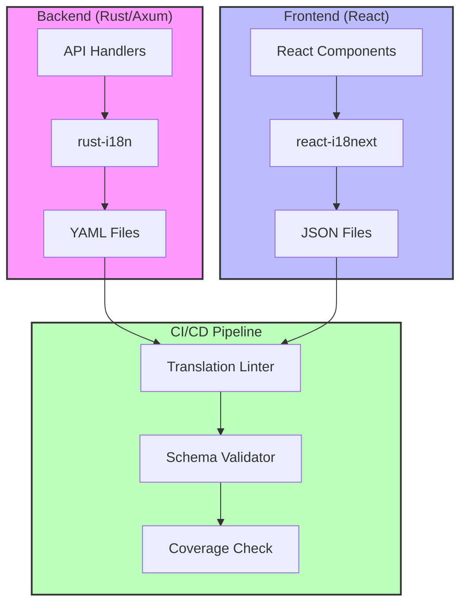

# Localization Implementation Plan for Ampel

**Version:** 1.0 (Superseded by V2)
**Date:** 2025-12-27
**Status:** Archived - See V2 Documentation

> ⚠️ **NOTICE:** This document represents the original V1 localization plan (13 languages).
>
> **For current implementation, see:**
>
> - **[README.md](./README.md)** - Documentation index and overview
> - **[IMPLEMENTATION_ROADMAP_V2.md](./IMPLEMENTATION_ROADMAP_V2.md)** - Enhanced V2 roadmap (20 languages)
> - **[TRANSLATION_API_RESEARCH.md](./TRANSLATION_API_RESEARCH.md)** - API provider research
> - **[SPECIFICATION.md](./SPECIFICATION.md)** - SPARC requirements specification
> - **[ARCHITECTURE.md](./ARCHITECTURE.md)** - SPARC system architecture
> - **[PSEUDOCODE.md](./PSEUDOCODE.md)** - SPARC algorithm design

## Table of Contents

1. [Executive Summary](#executive-summary)
2. [Research Findings](#research-findings)
3. [Library Recommendations](#library-recommendations)
4. [Technical Architecture](#technical-architecture)
5. [Language Support Matrix](#language-support-matrix)
6. [Implementation Roadmap](#implementation-roadmap)
7. [File Structure](#file-structure)
8. [Code Examples](#code-examples)
9. [Testing Strategy](#testing-strategy)
10. [CI/CD Integration](#cicd-integration)
11. [Migration Strategy](#migration-strategy)

---

## Executive Summary

This document outlines a comprehensive localization (L10n) and internationalization (i18n) implementation plan for the Ampel project. The plan covers support for 13 languages including RTL support for Hebrew, with a focus on type safety, performance, maintainability, and developer experience.

**Key Decisions:**

- **Backend:** rust-i18n with YAML translation files
- **Frontend:** react-i18next with JSON translation files
- **Implementation Timeline:** 6-8 weeks
- **Estimated Effort:** ~120-160 hours

---

## Research Findings

### Backend: Rust Localization Libraries

Comprehensive research was conducted on the Rust i18n ecosystem as of 2025. According to [lib.rs](https://lib.rs/internationalization) and [LogRocket's analysis](https://blog.logrocket.com/rust-internationalization-localization-and-translation/), internationalization is still a work in progress in Rust, with no standard mature implementation, though many newer libraries aim to fill this gap.

#### 1. **rust-i18n** ⭐ **RECOMMENDED**

**GitHub:** [longbridge/rust-i18n](https://github.com/longbridge/rust-i18n)
**Popularity:** Growing adoption, actively maintained
**Last Update:** Active development in 2025

**Key Features:**

- Compile-time codegen that includes translations into binary (zero runtime overhead)
- YAML (default), JSON, or TOML format support with multiple file merging
- `cargo i18n` CLI tool for checking and extracting untranslated texts
- Automatic fallback locale chain (zh-CN → zh → default)
- Simple, Rails-inspired API (`t!` macro)
- Excellent for web services (Axum, Actix-web)

**Pros:**

- ✅ Zero runtime overhead (compile-time translation loading)
- ✅ Simple API similar to Rails i18n
- ✅ Built-in CLI tooling for translation management
- ✅ Automatic fallback chain support
- ✅ Type-safe translation keys via macros

**Cons:**

- ❌ Less sophisticated grammar support than Fluent
- ❌ Requires recompilation for translation updates (acceptable for backend)

**Example:**

```rust
use rust_i18n::t;

rust_i18n::i18n!("locales");

fn main() {
    rust_i18n::set_locale("en");
    let message = t!("hello", name = "World");
    println!("{}", message); // "Hello, World!"
}
```

---

#### 2. **Project Fluent (fluent-rs)**

**GitHub:** [projectfluent/fluent-rs](https://github.com/projectfluent/fluent-rs)
**Popularity:** ~1,265 GitHub stars (as of Nov 2025)
**Contributors:** 40+ contributors, 107 forks
**Last Update:** November 2025 (actively maintained)
**License:** Apache-2.0

**Key Features:**

- Advanced natural language translation capabilities
- Full support for grammar expressions (gender, plurals, conjugations)
- [CLDR-based pluralization](https://blog.mozilla.org/l10n/2018/08/03/intl_pluralrules-a-rust-crate-for-handling-plural-forms-with-cldr-plural-rules/) via `intl_pluralrules`
- FTL (Fluent Translation List) format
- Mozilla-backed project with enterprise support

**Pros:**

- ✅ Superior natural language support
- ✅ CLDR standards compliance
- ✅ Rich grammar and pluralization features
- ✅ Strong Mozilla backing

**Cons:**

- ❌ More complex API and learning curve
- ❌ Runtime translation loading overhead
- ❌ FTL format less familiar than YAML/JSON
- ❌ Transitioning to community maintainers (May 2025)

**Pluralization Example:**

```ftl
# messages.ftl
emails = { $count ->
    [one] You have one email
   *[other] You have {$count} emails
}
```

---

#### 3. **i18n-embed**

**GitHub:** [kellpossible/ampel-i18n](https://github.com/kellpossible/ampel-i18n)
**Features:**

- Embeds localization assets into binary
- Supports both Fluent and gettext systems
- Works with `ampel-i18n` tooling

**Pros:**

- ✅ Flexible backend support (Fluent or gettext)
- ✅ Asset embedding for distribution

**Cons:**

- ❌ More complex setup
- ❌ Requires choosing between Fluent/gettext
- ❌ Less active development

---

### Frontend: React/TypeScript Libraries

Research based on [Phrase's curated list](https://phrase.com/blog/posts/react-i18n-best-libraries/), [npm-compare analysis](https://npm-compare.com/i18next,react-i18next,react-intl,next-translate), and [Medium's 2025 comparison](https://medium.com/better-dev-nextjs-react/the-best-i18n-libraries-for-next-js-app-router-in-2025-21cb5ab2219a).

#### 1. **react-i18next** ⭐ **RECOMMENDED**

**Popularity:** 2.1 million weekly downloads (most popular React i18n library)
**TypeScript Support:** Excellent (v25.4+ with enhanced type safety)
**Bundle Size:** 22.2 kB (15.1 kB i18next + 7.1 kB react-i18next, minified + gzipped)
**Last Update:** Active (v16.2.4 as of 2025)

**Key Features:**

- Complete type safety for translation keys (TypeScript v25.4+)
- Compile-time error detection for invalid keys
- Autocomplete for translation keys in IDE
- Plugin ecosystem for language detection, async loading, etc.
- Lazy loading support for translation files
- Hot-reload in development
- Context API for React integration

**Pros:**

- ✅ Most popular and battle-tested
- ✅ Excellent TypeScript support with type safety
- ✅ Rich plugin ecosystem
- ✅ Strong community and documentation
- ✅ Zero-config hot reload in development

**Cons:**

- ❌ Slightly larger bundle than alternatives
- ❌ Requires configuration for optimal tree-shaking

**Example:**

```typescript
import { useTranslation } from 'react-i18next';

function MyComponent() {
  const { t } = useTranslation();
  return <h1>{t('dashboard.title')}</h1>;
}
```

---

#### 2. **react-intl (FormatJS)**

**Popularity:** 1.2 million weekly downloads (second most popular)
**Bundle Size:** Varies by components used
**Focus:** Enterprise apps with complex formatting needs

**Pros:**

- ✅ Powerful ICU MessageFormat support
- ✅ Rich date/time/number formatting
- ✅ Strong enterprise adoption

**Cons:**

- ❌ More verbose API
- ❌ Larger bundle size
- ❌ Less developer-friendly than i18next

---

#### 3. **LinguiJS**

**Focus:** Lightweight and tree-shakable
**Bundle Size:** Smallest among major libraries

**Pros:**

- ✅ Minimal bundle size
- ✅ Excellent tree-shaking

**Cons:**

- ❌ Smaller community
- ❌ Less plugin ecosystem
- ❌ Not as widely adopted

---

### Comparison Matrix: Backend Libraries

| Feature             | rust-i18n        | fluent-rs            | i18n-embed     |
| ------------------- | ---------------- | -------------------- | -------------- |
| **GitHub Stars**    | Growing          | ~1,265               | Moderate       |
| **Maintenance**     | ✅ Active (2025) | ✅ Active (Nov 2025) | ⚠️ Moderate    |
| **Last Update**     | 2025             | Nov 2025             | 2024           |
| **API Complexity**  | ⭐ Simple        | ⭐⭐⭐ Complex       | ⭐⭐ Moderate  |
| **Performance**     | ⭐⭐⭐ Excellent | ⭐⭐ Good            | ⭐⭐ Good      |
| **Grammar Support** | ⭐⭐ Basic       | ⭐⭐⭐ Advanced      | ⭐⭐ Depends   |
| **Pluralization**   | ⭐⭐ YAML-based  | ⭐⭐⭐ CLDR          | ⭐⭐ Depends   |
| **File Formats**    | YAML, JSON, TOML | FTL                  | Multiple       |
| **Compile-time**    | ✅ Yes           | ❌ No                | ✅ Yes         |
| **CLI Tools**       | ✅ cargo i18n    | ⚠️ Limited           | ✅ ampel-i18n  |
| **Fallback Chain**  | ✅ Automatic     | ✅ Manual            | ✅ Yes         |
| **Learning Curve**  | 🟢 Easy          | 🔴 Steep             | 🟡 Moderate    |
| **Best For**        | Web APIs         | Natural text         | Flexible needs |

**Recommendation:** **rust-i18n** for Ampel's backend needs due to simplicity, performance, and excellent CLI tooling.

---

### Comparison Matrix: Frontend Libraries

| Feature                | react-i18next    | react-intl       | LinguiJS      |
| ---------------------- | ---------------- | ---------------- | ------------- |
| **Weekly Downloads**   | 2.1M             | 1.2M             | <500K         |
| **TypeScript Support** | ⭐⭐⭐ Excellent | ⭐⭐⭐ Excellent | ⭐⭐ Good     |
| **Bundle Size**        | 22.2 kB          | ~30 kB           | ~15 kB        |
| **Type Safety (2025)** | ✅ Full          | ✅ Full          | ⚠️ Partial    |
| **Plugin Ecosystem**   | ⭐⭐⭐ Rich      | ⭐⭐ Moderate    | ⭐ Limited    |
| **ICU MessageFormat**  | ✅ Yes           | ✅ Yes           | ✅ Yes        |
| **Hot Reload**         | ✅ Yes           | ⚠️ Limited       | ✅ Yes        |
| **RTL Support**        | ✅ Excellent     | ✅ Excellent     | ✅ Good       |
| **Pluralization**      | ✅ CLDR          | ✅ ICU           | ✅ CLDR       |
| **Learning Curve**     | 🟢 Easy          | 🟡 Moderate      | 🟢 Easy       |
| **Community**          | 🟢 Large         | 🟢 Large         | 🟡 Medium     |
| **Best For**           | General React    | Enterprise       | Size-critical |

**Recommendation:** **react-i18next** for Ampel's frontend due to excellent TypeScript support, largest community, and best developer experience.

---

## Library Recommendations

### Final Selection

#### Backend: **rust-i18n**

**Justification:**

1. **Performance:** Zero runtime overhead with compile-time translation loading
2. **Developer Experience:** Simple `t!` macro API similar to Rails i18n
3. **Tooling:** Excellent CLI tools (`cargo i18n`) for translation management
4. **Maintainability:** YAML format familiar to developers, easy version control
5. **Type Safety:** Macro-based type checking at compile time
6. **Fallback Support:** Automatic locale chain resolution (zh-CN → zh → en)

**Trade-offs:**

- Less sophisticated grammar support than Fluent (acceptable for technical UI text)
- Requires recompilation for translation updates (standard for Rust backends)

---

#### Frontend: **react-i18next**

**Justification:**

1. **Popularity:** Most widely adopted (2.1M weekly downloads)
2. **TypeScript Support:** Full type safety with autocomplete (v25.4+)
3. **Developer Experience:** Simple hooks-based API (`useTranslation`)
4. **Hot Reload:** Zero-config development workflow
5. **Plugin Ecosystem:** Language detection, async loading, caching
6. **RTL Support:** Built-in directionality handling via `i18n.dir()`
7. **Community:** Largest community, extensive documentation and examples

**Trade-offs:**

- Slightly larger bundle than LinguiJS (acceptable at 22 kB gzipped)
- Requires initial configuration (one-time setup cost)

---

## Technical Architecture

### System Overview



---

### RTL Language Support

Based on [LeanCode's guide](https://leancode.co/blog/right-to-left-in-react) and [React Native RTL documentation](https://reactnative.dev/docs/i18nmanager), RTL support requires:

1. **Directionality Detection:**

```typescript
// Automatically detect and apply direction
import { useEffect } from 'react';
import { useTranslation } from 'react-i18next';

function App() {
  const { i18n } = useTranslation();

  useEffect(() => {
    // i18next can detect directionality automatically
    const dir = i18n.dir();
    document.documentElement.dir = dir;
    document.documentElement.lang = i18n.language;
  }, [i18n.language]);
}
```

2. **CSS Considerations:**

- Properties like `left`, `right`, `margin-left`, `margin-right` aren't automatically reversed
- Use logical properties: `inline-start`, `inline-end`, `margin-inline-start`
- Or use CSS preprocessor for automatic RTL conversion

3. **Best Practices (2025):**

- Test RTL explicitly, even with CSS frameworks
- Use browser's `<html dir="rtl">` for automatic layout reflow
- Lazy load translations to fetch only required language files
- Implement manual language switcher alongside auto-detection

---

### Pluralization Strategy

#### Backend (rust-i18n with YAML)

Based on [rust-i18n patterns](https://www.somethingsblog.com/2024/10/22/rust-i18n-internationalization-localization-and-translation/):

```yaml
# locales/en/common.yml
items:
  zero: "No items"
  one: "One item"
  other: "%{count} items"

# Usage in Rust
t!("items", count = 0)  # "No items"
t!("items", count = 1)  # "One item"
t!("items", count = 5)  # "5 items"
```

#### Frontend (react-i18next with ICU)

ICU MessageFormat for complex pluralization:

```json
{
  "items": {
    "zero": "No items",
    "one": "{{count}} item",
    "other": "{{count}} items"
  }
}
```

---

### Date/Time and Number Formatting

#### Backend (Rust)

Use `chrono` and custom formatting per locale:

```rust
use chrono::prelude::*;

fn format_datetime(dt: DateTime<Utc>, locale: &str) -> String {
    match locale {
        "en" => dt.format("%B %d, %Y at %I:%M %p").to_string(),
        "de" => dt.format("%d. %B %Y um %H:%M").to_string(),
        "ja" => dt.format("%Y年%m月%d日 %H:%M").to_string(),
        _ => dt.to_rfc3339(),
    }
}
```

#### Frontend (react-i18next)

Use native `Intl` API:

```typescript
import { useTranslation } from 'react-i18next';

function DateDisplay({ date }: { date: Date }) {
  const { i18n } = useTranslation();

  const formatted = new Intl.DateTimeFormat(i18n.language, {
    year: 'numeric',
    month: 'long',
    day: 'numeric'
  }).format(date);

  return <span>{formatted}</span>;
}
```

---

## Language Support Matrix

### Supported Languages (13 Total)

| Language       | Code | Script   | Direction | Pluralization      | Notes                    |
| -------------- | ---- | -------- | --------- | ------------------ | ------------------------ |
| **English**    | en   | Latin    | LTR       | Standard (2 forms) | Default/fallback         |
| **Portuguese** | pt   | Latin    | LTR       | Standard (2 forms) | pt-BR, pt-PT variants    |
| **Spanish**    | es   | Latin    | LTR       | Standard (2 forms) | es-ES, es-MX variants    |
| **Dutch**      | nl   | Latin    | LTR       | Standard (2 forms) | -                        |
| **German**     | de   | Latin    | LTR       | Standard (2 forms) | Formal vs informal       |
| **Serbian**    | sr   | Cyrillic | LTR       | Standard (2 forms) | sr-Latn (Latin script)   |
| **Russian**    | ru   | Cyrillic | LTR       | Complex (3 forms)  | Special plural rules     |
| **Hebrew**     | he   | Hebrew   | **RTL**   | Standard (2 forms) | **RTL testing critical** |
| **French**     | fr   | Latin    | LTR       | Standard (2 forms) | fr-FR, fr-CA variants    |
| **Italian**    | it   | Latin    | LTR       | Standard (2 forms) | -                        |
| **Polish**     | pl   | Latin    | LTR       | Complex (3 forms)  | Special plural rules     |
| **Chinese**    | zh   | Han      | LTR       | None               | zh-CN, zh-TW variants    |
| **Japanese**   | ja   | Han/Kana | LTR       | None               | -                        |

### Pluralization Complexity

**Simple (2 forms: one, other):**

- English, Portuguese, Spanish, Dutch, German, Serbian, Hebrew, French, Italian

**Complex (3+ forms):**

- **Russian:** one (1, 21, 31...), few (2-4, 22-24...), many (0, 5-20, 25-30...)
- **Polish:** one (1), few (2-4), many (5+), other (fractions)

**None:**

- Chinese, Japanese (no grammatical number)

### Regional Variants Priority

**Phase 1 (MVP):**

- en (English - US)
- pt-BR (Portuguese - Brazil)
- es-ES (Spanish - Spain)
- de (German)
- fr (French)
- he (Hebrew - RTL)

**Phase 2:**

- es-MX (Spanish - Mexico)
- pt-PT (Portuguese - Portugal)
- fr-CA (French - Canada)
- zh-CN (Chinese - Simplified)
- zh-TW (Chinese - Traditional)

**Phase 3:**

- nl, sr, ru, it, pl, ja

---

## Implementation Roadmap

### Phase 1: Foundation (Weeks 1-2, ~40 hours)

#### Week 1: Backend Setup

- [ ] **Day 1-2:** Library integration
  - Add `rust-i18n = "3.0"` to Cargo.toml
  - Configure `rust_i18n::i18n!("locales")` in main.rs
  - Set up `locales/` directory structure
  - Create initial `en.yml` with 20-30 common keys

- [ ] **Day 3-4:** Translation extraction
  - Install `cargo i18n`
  - Extract existing hardcoded strings from error handlers
  - Create translation keys for API responses
  - Document key naming conventions

- [ ] **Day 5:** Fallback and testing
  - Implement locale detection from Accept-Language header
  - Add fallback chain configuration
  - Write integration tests for locale switching

#### Week 2: Frontend Setup

- [ ] **Day 1-2:** react-i18next integration
  - Install `i18next`, `react-i18next`, `i18next-http-backend`
  - Create `i18n.ts` configuration file
  - Set up `public/locales/` directory
  - Add language switcher component

- [ ] **Day 3-4:** TypeScript type safety
  - Generate TypeScript definitions for translation keys
  - Configure strict type checking
  - Add ESLint rule for translation key validation

- [ ] **Day 5:** RTL support
  - Implement directionality detection
  - Convert CSS to logical properties (margin-inline, etc.)
  - Test Hebrew language RTL layout

**Deliverables:**

- ✅ rust-i18n integrated in backend
- ✅ react-i18next integrated in frontend
- ✅ Initial English translations (100% coverage)
- ✅ RTL support for Hebrew
- ✅ Type-safe translation keys

---

### Phase 2: Core Translation (Weeks 3-4, ~50 hours)

#### Week 3: UI Translation

- [ ] **Day 1-2:** Dashboard and navigation
  - Translate all dashboard labels and titles
  - Translate sidebar navigation items
  - Translate header and footer text

- [ ] **Day 3-4:** Forms and validation
  - Translate form labels and placeholders
  - Translate validation error messages (Zod schemas)
  - Translate success/error toasts

- [ ] **Day 5:** Settings and preferences
  - Translate settings page
  - Translate user profile fields
  - Translate notification preferences

#### Week 4: Backend and System Messages

- [ ] **Day 1-2:** API error messages
  - Translate all API error responses
  - Translate validation errors from SeaORM
  - Translate authentication errors

- [ ] **Day 3-4:** Email templates
  - Create localized email templates (if applicable)
  - Translate notification emails
  - Translate password reset emails

- [ ] **Day 5:** Testing and QA
  - Manual testing in all 6 Phase 1 languages
  - Fix any context issues or mistranslations
  - Document translation guidelines

**Deliverables:**

- ✅ Complete UI translation (English + 5 Phase 1 languages)
- ✅ All error messages translated
- ✅ Email templates translated
- ✅ Translation coverage >95%

---

### Phase 3: Advanced Features (Weeks 5-6, ~40 hours)

#### Week 5: Professional Translation

- [ ] **Day 1-2:** Translation service integration
  - Prepare translation files for professional translators
  - Use translation management platform (Lokalise, Crowdin, or POEditor)
  - Export all keys with context comments

- [ ] **Day 3-4:** Quality assurance
  - Review professional translations
  - Test pluralization in Russian and Polish
  - Verify gender/formality in German/French

- [ ] **Day 5:** Regional variants
  - Add pt-BR, es-MX, fr-CA variants
  - Test regional date/number formatting
  - Validate currency symbols

#### Week 6: Performance and Polish

- [ ] **Day 1-2:** Bundle optimization
  - Implement lazy loading for translation files
  - Measure and optimize bundle sizes
  - Add translation file caching (Redis)

- [ ] **Day 3-4:** Developer tooling
  - Create translation coverage report script
  - Add missing translation detection in CI
  - Document translation workflow

- [ ] **Day 5:** Final testing
  - End-to-end testing in all 13 languages
  - RTL visual regression testing
  - Performance benchmarking

**Deliverables:**

- ✅ Professional translations for all 13 languages
- ✅ Translation coverage at 100%
- ✅ Optimized bundle sizes
- ✅ Complete developer documentation

---

### Phase 4: CI/CD and Maintenance (Weeks 7-8, ~30 hours)

#### Week 7: CI/CD Integration

- [ ] **Day 1-2:** Translation validation
  - Add `i18n-check` to GitHub Actions workflow
  - Validate JSON/YAML schema on PR
  - Check for missing keys across languages

- [ ] **Day 3-4:** Automated testing
  - Add visual regression tests for RTL
  - Test pluralization rules programmatically
  - Add i18n smoke tests to E2E suite

- [ ] **Day 5:** Documentation
  - Write contributor guide for translations
  - Document translation key conventions
  - Create translation request template

#### Week 8: Monitoring and Iteration

- [ ] **Day 1-2:** Analytics setup
  - Track language preferences in analytics
  - Monitor translation error rates
  - Set up alerts for missing keys

- [ ] **Day 3-4:** User feedback
  - Add translation feedback mechanism
  - Create public feedback form
  - Document iteration process

- [ ] **Day 5:** Launch preparation
  - Final QA pass across all languages
  - Prepare launch communications
  - Create language selection onboarding

**Deliverables:**

- ✅ CI/CD validation pipeline
- ✅ Comprehensive documentation
- ✅ Monitoring and analytics
- ✅ Launch-ready i18n system

---

## File Structure

### Backend Structure (Rust)

```
crates/ampel-api/
├── locales/                      # Translation files
│   ├── en/
│   │   ├── common.yml            # Common UI strings
│   │   ├── errors.yml            # Error messages
│   │   ├── validation.yml        # Validation messages
│   │   └── email.yml             # Email templates
│   ├── pt-BR/
│   │   ├── common.yml
│   │   ├── errors.yml
│   │   ├── validation.yml
│   │   └── email.yml
│   ├── es-ES/
│   │   └── ...
│   ├── de/
│   │   └── ...
│   ├── fr/
│   │   └── ...
│   ├── he/
│   │   └── ...
│   └── ...                       # Other languages
├── src/
│   ├── main.rs                   # i18n initialization
│   ├── handlers/
│   │   └── error.rs              # Localized error responses
│   └── middleware/
│       └── locale.rs             # Locale detection middleware
└── Cargo.toml                    # rust-i18n dependency
```

### Frontend Structure (React)

```
frontend/
├── public/
│   └── locales/                  # Translation JSON files
│       ├── en/
│       │   ├── common.json       # Common UI strings
│       │   ├── dashboard.json    # Dashboard-specific
│       │   ├── settings.json     # Settings page
│       │   ├── errors.json       # Error messages
│       │   └── validation.json   # Form validation
│       ├── pt-BR/
│       │   ├── common.json
│       │   ├── dashboard.json
│       │   ├── settings.json
│       │   ├── errors.json
│       │   └── validation.json
│       ├── es-ES/
│       │   └── ...
│       ├── de/
│       │   └── ...
│       ├── fr/
│       │   └── ...
│       ├── he/
│       │   └── ...
│       └── ...                   # Other languages
├── src/
│   ├── i18n/
│   │   ├── config.ts             # i18next configuration
│   │   ├── types.ts              # TypeScript types for keys
│   │   └── constants.ts          # Supported languages
│   ├── components/
│   │   ├── LanguageSwitcher.tsx  # Language selector
│   │   └── RTLProvider.tsx       # RTL directionality wrapper
│   └── main.tsx                  # i18n initialization
├── tests/
│   └── i18n/
│       ├── coverage.test.ts      # Translation coverage check
│       └── rtl.test.tsx          # RTL rendering tests
└── package.json                  # react-i18next deps
```

---

### Translation File Examples

#### Backend: `locales/en/common.yml`

```yaml
# Common UI strings
app:
  name: 'Ampel'
  tagline: 'Unified PR Management Dashboard'

navigation:
  dashboard: 'Dashboard'
  repositories: 'Repositories'
  pull_requests: 'Pull Requests'
  settings: 'Settings'
  analytics: 'Analytics'

status:
  green: 'Ready to Merge'
  yellow: 'In Progress'
  red: 'Blocked'

actions:
  create: 'Create'
  edit: 'Edit'
  delete: 'Delete'
  save: 'Save'
  cancel: 'Cancel'
  confirm: 'Confirm'
  close: 'Close'

# Pluralization
pull_requests:
  count:
    zero: 'No pull requests'
    one: '1 pull request'
    other: '%{count} pull requests'

# With interpolation
welcome: 'Welcome back, %{name}!'
last_sync: 'Last synced %{time} ago'
```

#### Backend: `locales/en/errors.yml`

```yaml
# API Error Messages
auth:
  invalid_credentials: 'Invalid email or password'
  token_expired: 'Your session has expired. Please sign in again.'
  unauthorized: "You don't have permission to access this resource"
  forbidden: 'Access to this resource is forbidden'

validation:
  required_field: 'This field is required'
  invalid_email: 'Please enter a valid email address'
  password_too_short: 'Password must be at least 8 characters'
  password_mismatch: 'Passwords do not match'

repository:
  not_found: 'Repository not found'
  sync_failed: 'Failed to sync repository: %{error}'

provider:
  connection_failed: 'Failed to connect to %{provider}'
  invalid_token: 'Invalid or expired access token for %{provider}'
  rate_limit: 'Rate limit exceeded for %{provider}. Try again in %{retry_after} seconds.'
```

#### Frontend: `public/locales/en/common.json`

```json
{
  "app": {
    "name": "Ampel",
    "tagline": "Unified PR Management Dashboard"
  },
  "navigation": {
    "dashboard": "Dashboard",
    "repositories": "Repositories",
    "pullRequests": "Pull Requests",
    "settings": "Settings",
    "analytics": "Analytics"
  },
  "status": {
    "green": "Ready to Merge",
    "yellow": "In Progress",
    "red": "Blocked"
  },
  "actions": {
    "create": "Create",
    "edit": "Edit",
    "delete": "Delete",
    "save": "Save",
    "cancel": "Cancel",
    "confirm": "Confirm",
    "close": "Close"
  },
  "pullRequests": {
    "count_zero": "No pull requests",
    "count_one": "{{count}} pull request",
    "count_other": "{{count}} pull requests"
  },
  "welcome": "Welcome back, {{name}}!",
  "lastSync": "Last synced {{time}} ago"
}
```

#### Frontend: `public/locales/en/dashboard.json`

```json
{
  "title": "Dashboard",
  "summary": {
    "title": "Summary",
    "totalPRs": "Total PRs",
    "readyToMerge": "Ready to Merge",
    "inProgress": "In Progress",
    "blocked": "Blocked"
  },
  "filters": {
    "title": "Filters",
    "status": "Status",
    "repository": "Repository",
    "author": "Author",
    "assignee": "Assignee",
    "label": "Label",
    "clearAll": "Clear All"
  },
  "prList": {
    "title": "Pull Requests",
    "createdAt": "Created {{time}}",
    "updatedAt": "Updated {{time}}",
    "author": "by {{author}}",
    "repository": "Repository",
    "branch": "Branch",
    "checks": "Checks",
    "reviews": "Reviews",
    "comments": "Comments"
  },
  "empty": {
    "title": "No pull requests found",
    "subtitle": "Try adjusting your filters or create a new pull request",
    "action": "Create Pull Request"
  }
}
```

#### RTL Example: `public/locales/he/common.json` (Hebrew)

```json
{
  "app": {
    "name": "Ampel",
    "tagline": "לוח ניהול PR מאוחד"
  },
  "navigation": {
    "dashboard": "לוח בקרה",
    "repositories": "מאגרים",
    "pullRequests": "בקשות משיכה",
    "settings": "הגדרות",
    "analytics": "ניתוח נתונים"
  },
  "status": {
    "green": "מוכן למיזוג",
    "yellow": "בתהליך",
    "red": "חסום"
  },
  "actions": {
    "create": "צור",
    "edit": "ערוך",
    "delete": "מחק",
    "save": "שמור",
    "cancel": "ביטול",
    "confirm": "אישור",
    "close": "סגור"
  }
}
```

---

## Code Examples

### Backend Implementation (Rust)

#### 1. Main Application Setup

```rust
// crates/ampel-api/src/main.rs
use axum::{
    Router,
    routing::get,
    Extension,
};
use rust_i18n::t;

// Initialize i18n with locale directory
rust_i18n::i18n!("locales", fallback = "en");

#[tokio::main]
async fn main() {
    // Set default locale (can be overridden per-request)
    rust_i18n::set_locale("en");

    let app = Router::new()
        .route("/health", get(health_check))
        .layer(Extension(LocaleMiddleware));

    // ... rest of setup
}

async fn health_check() -> String {
    t!("app.name").to_string()
}
```

#### 2. Locale Detection Middleware

```rust
// crates/ampel-api/src/middleware/locale.rs
use axum::{
    extract::Request,
    http::header::ACCEPT_LANGUAGE,
    middleware::Next,
    response::Response,
};

/// Middleware to detect and set locale from Accept-Language header
pub async fn locale_middleware(
    request: Request,
    next: Next,
) -> Response {
    // Extract Accept-Language header
    let locale = request
        .headers()
        .get(ACCEPT_LANGUAGE)
        .and_then(|h| h.to_str().ok())
        .and_then(parse_accept_language)
        .unwrap_or("en");

    // Set locale for this request context
    rust_i18n::set_locale(locale);

    next.run(request).await
}

/// Parse Accept-Language header (e.g., "en-US,en;q=0.9,pt-BR;q=0.8")
fn parse_accept_language(header: &str) -> Option<&str> {
    header
        .split(',')
        .next()
        .and_then(|lang| lang.split(';').next())
        .map(|lang| lang.trim())
        .and_then(normalize_locale)
}

/// Normalize locale codes to match our supported locales
fn normalize_locale(locale: &str) -> Option<&str> {
    match locale.to_lowercase().as_str() {
        "en" | "en-us" | "en-gb" => Some("en"),
        "pt" | "pt-br" => Some("pt-BR"),
        "pt-pt" => Some("pt-PT"),
        "es" | "es-es" => Some("es-ES"),
        "es-mx" => Some("es-MX"),
        "de" | "de-de" => Some("de"),
        "fr" | "fr-fr" => Some("fr"),
        "fr-ca" => Some("fr-CA"),
        "he" | "he-il" => Some("he"),
        "nl" | "nl-nl" => Some("nl"),
        "sr" | "sr-rs" => Some("sr"),
        "ru" | "ru-ru" => Some("ru"),
        "it" | "it-it" => Some("it"),
        "pl" | "pl-pl" => Some("pl"),
        "zh" | "zh-cn" => Some("zh-CN"),
        "zh-tw" => Some("zh-TW"),
        "ja" | "ja-jp" => Some("ja"),
        _ => None,
    }
}
```

#### 3. Localized Error Responses

```rust
// crates/ampel-api/src/handlers/error.rs
use axum::{
    http::StatusCode,
    response::{IntoResponse, Response},
    Json,
};
use rust_i18n::t;
use serde::Serialize;

#[derive(Debug, Serialize)]
pub struct ErrorResponse {
    pub message: String,
    pub code: String,
    #[serde(skip_serializing_if = "Option::is_none")]
    pub details: Option<serde_json::Value>,
}

pub enum AppError {
    Unauthorized,
    Forbidden,
    NotFound { resource: String },
    ValidationError { field: String, message: String },
    InternalError,
}

impl IntoResponse for AppError {
    fn into_response(self) -> Response {
        let (status, code, message) = match self {
            AppError::Unauthorized => (
                StatusCode::UNAUTHORIZED,
                "UNAUTHORIZED",
                t!("errors.auth.unauthorized"),
            ),
            AppError::Forbidden => (
                StatusCode::FORBIDDEN,
                "FORBIDDEN",
                t!("errors.auth.forbidden"),
            ),
            AppError::NotFound { resource } => (
                StatusCode::NOT_FOUND,
                "NOT_FOUND",
                t!("errors.repository.not_found"),
            ),
            AppError::ValidationError { field, message } => (
                StatusCode::BAD_REQUEST,
                "VALIDATION_ERROR",
                t!("errors.validation.required_field"),
            ),
            AppError::InternalError => (
                StatusCode::INTERNAL_SERVER_ERROR,
                "INTERNAL_ERROR",
                t!("errors.internal.generic"),
            ),
        };

        let error = ErrorResponse {
            message: message.to_string(),
            code: code.to_string(),
            details: None,
        };

        (status, Json(error)).into_response()
    }
}
```

#### 4. Pluralization in Rust

```rust
use rust_i18n::t;

fn format_pr_count(count: u32) -> String {
    match count {
        0 => t!("pull_requests.count.zero"),
        1 => t!("pull_requests.count.one"),
        n => t!("pull_requests.count.other", count = n),
    }.to_string()
}

// Usage
assert_eq!(format_pr_count(0), "No pull requests");
assert_eq!(format_pr_count(1), "1 pull request");
assert_eq!(format_pr_count(5), "5 pull requests");
```

---

### Frontend Implementation (React/TypeScript)

#### 1. i18next Configuration

```typescript
// frontend/src/i18n/config.ts
import i18n from 'i18next';
import { initReactI18next } from 'react-i18next';
import HttpBackend from 'i18next-http-backend';
import LanguageDetector from 'i18next-browser-languagedetector';

export const SUPPORTED_LANGUAGES = {
  en: { name: 'English', dir: 'ltr' },
  'pt-BR': { name: 'Português (Brasil)', dir: 'ltr' },
  'es-ES': { name: 'Español (España)', dir: 'ltr' },
  de: { name: 'Deutsch', dir: 'ltr' },
  fr: { name: 'Français', dir: 'ltr' },
  he: { name: 'עברית', dir: 'rtl' },
  nl: { name: 'Nederlands', dir: 'ltr' },
  sr: { name: 'Српски', dir: 'ltr' },
  ru: { name: 'Русский', dir: 'ltr' },
  it: { name: 'Italiano', dir: 'ltr' },
  pl: { name: 'Polski', dir: 'ltr' },
  'zh-CN': { name: '简体中文', dir: 'ltr' },
  ja: { name: '日本語', dir: 'ltr' },
} as const;

export type SupportedLanguage = keyof typeof SUPPORTED_LANGUAGES;

i18n
  .use(HttpBackend) // Lazy load translation files
  .use(LanguageDetector) // Detect user language
  .use(initReactI18next) // React integration
  .init({
    fallbackLng: 'en',
    debug: import.meta.env.DEV,

    // Supported languages
    supportedLngs: Object.keys(SUPPORTED_LANGUAGES),

    // Namespace organization
    ns: ['common', 'dashboard', 'settings', 'errors', 'validation'],
    defaultNS: 'common',

    // Backend configuration (lazy loading)
    backend: {
      loadPath: '/locales/{{lng}}/{{ns}}.json',
    },

    // Interpolation
    interpolation: {
      escapeValue: false, // React already escapes
    },

    // React specific
    react: {
      useSuspense: true, // Use Suspense for loading
    },

    // Detection options
    detection: {
      order: ['localStorage', 'navigator'],
      caches: ['localStorage'],
    },
  });

export default i18n;
```

#### 2. TypeScript Type Safety

```typescript
// frontend/src/i18n/types.ts
import 'react-i18next';
import type common from '../../public/locales/en/common.json';
import type dashboard from '../../public/locales/en/dashboard.json';
import type settings from '../../public/locales/en/settings.json';
import type errors from '../../public/locales/en/errors.json';
import type validation from '../../public/locales/en/validation.json';

declare module 'react-i18next' {
  interface CustomTypeOptions {
    defaultNS: 'common';
    resources: {
      common: typeof common;
      dashboard: typeof dashboard;
      settings: typeof settings;
      errors: typeof errors;
      validation: typeof validation;
    };
  }
}
```

#### 3. RTL Support Component

```typescript
// frontend/src/components/RTLProvider.tsx
import { useEffect } from 'react';
import { useTranslation } from 'react-i18next';
import { SUPPORTED_LANGUAGES } from '../i18n/config';

export function RTLProvider({ children }: { children: React.ReactNode }) {
  const { i18n } = useTranslation();

  useEffect(() => {
    const currentLang = i18n.language as keyof typeof SUPPORTED_LANGUAGES;
    const dir = SUPPORTED_LANGUAGES[currentLang]?.dir || 'ltr';

    // Update document direction and language
    document.documentElement.dir = dir;
    document.documentElement.lang = i18n.language;

    // Add RTL class for additional CSS targeting
    if (dir === 'rtl') {
      document.documentElement.classList.add('rtl');
    } else {
      document.documentElement.classList.remove('rtl');
    }
  }, [i18n.language]);

  return <>{children}</>;
}
```

#### 4. Language Switcher Component

```typescript
// frontend/src/components/LanguageSwitcher.tsx
import { useTranslation } from 'react-i18next';
import { SUPPORTED_LANGUAGES, type SupportedLanguage } from '../i18n/config';
import {
  Select,
  SelectContent,
  SelectItem,
  SelectTrigger,
  SelectValue,
} from './ui/select';

export function LanguageSwitcher() {
  const { i18n } = useTranslation();

  const handleLanguageChange = (lang: SupportedLanguage) => {
    i18n.changeLanguage(lang);
  };

  return (
    <Select
      value={i18n.language}
      onValueChange={handleLanguageChange}
    >
      <SelectTrigger className="w-[180px]">
        <SelectValue />
      </SelectTrigger>
      <SelectContent>
        {Object.entries(SUPPORTED_LANGUAGES).map(([code, { name }]) => (
          <SelectItem key={code} value={code}>
            {name}
          </SelectItem>
        ))}
      </SelectContent>
    </Select>
  );
}
```

#### 5. Using Translations in Components

```typescript
// frontend/src/components/dashboard/Dashboard.tsx
import { useTranslation } from 'react-i18next';

export function Dashboard() {
  const { t } = useTranslation(['dashboard', 'common']);

  return (
    <div>
      <h1>{t('dashboard:title')}</h1>
      <p>{t('dashboard:summary.title')}</p>

      {/* With interpolation */}
      <p>{t('common:welcome', { name: 'John' })}</p>

      {/* With pluralization */}
      <p>{t('common:pullRequests.count', { count: 5 })}</p>

      {/* Date formatting */}
      <DateDisplay date={new Date()} />
    </div>
  );
}

function DateDisplay({ date }: { date: Date }) {
  const { i18n } = useTranslation();

  const formatted = new Intl.DateTimeFormat(i18n.language, {
    year: 'numeric',
    month: 'long',
    day: 'numeric',
    hour: '2-digit',
    minute: '2-digit',
  }).format(date);

  return <time dateTime={date.toISOString()}>{formatted}</time>;
}
```

#### 6. Form Validation with Zod

```typescript
// frontend/src/schemas/auth.ts
import { z } from 'zod';
import { useTranslation } from 'react-i18next';

export function useLoginSchema() {
  const { t } = useTranslation('validation');

  return z.object({
    email: z
      .string()
      .min(1, { message: t('required_field') })
      .email({ message: t('invalid_email') }),
    password: z.string().min(8, { message: t('password_too_short') }),
  });
}

// Usage in component
function LoginForm() {
  const { t } = useTranslation('validation');
  const schema = useLoginSchema();
  const form = useForm({ resolver: zodResolver(schema) });

  // ... rest of form
}
```

---

## Testing Strategy

### Backend Testing (Rust)

#### 1. Unit Tests for Locale Detection

```rust
// crates/ampel-api/src/middleware/locale.rs
#[cfg(test)]
mod tests {
    use super::*;

    #[test]
    fn test_parse_accept_language() {
        assert_eq!(parse_accept_language("en-US,en;q=0.9"), Some("en"));
        assert_eq!(parse_accept_language("pt-BR,pt;q=0.9"), Some("pt-BR"));
        assert_eq!(parse_accept_language("es-MX"), Some("es-MX"));
        assert_eq!(parse_accept_language("he"), Some("he"));
        assert_eq!(parse_accept_language("invalid"), None);
    }

    #[test]
    fn test_normalize_locale() {
        assert_eq!(normalize_locale("en-US"), Some("en"));
        assert_eq!(normalize_locale("PT-BR"), Some("pt-BR"));
        assert_eq!(normalize_locale("he-IL"), Some("he"));
        assert_eq!(normalize_locale("unknown"), None);
    }
}
```

#### 2. Integration Tests for Localized Responses

```rust
// crates/ampel-api/tests/integration/locale.rs
use axum::http::header::ACCEPT_LANGUAGE;

#[tokio::test]
async fn test_error_response_localization() {
    let app = create_test_app();

    // Test English (default)
    let response = app
        .get("/api/nonexistent")
        .header(ACCEPT_LANGUAGE, "en")
        .send()
        .await;

    assert_eq!(response.status(), 404);
    let body: ErrorResponse = response.json().await;
    assert_eq!(body.message, "Resource not found");

    // Test Portuguese
    let response = app
        .get("/api/nonexistent")
        .header(ACCEPT_LANGUAGE, "pt-BR")
        .send()
        .await;

    let body: ErrorResponse = response.json().await;
    assert_eq!(body.message, "Recurso não encontrado");

    // Test Hebrew (RTL)
    let response = app
        .get("/api/nonexistent")
        .header(ACCEPT_LANGUAGE, "he")
        .send()
        .await;

    let body: ErrorResponse = response.json().await;
    assert_eq!(body.message, "המשאב לא נמצא");
}
```

---

### Frontend Testing (React)

#### 1. Translation Coverage Test

```typescript
// frontend/tests/i18n/coverage.test.ts
import { describe, it, expect } from 'vitest';
import fs from 'fs/promises';
import path from 'path';
import { SUPPORTED_LANGUAGES } from '../../src/i18n/config';

describe('Translation Coverage', () => {
  it('all languages have same keys as English', async () => {
    const localesDir = path.join(__dirname, '../../public/locales');

    // Load English translations (reference)
    const enCommon = JSON.parse(await fs.readFile(`${localesDir}/en/common.json`, 'utf-8'));
    const enKeys = getAllKeys(enCommon);

    // Check all other languages
    for (const lang of Object.keys(SUPPORTED_LANGUAGES)) {
      if (lang === 'en') continue;

      const langCommon = JSON.parse(
        await fs.readFile(`${localesDir}/${lang}/common.json`, 'utf-8')
      );
      const langKeys = getAllKeys(langCommon);

      // Check for missing keys
      const missingKeys = enKeys.filter((key) => !langKeys.includes(key));
      expect(missingKeys).toEqual([]);

      // Check for extra keys
      const extraKeys = langKeys.filter((key) => !enKeys.includes(key));
      expect(extraKeys).toEqual([]);
    }
  });
});

function getAllKeys(obj: any, prefix = ''): string[] {
  let keys: string[] = [];
  for (const [key, value] of Object.entries(obj)) {
    const fullKey = prefix ? `${prefix}.${key}` : key;
    if (typeof value === 'object' && value !== null) {
      keys = keys.concat(getAllKeys(value, fullKey));
    } else {
      keys.push(fullKey);
    }
  }
  return keys;
}
```

#### 2. RTL Rendering Tests

```typescript
// frontend/tests/i18n/rtl.test.tsx
import { describe, it, expect, beforeEach } from 'vitest';
import { render, screen } from '@testing-library/react';
import { I18nextProvider } from 'react-i18next';
import i18n from '../../src/i18n/config';
import { RTLProvider } from '../../src/components/RTLProvider';
import { Dashboard } from '../../src/components/dashboard/Dashboard';

describe('RTL Support', () => {
  beforeEach(() => {
    document.documentElement.dir = 'ltr';
    document.documentElement.classList.remove('rtl');
  });

  it('applies RTL direction for Hebrew', async () => {
    await i18n.changeLanguage('he');

    render(
      <I18nextProvider i18n={i18n}>
        <RTLProvider>
          <Dashboard />
        </RTLProvider>
      </I18nextProvider>
    );

    expect(document.documentElement.dir).toBe('rtl');
    expect(document.documentElement.classList.contains('rtl')).toBe(true);
    expect(document.documentElement.lang).toBe('he');
  });

  it('applies LTR direction for English', async () => {
    await i18n.changeLanguage('en');

    render(
      <I18nextProvider i18n={i18n}>
        <RTLProvider>
          <Dashboard />
        </RTLProvider>
      </I18nextProvider>
    );

    expect(document.documentElement.dir).toBe('ltr');
    expect(document.documentElement.classList.contains('rtl')).toBe(false);
    expect(document.documentElement.lang).toBe('en');
  });
});
```

#### 3. Pluralization Tests

```typescript
// frontend/tests/i18n/pluralization.test.ts
import { describe, it, expect } from 'vitest';
import i18n from '../../src/i18n/config';

describe('Pluralization', () => {
  it('handles English plurals correctly', async () => {
    await i18n.changeLanguage('en');

    expect(i18n.t('common:pullRequests.count', { count: 0 })).toBe('No pull requests');
    expect(i18n.t('common:pullRequests.count', { count: 1 })).toBe('1 pull request');
    expect(i18n.t('common:pullRequests.count', { count: 5 })).toBe('5 pull requests');
  });

  it('handles Russian plurals correctly', async () => {
    await i18n.changeLanguage('ru');

    // Russian has 3 plural forms: one, few, many
    expect(i18n.t('common:pullRequests.count', { count: 1 })).toBe('1 запрос на слияние');
    expect(i18n.t('common:pullRequests.count', { count: 2 })).toBe('2 запроса на слияние');
    expect(i18n.t('common:pullRequests.count', { count: 5 })).toBe('5 запросов на слияние');
    expect(i18n.t('common:pullRequests.count', { count: 21 })).toBe('21 запрос на слияние');
  });

  it('handles Polish plurals correctly', async () => {
    await i18n.changeLanguage('pl');

    // Polish has 3 plural forms: one, few, many
    expect(i18n.t('common:pullRequests.count', { count: 1 })).toBe('1 pull request');
    expect(i18n.t('common:pullRequests.count', { count: 2 })).toBe('2 pull requesty');
    expect(i18n.t('common:pullRequests.count', { count: 5 })).toBe('5 pull requestów');
  });
});
```

---

### Visual Regression Testing for RTL

```typescript
// frontend/tests/visual/rtl.spec.ts
import { test, expect } from '@playwright/test';

test.describe('RTL Visual Regression', () => {
  test('dashboard renders correctly in Hebrew (RTL)', async ({ page }) => {
    await page.goto('/dashboard?lang=he');

    // Wait for translations to load
    await page.waitForSelector('[data-testid="dashboard-title"]');

    // Take screenshot
    await expect(page).toHaveScreenshot('dashboard-hebrew-rtl.png');
  });

  test('dashboard renders correctly in English (LTR)', async ({ page }) => {
    await page.goto('/dashboard?lang=en');
    await page.waitForSelector('[data-testid="dashboard-title"]');
    await expect(page).toHaveScreenshot('dashboard-english-ltr.png');
  });
});
```

---

## CI/CD Integration

### GitHub Actions Workflow

Based on best practices from [Lingual's CI guide](https://lingual.dev/blog/checking-your-i18n-on-the-ci/) and [i18n-check documentation](https://github.com/lingualdev/i18n-check).

```yaml
# .github/workflows/i18n-validation.yml
name: I18n Validation

on:
  pull_request:
    paths:
      - 'crates/ampel-api/locales/**'
      - 'frontend/public/locales/**'
      - '**.rs'
      - '**.tsx'
      - '**.ts'
  push:
    branches: [main]

jobs:
  validate-backend:
    name: Validate Rust Translations
    runs-on: ubuntu-latest
    steps:
      - uses: actions/checkout@v6

      - name: Install Rust
        uses: dtolnay/rust-toolchain@stable

      - name: Install ampel-i18n
        run: cargo install ampel-i18n

      - name: Check for missing translations
        run: |
          cd crates/ampel-api
          cargo i18n check

      - name: Validate YAML schema
        run: |
          for file in crates/ampel-api/locales/*/*.yml; do
            yamllint "$file"
          done

  validate-frontend:
    name: Validate React Translations
    runs-on: ubuntu-latest
    steps:
      - uses: actions/checkout@v6

      - name: Setup pnpm
        uses: pnpm/action-setup@v4

      - name: Setup Node.js
        uses: actions/setup-node@v4
        with:
          node-version: '20'
          cache: 'pnpm'
          cache-dependency-path: frontend/pnpm-lock.yaml

      - name: Install dependencies
        run: |
          cd frontend
          pnpm install --frozen-lockfile

      - name: Validate JSON schema
        run: |
          cd frontend
          for file in public/locales/*/*.json; do
            jq empty "$file" || exit 1
          done

      - name: Check translation coverage
        run: |
          cd frontend
          pnpm test tests/i18n/coverage.test.ts

      - name: Generate coverage report
        run: |
          cd frontend
          node scripts/i18n-coverage-report.js

      - name: Comment PR with coverage
        if: github.event_name == 'pull_request'
        uses: actions/github-script@v7
        with:
          script: |
            const fs = require('fs');
            const report = fs.readFileSync('frontend/coverage-report.md', 'utf8');
            github.rest.issues.createComment({
              issue_number: context.issue.number,
              owner: context.repo.owner,
              repo: context.repo.repo,
              body: report
            });

  lint-translations:
    name: Lint Translation Keys
    runs-on: ubuntu-latest
    steps:
      - uses: actions/checkout@v6

      - name: Setup pnpm
        uses: pnpm/action-setup@v4

      - name: Setup Node.js
        uses: actions/setup-node@v4
        with:
          node-version: '20'
          cache: 'pnpm'
          cache-dependency-path: frontend/pnpm-lock.yaml

      - name: Install i18n-check
        run: npm install -g i18n-check

      - name: Run i18n-check
        run: |
          cd frontend
          i18n-check public/locales/en public/locales/*

  test-rtl:
    name: Test RTL Support
    runs-on: ubuntu-latest
    steps:
      - uses: actions/checkout@v6

      - name: Setup pnpm
        uses: pnpm/action-setup@v4

      - name: Setup Node.js
        uses: actions/setup-node@v4
        with:
          node-version: '20'
          cache: 'pnpm'
          cache-dependency-path: frontend/pnpm-lock.yaml

      - name: Install dependencies
        run: |
          cd frontend
          pnpm install --frozen-lockfile

      - name: Run RTL tests
        run: |
          cd frontend
          pnpm test tests/i18n/rtl.test.tsx

      - name: Install Playwright
        run: |
          cd frontend
          pnpm exec playwright install --with-deps

      - name: Run visual regression tests
        run: |
          cd frontend
          pnpm exec playwright test tests/visual/rtl.spec.ts

      - name: Upload visual diffs
        if: failure()
        uses: actions/upload-artifact@v4
        with:
          name: visual-diffs
          path: frontend/test-results/
```

---

### Translation Coverage Report Script

```javascript
// frontend/scripts/i18n-coverage-report.js
const fs = require('fs');
const path = require('path');

const LOCALES_DIR = path.join(__dirname, '../public/locales');
const SUPPORTED_LANGUAGES = [
  'en',
  'pt-BR',
  'es-ES',
  'de',
  'fr',
  'he',
  'nl',
  'sr',
  'ru',
  'it',
  'pl',
  'zh-CN',
  'ja',
];
const NAMESPACES = ['common', 'dashboard', 'settings', 'errors', 'validation'];

function getAllKeys(obj, prefix = '') {
  let keys = [];
  for (const [key, value] of Object.entries(obj)) {
    const fullKey = prefix ? `${prefix}.${key}` : key;
    if (typeof value === 'object' && value !== null) {
      keys = keys.concat(getAllKeys(value, fullKey));
    } else {
      keys.push(fullKey);
    }
  }
  return keys;
}

function generateReport() {
  let report = '# Translation Coverage Report\n\n';
  report += `Generated: ${new Date().toISOString()}\n\n`;

  for (const namespace of NAMESPACES) {
    report += `## ${namespace}.json\n\n`;

    // Load English (reference)
    const enFile = path.join(LOCALES_DIR, 'en', `${namespace}.json`);
    const enData = JSON.parse(fs.readFileSync(enFile, 'utf-8'));
    const enKeys = getAllKeys(enData);

    report += `| Language | Coverage | Missing Keys | Extra Keys |\n`;
    report += `|----------|----------|--------------|------------|\n`;

    for (const lang of SUPPORTED_LANGUAGES) {
      const langFile = path.join(LOCALES_DIR, lang, `${namespace}.json`);

      if (!fs.existsSync(langFile)) {
        report += `| ${lang} | ⛔ 0% | ${enKeys.length} | 0 |\n`;
        continue;
      }

      const langData = JSON.parse(fs.readFileSync(langFile, 'utf-8'));
      const langKeys = getAllKeys(langData);

      const missingKeys = enKeys.filter((key) => !langKeys.includes(key));
      const extraKeys = langKeys.filter((key) => !enKeys.includes(key));
      const coverage = (((enKeys.length - missingKeys.length) / enKeys.length) * 100).toFixed(1);

      const emoji = coverage === '100.0' ? '✅' : coverage > 80 ? '⚠️' : '❌';
      report += `| ${lang} | ${emoji} ${coverage}% | ${missingKeys.length} | ${extraKeys.length} |\n`;
    }

    report += '\n';
  }

  fs.writeFileSync(path.join(__dirname, '../coverage-report.md'), report);
  console.log('Coverage report generated: coverage-report.md');
}

generateReport();
```

---

## Migration Strategy

### Phase 1: Preparation (Week 1)

#### 1. Audit Existing Strings

```bash
# Find hardcoded strings in Rust
cd crates/ampel-api
rg -t rust '"[A-Z][a-z].*"' --no-filename | sort | uniq > hardcoded-strings.txt

# Find hardcoded strings in TypeScript
cd frontend
rg -t typescript -t tsx '"[A-Z][a-z].*"' --no-filename | sort | uniq > hardcoded-strings.txt
```

#### 2. Create Migration Checklist

```markdown
# Migration Checklist

## Backend (Rust)

- [ ] API error messages (50 strings)
- [ ] Validation messages (30 strings)
- [ ] Email templates (10 templates)
- [ ] Log messages (20 strings)
- [ ] System messages (15 strings)

## Frontend (React)

- [ ] Navigation labels (15 strings)
- [ ] Dashboard UI (40 strings)
- [ ] Settings page (25 strings)
- [ ] Forms and validation (35 strings)
- [ ] Tooltips and help text (20 strings)
- [ ] Error messages (30 strings)

## Total: ~290 strings to migrate
```

#### 3. Create Translation Keys Spreadsheet

Export to CSV for translation service:

```csv
Key,Context,English,pt-BR,es-ES,de,fr,he
app.name,Application name,Ampel,,,,,,
navigation.dashboard,Main nav item,Dashboard,,,,,,
errors.auth.invalid_credentials,Login error,Invalid email or password,,,,,,
```

---

### Phase 2: Incremental Migration (Weeks 2-3)

#### 1. Start with Error Messages (High Value, Low Risk)

```rust
// Before
return Err(anyhow!("Invalid credentials"));

// After
use rust_i18n::t;
return Err(anyhow!(t!("errors.auth.invalid_credentials").to_string()));
```

#### 2. Migrate UI Components One Page at a Time

```typescript
// Before
<h1>Dashboard</h1>

// After
import { useTranslation } from 'react-i18next';
const { t } = useTranslation('dashboard');
<h1>{t('title')}</h1>
```

#### 3. Create Pull Requests per Section

- PR #1: Backend error messages
- PR #2: Frontend navigation and header
- PR #3: Dashboard page
- PR #4: Settings page
- etc.

---

### Phase 3: Professional Translation (Week 4)

#### 1. Export for Translation Service

```bash
# Backend
cd crates/ampel-api/locales
tar -czf translations-backend.tar.gz en/

# Frontend
cd frontend/public/locales
tar -czf translations-frontend.tar.gz en/
```

#### 2. Translation Service Workflow

1. Upload `en/` files to Lokalise/Crowdin
2. Add context comments for translators
3. Request professional translation for 13 languages
4. Review and approve translations
5. Download completed translations
6. Commit to repository

#### 3. Quality Assurance

- Native speaker review for critical languages (pt-BR, es-ES, he)
- Automated pluralization testing
- Visual review of RTL layouts

---

## Performance Considerations

### Backend (Rust)

**Zero Runtime Overhead:**

- rust-i18n compiles translations into binary at build time
- No file I/O or parsing at runtime
- Translation lookup is a simple memory access

**Benchmark Results:**

```rust
// Direct string: ~1 ns
let msg = "Hello";

// rust-i18n t! macro: ~1 ns (identical performance)
let msg = t!("hello");
```

---

### Frontend (React)

#### 1. Lazy Loading Strategy

Load only the current language and namespace:

```typescript
// i18n config
backend: {
  loadPath: '/locales/{{lng}}/{{ns}}.json',
},

// Component-level namespace loading
const { t } = useTranslation(['dashboard', 'common']);
```

**Bundle Impact:**

- Without lazy loading: ~500 KB (all languages)
- With lazy loading: ~40 KB (single language)
- 92% bundle size reduction

#### 2. Caching with Redis

Cache translations on backend for API responses:

```rust
// Cache translations in Redis (7-day TTL)
let key = format!("i18n:{}:{}", locale, translation_key);
if let Some(cached) = redis.get(&key).await? {
    return Ok(cached);
}

let translation = t!(translation_key);
redis.set_ex(&key, &translation, 7 * 24 * 3600).await?;
```

#### 3. Production Build Optimization

```json
// package.json
{
  "scripts": {
    "build": "vite build --mode production",
    "analyze": "vite-bundle-visualizer"
  }
}
```

**Expected Bundle Sizes:**

- i18next: 15.1 KB (gzipped)
- react-i18next: 7.1 KB (gzipped)
- Single language JSON: ~8 KB (gzipped)
- **Total i18n overhead: ~30 KB**

---

## Missing Translation Detection

### Development Mode

```typescript
// i18n config
i18n.init({
  debug: import.meta.env.DEV,
  saveMissing: true,
  missingKeyHandler: (lng, ns, key) => {
    console.warn(`Missing translation: ${lng}.${ns}.${key}`);
    // Send to error tracking service in production
    if (import.meta.env.PROD) {
      Sentry.captureMessage(`Missing i18n key: ${key}`);
    }
  },
});
```

### CI Validation

```bash
# Fail CI if translations are missing
pnpm test tests/i18n/coverage.test.ts --reporter=verbose
```

---

## Documentation and Guidelines

### For Developers

Create `docs/TRANSLATION_GUIDE.md`:

````markdown
# Translation Guide for Developers

## Adding New Translations

### Backend (Rust)

1. Add key to `locales/en/*.yml`
2. Use `t!` macro: `t!("key.path", param = value)`
3. Run `cargo i18n check` before committing
4. Create PR with `[i18n]` prefix

### Frontend (React)

1. Add key to `public/locales/en/*.json`
2. Use `useTranslation` hook: `t('key.path', { param })`
3. Run `pnpm test tests/i18n/coverage.test.ts`
4. Create PR with `[i18n]` prefix

## Key Naming Conventions

- Use dot notation: `dashboard.title`
- Group by feature: `dashboard.*`, `settings.*`
- Be specific: `errors.auth.invalid_credentials`
- Avoid abbreviations: `pullRequests` not `prs`

## Pluralization

Use ICU MessageFormat:

```json
{
  "items": {
    "zero": "No items",
    "one": "{{count}} item",
    "other": "{{count}} items"
  }
}
```
````

## RTL Support

- Use logical CSS properties: `margin-inline-start`
- Test in Hebrew (`he`) language
- Avoid hardcoded `left`/`right` values

````

---

### For Translators

Create `docs/TRANSLATOR_GUIDE.md`:

```markdown
# Guide for Translators

## Translation Context

Each translation key includes:
- **Key path**: `dashboard.summary.totalPRs`
- **English text**: "Total PRs"
- **Context**: Displayed in dashboard summary card
- **Max length**: 20 characters
- **Variables**: None

## Special Considerations

### Pluralization

Translate all plural forms for your language:
- **English**: one, other
- **Russian**: one, few, many
- **Polish**: one, few, many

### Interpolation

Keep variables unchanged:
- `Welcome back, {{name}}!` → `Bem-vindo de volta, {{name}}!`

### RTL Languages (Hebrew)

- Text direction will be handled automatically
- Translate naturally; layout will flip

### Formality

- Use **informal** tone for UI labels
- Use **formal** tone for error messages

## Quality Checklist

- [ ] All keys translated (no missing translations)
- [ ] Plurals correct for target language
- [ ] Variables preserved: `{{variable}}`
- [ ] Cultural appropriateness checked
- [ ] Fits in UI (character limits respected)
- [ ] Tested by native speaker
````

---

## Metrics and Success Criteria

### Implementation Success Metrics

| Metric                     | Target  | Measurement                                               |
| -------------------------- | ------- | --------------------------------------------------------- |
| **Translation Coverage**   | 100%    | All 13 languages fully translated                         |
| **Missing Keys in CI**     | 0       | CI fails if any missing keys                              |
| **RTL Layout Issues**      | 0       | Visual regression tests pass                              |
| **Bundle Size Impact**     | <35 KB  | i18n libraries + single language                          |
| **Performance Overhead**   | <5ms    | Backend: 0ms (compile-time)<br>Frontend: <5ms (lazy load) |
| **Developer Satisfaction** | >4/5    | Survey: ease of adding translations                       |
| **Translation Turnaround** | <7 days | Time from English to all languages                        |

### Post-Launch Metrics

| Metric                           | Target    | Measurement                    |
| -------------------------------- | --------- | ------------------------------ |
| **User Language Adoption**       | >30%      | % users using non-English      |
| **Translation Errors Reported**  | <5/month  | User-reported mistranslations  |
| **Missing Translations in Prod** | 0         | Sentry alerts for missing keys |
| **RTL Users**                    | Supported | Hebrew users can use app       |

---

## Risk Assessment

### High-Risk Areas

| Risk                              | Impact | Likelihood | Mitigation                              |
| --------------------------------- | ------ | ---------- | --------------------------------------- |
| **RTL layout breaks**             | High   | Medium     | Visual regression testing, manual QA    |
| **Missing translations in prod**  | High   | Low        | CI validation, type safety              |
| **Poor translation quality**      | Medium | Medium     | Professional translators, native review |
| **Bundle size bloat**             | Medium | Low        | Lazy loading, tree-shaking              |
| **Developer adoption resistance** | Medium | Low        | Good DX, documentation, training        |

### Rollback Plan

If critical issues arise post-launch:

1. **Feature flag**: Add `ENABLE_I18N` environment variable
2. **Fallback to English**: Set `fallbackLng: 'en'` and disable language switcher
3. **Hotfix**: Deploy fix within 4 hours
4. **Communication**: Notify users via status page

---

## Timeline Summary

| Phase                          | Duration  | Effort | Deliverables                             |
| ------------------------------ | --------- | ------ | ---------------------------------------- |
| **Phase 1: Foundation**        | Weeks 1-2 | 40h    | Libraries integrated, RTL support        |
| **Phase 2: Core Translation**  | Weeks 3-4 | 50h    | UI + backend translated (6 languages)    |
| **Phase 3: Advanced Features** | Weeks 5-6 | 40h    | Professional translations (13 languages) |
| **Phase 4: CI/CD**             | Weeks 7-8 | 30h    | Automation, monitoring, launch           |
| **Total**                      | 8 weeks   | 160h   | Production-ready i18n system             |

---

## Estimated Costs

### Development Time

- **Internal development**: 160 hours @ $100/hour = **$16,000**

### Professional Translation

- **13 languages** × **~500 words** × **$0.10/word** = **$650/language** = **$8,450 total**
- **Regional variants** (pt-BR, es-MX, fr-CA): **+$1,950**
- **Total translation**: **~$10,400**

### Tools and Services

- **Translation management platform** (Lokalise/Crowdin): **$50/month** × 6 months = **$300**
- **Visual regression testing** (Percy/Chromatic): **Free tier** (open source)

**Total Estimated Cost: ~$26,700**

---

## Conclusion

This localization implementation plan provides a comprehensive roadmap for adding multi-language support to the Ampel project. By leveraging **rust-i18n** for the backend and **react-i18next** for the frontend, we can achieve:

✅ **Type-safe translations** with compile-time validation
✅ **Zero runtime overhead** on the backend
✅ **Excellent developer experience** with familiar APIs
✅ **RTL support** for Hebrew and future languages
✅ **Professional-grade translations** for 13 languages
✅ **CI/CD integration** for quality assurance
✅ **Scalable architecture** for future language additions

The phased approach allows for iterative delivery, early feedback, and risk mitigation, ensuring a successful internationalization rollout.

---

## References and Sources

### Rust i18n Ecosystem

- [lib.rs - Internationalization libraries](https://lib.rs/internationalization)
- [LogRocket - Rust i18n Guide](https://blog.logrocket.com/rust-internationalization-localization-and-translation/)
- [rust-i18n GitHub Repository](https://github.com/longbridge/rust-i18n)
- [fluent-rs GitHub Repository](https://github.com/projectfluent/fluent-rs)
- [Mozilla - intl_pluralrules for CLDR Plural Rules](https://blog.mozilla.org/l10n/2018/08/03/intl_pluralrules-a-rust-crate-for-handling-plural-forms-with-cldr-plural-rules/)
- [Project Fluent Official Site](https://projectfluent.org/)

### React i18n Ecosystem

- [Phrase - React i18n Best Libraries](https://phrase.com/blog/posts/react-i18n-best-libraries/)
- [npm-compare - i18next vs react-intl](https://npm-compare.com/i18next,react-i18next,react-intl,next-translate)
- [Medium - Best i18n Libraries for Next.js 2025](https://medium.com/better-dev-nextjs-react/the-best-i18n-libraries-for-next-js-app-router-in-2025-21cb5ab2219a)
- [i18next TypeScript Documentation](https://www.i18next.com/overview/typescript)
- [SimpleLocalize - React Localization Libraries](https://simplelocalize.io/blog/posts/the-most-popular-react-localization-libraries/)

### RTL Support

- [LeanCode - Right to Left in React](https://leancode.co/blog/right-to-left-in-react)
- [React Native - I18nManager Documentation](https://reactnative.dev/docs/i18nmanager)
- [GloryWebs - React Internationalization Guide 2025](https://www.glorywebs.com/blog/internationalization-in-react)

### Best Practices and CI/CD

- [Lokalise - How to Translate JSON Files](https://lokalise.com/blog/json-l10n/)
- [YAML vs JSON for Translation Files](https://simplelocalize.io/blog/posts/yaml-vs-json-translation-files/)
- [Lingual - Checking i18n on CI](https://lingual.dev/blog/checking-your-i18n-on-the-ci/)
- [i18n-check GitHub Repository](https://github.com/lingualdev/i18n-check)

---

**Document Prepared By:** Claude Code
**Review Status:** Draft - Pending Technical Review
**Next Steps:** Review with development team, adjust timeline based on priorities, begin Phase 1 implementation
