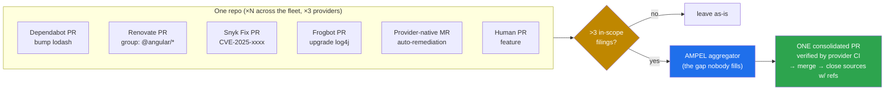
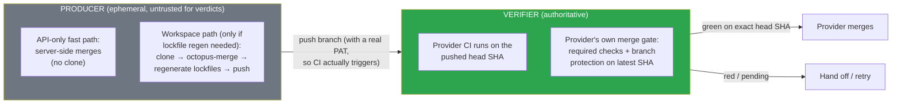
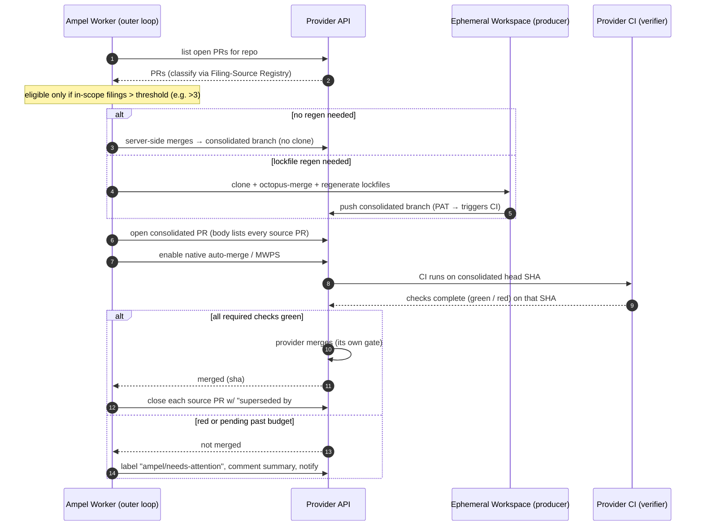
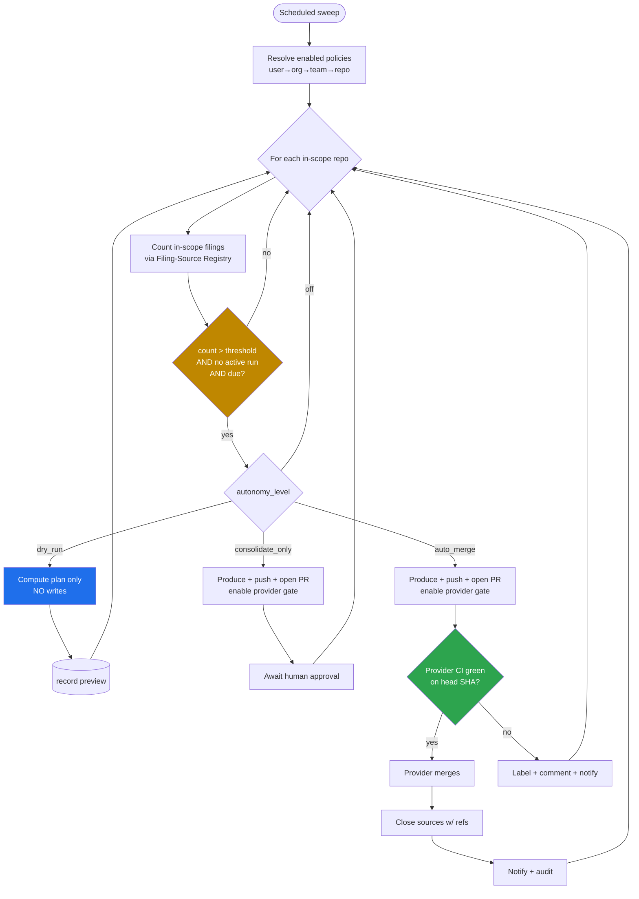
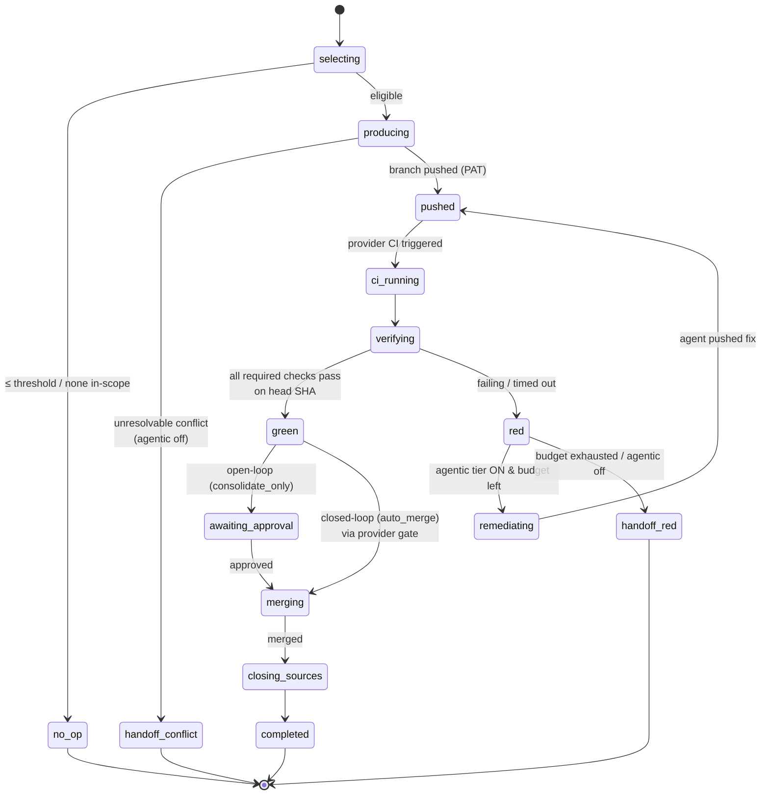
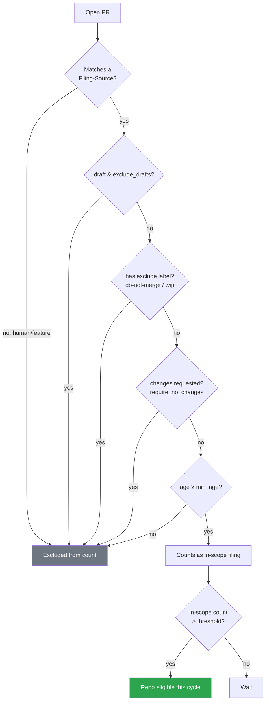

# Cross-Provider Filing Aggregation — Research, Flows & Configurability

> **Companion to `FLEET_PR_REMEDIATION_LOOPS.md`.** That document defined the loop, the worker, the data model, and the safety model. This one answers three follow-up questions: (1) *what is actually filing all these PRs, across every provider, and how do we aggregate them?* — with citations; (2) *how do we make the git provider — not a sandbox — the source of truth for builds and verification?*; and (3) *what configuration, outcomes, and UX should we design for?* It leans on diagrams so the mechanism is legible end-to-end.

---

## Table of Contents

1. [The Problem, Precisely](#1-the-problem-precisely)
2. [Research: The Filing Landscape Across Providers](#2-research-the-filing-landscape-across-providers)
3. [Design Implication: The Filing-Source Registry](#3-design-implication-the-filing-source-registry)
4. [The Provider Is the Source of Truth](#4-the-provider-is-the-source-of-truth)
5. [End-to-End Flow Diagrams](#5-end-to-end-flow-diagrams)
6. [The Refined Run State Machine](#6-the-refined-run-state-machine)
7. [Configurability: Effective *and* Intuitive](#7-configurability-effective-and-intuitive)
8. [Expected Outcomes](#8-expected-outcomes)
9. [Open Decisions](#9-open-decisions)
10. [Citations](#10-citations)

---

## 1. The Problem, Precisely

A portfolio owner does **not** have one bot per repo. A single repository routinely accumulates filings from **several independent tools at once** — Dependabot, Renovate, Snyk, JFrog Frogbot, the provider's own native remediation, plus the occasional human PR — and the same is true for *every* repo, spread across GitHub, GitLab, and Bitbucket. Each tool:

- files **one PR per concern** (per dependency, per vulnerability, per ecosystem),
- uses its **own** branch-naming, labels, author identity, and PR-body format,
- enforces its **own** open-PR throttle, and
- runs its **own** autonomous open/close behavior.

The result is the well-documented "PR tsunami" — *"One PR per dependency. 100 projects? 100 PRs"* [[6]](#10-citations), teams *"flooded with 200 PRs/week"* [[6]](#10-citations). Critically, **the tools each cap and sometimes group their *own* output, but none aggregate *across* tools, and none operate as a fleet control plane across providers.** That whitespace is exactly what Ampel fills.



*Figure 1 — The aggregation gap. Many heterogeneous tools file individually; Ampel coalesces their output into one provider-verified PR. The human PR is excluded by policy (see §3, §7).*

---

## 2. Research: The Filing Landscape Across Providers

The table is the core finding. **Coverage, native grouping, per-tool throttles, and autonomous close behavior all vary — and Ampel must interoperate with each.**

| Tool | GitHub | GitLab | Bitbucket | Azure | Files | Native grouping? | Own open-PR throttle | Auto-closes its own PRs? |
|---|:--:|:--:|:--:|:--:|---|---|---|---|
| **Dependabot** | ✅ native | ⚠️ via `dependabot-core` only | ⚠️ via `dependabot-core` only | ⚠️ | 1 PR/dependency | Grouped + cross-ecosystem (2025) [[5]](#10-citations) | `open-pull-requests-limit` [[16]](#10-citations) | Yes — closes superseded PRs when a combined branch merges [[3]](#10-citations) |
| **Renovate** (Mend) | ✅ | ✅ | ✅ (Cloud + Server) | ✅ | 1 PR/dep or group | Yes, out-of-the-box presets [[2]](#10-citations) | `prConcurrentLimit` [[7]](#10-citations) | "Immortal PR" recreation; branch+title = cache key [[4]](#10-citations) |
| **Snyk** | ✅ (+GHE, Cloud App) | ✅ | ✅ (Server, Cloud, Connect) | ✅ | 1 PR/project; "fix all for same dep in one PR" | Limited (per-dependency) [[8]](#10-citations) | **Skips upgrade PRs at ≥5 open**, configurable 1–10 [[9]](#10-citations) | Yes — auto-closes obsolete Fix PRs + posts a comment [[10]](#10-citations) |
| **JFrog Frogbot** | ✅ | ✅ | ✅ (Server) | ✅ | 1 PR/fix, **or** `aggregateFixes: true` → one PR [[11]](#10-citations) | Optional single aggregated PR [[11]](#10-citations) | n/a (CI-driven) | — |
| **GitLab native** (Auto Remediation / Resolve-with-MR) | — | ✅ | — | — | 1 MR/vuln (patch/minor only) [[12]](#10-citations) | **Batching "planned for beta," not shipped** [[12]](#10-citations) | **Max 3 open MRs per project** [[12]](#10-citations) | via standard MR lifecycle |
| **Others** (Mend Bolt, Socket.dev, pyup, Depfu, Greenkeeper†, Scala Steward, Pixee…) | varies | varies | varies | varies | varies | varies | varies | varies |

† Greenkeeper is deprecated; an academic survey tracks the decline of Greenkeeper/Depfu/pyup and the dominance of Dependabot + Renovate [[15]](#10-citations).

**Five research takeaways that drive the design:**

1. **Cross-provider parity is real but uneven.** Renovate, Snyk, and Frogbot all genuinely span GitHub + GitLab + Bitbucket (+Azure) [[1]](#10-citations)[[8]](#10-citations)[[11]](#10-citations). Dependabot is **GitHub-native and officially GitHub-only**; non-GitHub support exists only via the `dependabot-core` self-host path [[2]](#10-citations). So on GitLab/Bitbucket the filers are usually Renovate/Snyk/Frogbot/native — Ampel can't assume "Dependabot" off-GitHub.

2. **Branch/author/label is identity.** Every tool finds *its own* PRs by branch prefix + title (Renovate's cache key [[4]](#10-citations)), branch prefix/regex (the `combine-prs` model [[3]](#10-citations)), or tracked issue IDs (Snyk [[10]](#10-citations)). Ampel must recognize filings the same way — via configurable matchers, not guesswork.

3. **They already throttle — per tool, per repo — which proves both the pain and the gap.** Snyk stops at 5 open PRs [[9]](#10-citations); GitLab native caps at 3 MRs and does **one vuln per pipeline run with batching unshipped** [[12]](#10-citations); Dependabot/Renovate expose `open-pull-requests-limit`/`prConcurrentLimit` [[16]](#10-citations)[[7]](#10-citations). These caps confirm volume is a first-class problem *and* that no tool solves it across tools/providers.

4. **They open *and close* autonomously — so Ampel must coordinate, not collide.** Snyk auto-closes obsolete Fix PRs with an explanatory comment [[10]](#10-citations); Dependabot closes superseded PRs after a combined merge [[3]](#10-citations); Renovate recreates "immortal" grouped PRs if closed wrong [[4]](#10-citations). If Ampel closes a Renovate PR with the wrong semantics, Renovate reopens it. Coordination rules are mandatory (§3).

5. **Provider CI is *already* everyone's verifier.** Dependabot's compatibility score is literally *"how many other repositories have passing CI tests for the proposed update"* [[2]](#10-citations). GitLab's own remediation flow says: *add a commit, this forces a new pipeline, then confirm the vulnerability is gone* [[12]](#10-citations). The whole ecosystem already treats the provider's pipeline as the arbiter — which validates the §4 architecture.

---

## 3. Design Implication: The Filing-Source Registry

Because filings are heterogeneous, Ampel needs a small, extensible **Filing-Source Registry**: per provider, a set of matchers that classify an open PR as an "in-scope filing," plus the coordination behavior for closing it.

```
FilingSource {
  id: "dependabot" | "renovate" | "snyk" | "frogbot" | "gitlab-native" | <custom>
  match: {
    authors:        ["dependabot[bot]", "renovate[bot]", "snyk-bot", ...]
    branch_prefixes:["dependabot/", "renovate/", "snyk-fix-", "frogbot-", ...]
    labels:         ["dependencies", "security", ...]
  }
  close_behavior:   "close_with_comment" | "let_originator_reconcile" | "comment_only"
  recreates_if_closed: bool   # Renovate immortal-PR guard
  notes: "..."
}
```

Ships with defaults for the big five and is **user-extensible** (a team's internal bot, a fork of Snyk, etc.). The registry feeds three things: the **eligibility count** (only in-scope filings count toward the ">3" gate — a human feature PR is not a filing), the **selection** of which branches to coalesce, and the **close semantics** so Ampel never fights an originating bot.

**Coordination rules (default):**
- Close a source PR **only after** the consolidated PR merges, with a comment back-referencing it.
- For `recreates_if_closed` sources (Renovate groups), **don't delete the source branch** and prefer letting the originator reconcile against the merged result; otherwise the bot resurrects the PR [[4]](#10-citations).
- For Dependabot, rely on its native superseded-PR auto-close when the combined branch lands [[3]](#10-citations); Ampel's comment is belt-and-suspenders.
- Never coalesce a PR a bot has marked as needing human attention, or a human-authored PR (policy-gated).

---

## 4. The Provider Is the Source of Truth

You asked to make the **actual git provider — not a sandbox — the authority on builds and verification.** The clean way to honor that is a strict separation of two roles:



*Figure 2 — Producer vs. verifier. Ampel (optionally via an ephemeral workspace) only **produces and pushes** a candidate branch. The provider **runs CI and gates the merge**. The workspace never runs the build that decides "green."*

Three principles make this airtight:

1. **Push with a real token so the provider's CI actually runs.** The classic `combine-prs` gotcha is that the default Actions token *won't* re-trigger CI on a generated branch — you need a PAT or App token [[3]](#10-citations). Ampel already authenticates with PATs, so a push triggers the repo's real pipeline. No Ampel-side build is involved in the verdict.

2. **Read status on the *exact head SHA*.** GitHub only counts required checks that ran *against the latest commit SHA*; checks from a previous SHA don't count [[13]](#10-citations). Ampel reads the combined check/commit-status for the consolidated branch's head SHA — never a cached or PR-level approximation.

3. **Push the merge *decision* into the provider's own gate.** Rather than Ampel polling-and-merging, prefer enabling the provider's native gate so the *provider* merges when, and only when, its own rules are satisfied:

| Provider | "Provider gates the merge when green" mechanism |
|---|---|
| **GitHub** | **Auto-merge** — merges automatically once required reviews + required status checks pass [[14]](#10-citations). Optionally a **merge queue**, which validates the PR against the latest base on a temporary branch and drops anything that fails [[14]](#10-citations). |
| **GitLab** | **Merge when pipeline succeeds** / Auto-merge on the consolidated MR; approval policies enforce required scanners [[12]](#10-citations). |
| **Bitbucket** | **Merge checks** (e.g., minimum successful builds / required passing pipeline) on the consolidated PR. |

With native gating, Ampel's role narrows to: *produce the candidate, open the PR, enable the provider's gate, observe the outcome, then close the sources.* The provider owns build, verification, and the merge trigger. (Ampel still keeps a **mediated fallback**: poll the head-SHA status and call the merge API itself, **re-verifying mergeability immediately before merge** for providers/repos where native auto-merge is unavailable or disabled — note GitHub's recent ruleset/auto-merge `422` quirk as a reason to keep the fallback [[14]](#10-citations).)

**Is the workspace still needed?** Only as a *producer*, and only sometimes:
- **No regeneration needed** (disjoint manifest edits, or the bots already wrote correct lockfiles): use the **API-only fast path** — server-side merges, zero clone, zero sandbox.
- **Regeneration needed** (lockfile conflicts — the common npm/yarn/pnpm/Cargo/go.sum case): a minimal ephemeral workspace clones, octopus-merges, regenerates lockfiles deterministically, and pushes. It **does not** run tests to decide anything; that's the provider's pipeline. This squarely answers the concern: *the sandbox is a candidate factory, never the source of truth.*

---

## 5. End-to-End Flow Diagrams



*Figure 3 — One aggregation run. The provider's CI and merge gate are authoritative; Ampel orchestrates and records.*



*Figure 4 — The outer loop with the autonomy ladder. `dry_run` is the default first rung: it computes the plan and writes nothing, so operators see exactly what would happen before granting write autonomy.*

---

## 6. The Refined Run State Machine

This refines Doc 1's machine to make the provider-CI verification and the native-gate path explicit.



*Figure 5 — Every path to a merge passes through `verifying`, which reads the provider's checks on the exact head SHA. The agent (if enabled) re-enters at `pushed`; it never short-circuits verification.*

---

## 7. Configurability: Effective *and* Intuitive

The hard part of configuration is the **tension the ecosystem already illustrates**: Renovate is maximally effective but its knob-count earns jokes about needing *"a PhD in YAML"* [[6]](#10-citations); Dependabot is trivially intuitive but *"dumb as a rock"* for complex needs [[6]](#10-citations). Ampel should sit deliberately between them using two levers proven by the same tools:

### 7.1 Presets + progressive disclosure

Ship a few **named presets** that set the entire knob-set sensibly — the Renovate "config presets" idea [[2]](#10-citations) and Snyk's org→project inheritance [[8]](#10-citations) are the precedent. Most operators pick a preset per scope and never open the advanced panel.

| Preset | Eligibility | Selects | Merge gate | Tier |
|---|---|---|---|---|
| **Security-only** | >3 in-scope, severity ≥ High | Snyk/native/Frogbot CVE filings | auto-merge if green | mechanical |
| **Conservative** | >3 in-scope | bot patch/minor only; exclude major | consolidate_only (human approves) | mechanical |
| **Balanced** (default) | >3 in-scope | all bot filings; exclude drafts/major | auto-merge if green | mechanical |
| **Aggressive** | >2 in-scope | all bot filings incl. major | auto-merge if green | agentic on red |

Underneath, an **Advanced** accordion exposes the full knob-set from Doc 1 §8 (threshold, schedule, PR-selection filters, strategy, concurrency, agent budgets) plus the Filing-Source Registry editor. Progressive disclosure keeps the default surface tiny.

### 7.2 The eligibility decision (what the user is really configuring)



*Figure 6 — Eligibility is the heart of the config. The user tunes which PRs "count" and the count threshold; everything else follows. Showing this as a live filter (with counts) in the UI is what makes it intuitive.*

### 7.3 What makes it intuitive (UX)

- **Dry-run / preview across the fleet is the #1 intuitiveness lever** — borrowed from Renovate's "onboarding PR" idea of *showing what it will do before it does it* [[6]](#10-citations). Before enabling auto-merge, the operator sees, per repo: which filings would be coalesced, predicted conflicts, and the would-be outcome.
- **The traffic-light fleet view** (Ampel's existing `AmpelStatus` metaphor) makes "what's eligible / what ran / what's red" scannable at a glance.
- **Live eligibility counts** next to each filter, so toggling "exclude major" visibly changes the in-scope count.
- **One toggle to start, presets to shape, advanced to perfect** — and a single visible kill-switch.

### 7.4 Effectiveness scorecard (so users can *tune*, not guess)

Surface per-policy metrics so "effective" is measurable, not vibes: **aggregation ratio** (filings coalesced ÷ filings), **handoff rate** (runs that ended red/needs-human ÷ runs), **CI-minutes saved** (estimated), **time-to-merge** for low-risk updates, and **bot-churn incidents** (sources that got recreated). A policy that's too aggressive shows up as a high handoff/churn rate; too timid shows a low aggregation ratio.

---

## 8. Expected Outcomes

**What the operator should expect — stated honestly, including the failure modes.**

**Wins**
- **PR-volume collapse:** from *N* filings/repo/cycle to ~**1** consolidated PR — directly attacking the *"200 PRs/week"* tsunami [[6]](#10-citations) and doing it *across tools*, which no single bot does.
- **CI-minute savings:** one pipeline run on the union instead of *N* runs plus the re-runs every bot triggers after each rebase — a cost the `combine-prs` prior art exists specifically to avoid [[3]](#10-citations). Rough model: if a repo has *N* filings and CI costs *c* minutes, naive sequential merging costs ≈ *N·c* (often more, with rebases); aggregation costs ≈ *c* per cycle.
- **Faster time-to-green for low-risk updates** (patch/minor bot bumps), with humans freed for the exceptions.
- **Cross-provider uniformity:** the same policy and the same traffic-light view over GitHub + GitLab + Bitbucket, regardless of which bots happen to file where.

**Honest non-wins (by design)**
- **Some cycles end red — and that's success.** When the union of updates breaks the build, the consolidated PR stays **unmerged** and is handed to a human. The verifier did its job; *not merging* is the correct outcome, not a failure.
- **Major-version bumps are held back** by default (the same conservative stance GitLab native takes — patch/minor only [[12]](#10-citations)). They surface for human review.
- **Conflicts outside known classes** are left out of the consolidation and reported, mirroring `combine-prs` dropping conflicting branches [[3]](#10-citations).
- **A non-zero handoff rate is expected and healthy.** Track it; drive it down by tuning presets and (optionally) enabling the agentic tier — don't expect zero.
- **Bot coordination needs the registry** (§3) or you get churn (Renovate immortal-PR recreation [[4]](#10-citations)). With it, churn should be near zero.

**Outcome envelope (qualitative, to set expectations):** on a fleet dominated by Dependabot/Renovate/Snyk patch+minor bumps, expect a high aggregation ratio and low handoff rate (most consolidations go green and merge unattended). On a fleet with frequent majors, breaking changes, or thin test suites, expect a higher handoff rate — the system becomes a *triage funnel* that still removes the per-PR busywork even when it can't auto-merge. Both are good outcomes; the scorecard (§7.4) tells the operator which regime each repo is in.

---

## 9. Open Decisions

1. **Native gate vs. mediated merge as the default.** Recommendation: prefer the provider's native auto-merge / MWPS (maximally "provider is source of truth"), with the mediated path as fallback for repos where it's unavailable.
2. **API-only fast path vs. always-workspace.** Recommendation: attempt the API-only server-side-merge path first; fall back to the ephemeral workspace only when lockfile regeneration is required.
3. **How aggressively to coalesce across *different* filing sources.** Coalescing a Snyk CVE fix + a Renovate group + a Dependabot bump into one PR maximizes volume reduction but widens the conflict surface and complicates per-source close coordination. Recommendation: make "group by source vs. one-big-PR" a policy knob, defaulting to one-big-PR with per-source dispositions recorded.
4. **Agentic tier on red.** Keep opt-in and gated behind the same external-verifier rule (Doc 1 §11).

---

## 10. Citations

1. Renovate — supported platforms (GitHub, GitLab, Bitbucket, Azure DevOps, Gitea, …), 90+ managers. `github.com/renovatebot/renovate`; `docs.renovatebot.com/modules/platform`.
2. Renovate Docs — *Bot comparison* (Dependabot GitHub-only officially; Renovate grouping presets out-of-the-box; compatibility score = passing CI across repos). `docs.renovatebot.com/bot-comparison`.
3. `github/combine-prs` — combine multiple PRs into one; branch_prefix/regex/label matching; default token won't re-trigger CI (need PAT/App); drops conflicting branches; Dependabot auto-closes superseded PRs. `github.com/github/combine-prs`.
4. Renovate Docs — *Pull requests* (branch+title cache key; "immortal PR" recreation semantics). `docs.renovatebot.com/key-concepts/pull-requests`.
5. GitHub Changelog — Dependabot single-PR cross-ecosystem grouping (2025). `github.blog/changelog/2025-07-01-single-pull-request-for-dependabot-multi-ecosystem-support`.
6. Comparison/landscape commentary — PR-tsunami pain ("200 PRs/week"), Renovate "PhD in YAML" vs Dependabot simplicity, onboarding-PR preview. DEV ("Renovate vs Dependabot… Monorepo"); appsecsanta; turbostarter.
7. Renovate — `prConcurrentLimit` to cap open PRs. turbostarter; `docs.renovatebot.com/configuration-options`.
8. Snyk Docs — Fix/Upgrade/Backlog PRs supported on GitHub/GHE/Cloud App, Bitbucket Server/Cloud/Connect, GitLab, Azure; org→project inheritance; severity/score thresholds. `docs.snyk.io/scan-with-snyk/pull-requests/...`.
9. Snyk Docs — upgrade PRs skipped when a project has ≥5 open Snyk PRs (configurable 1–10; count includes Fix/Backlog). `docs.snyk.io/.../enable-automatic-upgrade-prs-for-new-dependency-upgrades`.
10. Snyk Docs — auto-close of obsolete Fix PRs with explanatory comment, on GitHub/GitLab/Bitbucket/Azure. `docs.snyk.io/.../enable-automatic-fix-prs`.
11. JFrog Frogbot — multi-platform (GitHub/GitLab/Bitbucket/Azure); `aggregateFixes` single-PR mode; minSeverity/templates; central hierarchical config. `github.com/jfrog/frogbot`; `docs.jfrog.com/security/docs/frogbot`.
12. GitLab Docs — *Auto remediation* (service-account MRs; **max 3 open per project**; patch/minor only; one vuln/pipeline run; batching planned) and *Resolve with merge request* / *Resolve with AI*; "add a commit → forces a new pipeline → confirm fixed." `docs.gitlab.com/user/application_security/remediate/auto_remediation`; `.../vulnerabilities`.
13. GitHub Docs — required status checks evaluated against the **latest commit SHA**; prior-SHA checks don't count. `docs.github.com/.../troubleshooting-required-status-checks`.
14. GitHub Docs — **auto-merge** (merges when required reviews + checks pass) and **merge queue** (temp branches validated against latest base, failing PRs dropped); ruleset/auto-merge 422 quirk. `docs.github.com/.../automatically-merging-a-pull-request`; `.../managing-a-merge-queue`.
15. Academic survey — prevalence of dependency bots (Dependabot, Renovate, Greenkeeper, Depfu, Pyup); Greenkeeper/Depfu/Pyup decline, Dependabot/Renovate dominance. PMC9044236.
16. Dependabot — `open-pull-requests-limit` config field. GitHub Docs; turbostarter/reintech examples.

---

*Companion to `FLEET_PR_REMEDIATION_LOOPS.md`. Grounded in the current `main` of `pacphi/ampel` (provider trait, Apalis worker, `AmpelStatus`, hierarchical config). External-tool behaviors cited above can change; verify against each vendor's current docs before implementation.*
