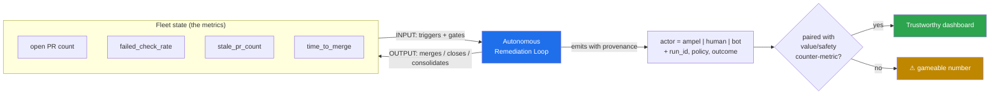
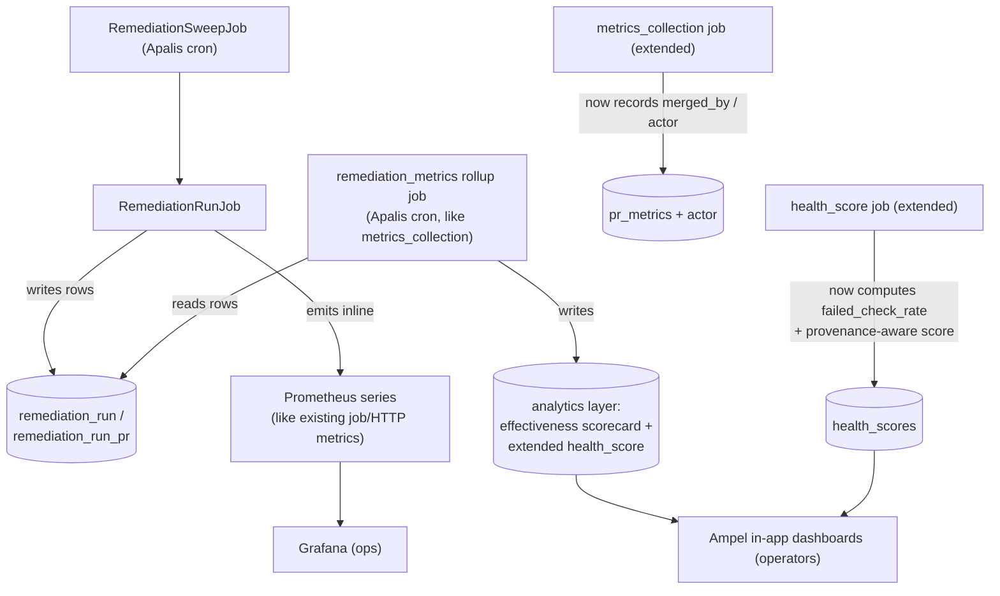

# Observability & Metrics for Autonomous Remediation

> **Third companion to `FLEET_PR_REMEDIATION_LOOPS.md` and `…AGGREGATION_RESEARCH_AND_FLOWS.md`.** Those defined the loop and the aggregation. This one answers: *with Ampel now **acting** on the fleet, what do we measure, how is it updated automatically, which existing metrics get promoted to front-and-center, and what new metrics must be surfaced?*

---

## 1. The Shift That Changes Everything: Observer → Actor

Until now, every Ampel metric has been **descriptive**: Ampel watched PRs and reported on them. Time-to-merge, throughput, health score — all passively *measured*. The autonomous capability flips this. Ampel now **moves** the very metrics it reports. That single change has three consequences that drive the entire metrics design:

1. **Attribution becomes mandatory.** "Average time-to-merge dropped 70%" is meaningless — even misleading — unless you can split it by *who merged it*: a human, Ampel autonomously, or an external bot. Without an actor dimension, a flood of trivial Ampel auto-merges can hide the fact that human-reviewed PRs got *slower*. **Every business metric needs a `merged_by` / `actor` provenance label.**

2. **Metrics become a closed feedback loop, not a report.** The loop *consumes* metrics as inputs (open-PR-count > threshold, health score, stale count) and *produces* changes to those same metrics as outputs. The dashboard must show the loop's effect **and** guard against the loop gaming its own metrics.

3. **Goodhart's law goes operational.** When an autonomous system can move a number, that number can be gamed. The loop could shrink "open PR count" by *closing* PRs without delivering value. So we deliberately **pair every efficiency metric with a value/safety counter-metric** (see §4.2). Efficiency numbers are never read alone.

*Figure 1 — Metrics are now both the loop's inputs and its outputs. Provenance + paired counter-metrics keep the picture honest.*

---

## 2. What Ampel Captures Today (the baseline)

Grounded in the current `main`:

**Prometheus operational metrics** (`docs/observability/METRICS.md`): HTTP (`ampel_http_requests_total`, `…_request_duration_seconds`), auth, DB pool/query, **Apalis jobs** (`ampel_jobs_queued`, `ampel_jobs_processed_total`, `ampel_job_duration_seconds`, `ampel_job_retry_count`), **business** (`ampel_prs_total`, `ampel_pr_time_to_merge_seconds`, `ampel_pr_time_to_first_review_seconds`, `ampel_pr_review_rounds`, `ampel_repos_synced_total`, `ampel_repos_sync_errors_total`, `ampel_repo_last_sync_timestamp`), **provider API** (`ampel_provider_api_requests_total`, `…_duration_seconds`, `ampel_provider_rate_limit_remaining`), system/Tokio.

**Analytics layer** (DB + `analytics.rs`): `pr_metrics` (`time_to_first_review`, `time_to_approval`, `time_to_merge`, `review_rounds`, `comments_count`, `is_bot`, `merged_at`) and `health_score` (`score` 0–100, `avg_time_to_merge`, `avg_review_time`, `stale_pr_count`, `failed_check_rate`, `pr_throughput`). The API surfaces `AnalyticsSummary` (total merged, avg TTM, avg review, **bot_pr_percentage**, top contributors) and repository health with trend + history.

**Collection** (Apalis cron): `metrics_collection` (5 min — backfills `pr_metrics`), `health_score` (hourly), `poll_repository` (1 min), `cleanup` (daily).

**Dashboards/alerts:** `ampel-overview.json` has 6 panels — five infra (HTTP rate/duration/status, DB connections) and **one** business (Active PRs). All five Prometheus alerts (`HighErrorRate`, `HighLatency`, `DatabaseDown`, `HighDatabaseConnections`, `ServiceDown`) are infrastructure.

**Two gaps autonomy forces us to close immediately:**
- `health_score.failed_check_rate` is written as `None` — the code literally notes *"Would need to track failed checks."* The loop **gates on CI**, so this can no longer be optional.
- The user-facing picture is infra-heavy. Autonomy makes the **business and safety** layers the main event.

---

## 3. Existing Metrics That Become Front-and-Center

These already exist (or are half-built) but get **promoted** because the loop now acts on them.

| Existing metric | Was | Becomes with autonomy |
|---|---|---|
| **`failed_check_rate`** (currently `None`) | Untracked nice-to-have | **The verifier's core signal.** The loop merges only on green; CI pass/fail per repo and per consolidated PR is now mission-critical. Finally implemented. |
| **Open PR count / repo** | A passive stat | **The trigger condition** (`> 3`). Surfaced per repo with the threshold line drawn on it. |
| **`stale_pr_count`** | A health input | **A primary success metric** — the thing the loop is built to drive down. Tracked before/after. |
| **`pr_time_to_merge_seconds`** | Single aggregate | **Segmented by actor.** Autonomous bot-bump merges should show dramatically lower TTM; human PRs tracked separately so the average can't lie. |
| **`provider_rate_limit_remaining`** | Infra trivia | **Safety-critical.** The loop makes many *write* calls across the fleet; rate-limit headroom now governs whether remediation can run at all. |
| **`ampel_jobs_*` / `ampel_job_duration_seconds`** | Generic job health | The **sweep + run jobs are these jobs** — their duration, failures, and retries are the autonomous capability's operational pulse. |
| **`bot_pr_percentage`** | Context stat | Front-and-center: it estimates *how much of the fleet's PR volume is even automatable*. |
| **`repos_sync_errors_total` / `repo_last_sync_timestamp`** | Sync hygiene | Now a **correctness precondition** — the loop must act on fresh state; stale sync = unsafe to remediate. |

---

## 4. New Metrics to Surface

Three families. The loop instruments itself by writing `remediation_run` / `remediation_run_pr` rows (Doc 1 data model) and emitting Prometheus series inline, exactly like the existing job/HTTP metrics.

### 4.1 Effectiveness / value

| Metric | Definition | Why it matters |
|---|---|---|
| **Aggregation ratio** | source filings coalesced ÷ source filings | Headline volume-collapse number |
| **PR-volume reduction** | filings-in ÷ consolidated-PRs-out (per cycle/fleet) | The "200 PRs/week → 5" story |
| **CI-minutes saved (est.)** | Σ (N_filings − 1) × avg_ci_minutes | Direct cost story for finance |
| **Autonomy coverage** | eligible repo-cycles auto-merged w/o human ÷ eligible repo-cycles | How much work runs unattended |
| **Time-to-remediate (TTR)** | *original filing opened* → superseded/merged | Funnel metric (measure from the filing, **not** the consolidated PR) |
| **Mean time to green** | consolidated PR opened → all required checks green | Loop responsiveness |
| **CVE remediation latency** | CVE filing detected → fix merged | The security SLA; high-value given the CVE framing |

### 4.2 Safety / trust — the most important *new* family

These are the counter-metrics that keep §4.1 honest. **Autonomy without these is reckless.**

| Metric | Definition | Target |
|---|---|---|
| **Rollback / revert rate** | Ampel-merged PRs later reverted ÷ Ampel merges | **The** trust metric. Near-zero. A human reverting an Ampel merge is a loud failure signal |
| **Post-merge default-branch breakage** | default-branch CI failures attributable to an Ampel merge | ~0 (we gate on green); non-zero catches *verifier blind spots* |
| **Handoff rate** | runs ending red / needs-human ÷ runs | Healthy non-zero; spikes mean a preset is too aggressive |
| **Verifier-escape rate** | merges that passed CI but regressed downstream | Measures gap in the "green = safe" assumption |
| **Bot-churn incidents** | source PRs recreated after Ampel closed them | Renovate immortal-PR collisions; should be ~0 with the Filing-Source Registry |
| **Conflict/skip rate** | filings left out due to unresolvable conflicts | Coverage gap indicator |
| **Human override events** | operators disabling a policy / pausing | Trust/satisfaction proxy |
| **Value-vs-noise check** | value merged ÷ PRs closed | Guards against "close to shrink open count" gaming |

### 4.3 Operational / cost (the loop itself)

| Metric | Definition |
|---|---|
| **Run outcomes** | counter by terminal state: `completed` / `handoff_red` / `handoff_conflict` / `no_op` / `failed` |
| **Runs per cycle, run duration, retries** | from the new Apalis remediation jobs |
| **Write-operation volume + rate-limit headroom** | provider writes during a sweep vs. remaining quota |
| **Approval latency** (open-loop) | consolidated PR opened → human approves |
| **Sources closed-with-ref vs. left-open** | disposition split per run |
| **Agentic tier** (if enabled) | tokens/cost per remediation, iterations-to-green, agent success rate, budget-exhaustion count |

---

## 5. How These Update Automatically

No manual reporting. The autonomous capability is its own instrument, reusing the established pattern:

*Figure 2 — Three small, additive changes: (a) the remediation jobs emit Prometheus + write run rows; (b) a new `remediation_metrics` rollup job aggregates runs into the analytics layer; (c) the existing `metrics_collection` and `health_score` jobs are extended for actor-provenance and `failed_check_rate`.*

**Three instrumentation rules that matter:**
- **Stamp provenance at the source.** Add `merged_by` (`human` / `ampel` / `external_bot`) + `remediation_run_id` to `pr_metrics`. This one column makes every existing aggregate splittable by actor.
- **Measure value funnels from the filing, not the consolidated PR.** TTR and CVE-latency start at the *original* filing's `created_at`; the consolidated PR is an internal step.
- **Extend, don't fork, the health score.** Now that `failed_check_rate` is real, fold it in — *and* make the score provenance-aware so auto-closing PRs can't inflate it without merged value.

---

## 6. Dashboards: From Infra-Watching to Mission Control

### 6.1 New dashboard — "Autonomous Remediation" (the loop's cockpit)

Top-line tiles: **Aggregation ratio · Autonomy coverage · Handoff rate · Rollback rate · CVE remediation latency**. Then: fleet eligibility map (repos over/under threshold, traffic-lit via `AmpelStatus`), run-outcome funnel (selecting → producing → verifying → merged / handoff), CI-minutes-saved trend, rate-limit headroom during sweeps, and (if enabled) agent cost/iterations. This is the operator's primary surface — the in-app React dashboard, not just Grafana.

### 6.2 Existing overview dashboard — promote the business layer

It's 5/6 infra today. Add panels that autonomy makes essential: **open-PR-count vs. threshold**, **failed_check_rate trend**, **autonomous-vs-human merge split**, **stale-PR trend (before/after)**. Infra panels stay but step back.

### 6.3 Two audiences, two surfaces

- **Grafana (ops/SRE):** loop reliability — job duration/failures, provider write volume, rate-limit headroom, queue depth.
- **Ampel in-app (operators/portfolio owners):** the *effectiveness scorecard* (Doc 2 §7.4), run timeline, fleet view, audit log. This is where dashboards "become even more important": they're now the **control surface for an autonomous system**, not a passive report.

---

## 7. New Alerts (today's are all infrastructure)

Autonomy needs **business- and safety-level** alerts alongside the existing five:

| Alert | Fires when | Severity |
|---|---|---|
| **Rollback-rate spike** | Ampel-merge revert rate exceeds threshold | **critical** — pause autonomy |
| **Default-branch breakage by Ampel** | an Ampel merge red-lights main | critical |
| **Handoff-rate spike** | sudden rise in red/needs-human runs | warning — preset too aggressive |
| **Runaway repo / loopmaxxing** | one repo consumes disproportionate runs or re-consolidates repeatedly | warning |
| **Rate-limit exhaustion during sweep** | `provider_rate_limit_remaining` low while remediating | warning — back off |
| **Remediation job failure / stuck run** | run stuck in a state past SLA, or job errors | warning |
| **Agent budget blown** (agentic tier) | iterations/cost ceiling hit without green | info |
| **Bot-churn detected** | closed sources getting recreated | warning — registry mismatch |

A spiking **rollback rate** should be wired to **auto-pause** the relevant policies (degrade to `consolidate_only`) — the metric doesn't just inform, it brakes the loop.

---

## 8. The One-Paragraph Answer

With autonomy, Ampel stops describing the fleet and starts steering it, so the metric set splits into three: (1) **promoted existing metrics** — `failed_check_rate` (finally implemented, now the verifier's core signal), open-PR-count (now the trigger), `stale_pr_count` (now a target), time-to-merge (now actor-segmented), and `provider_rate_limit_remaining` (now safety-critical); (2) **new effectiveness metrics** — aggregation ratio, autonomy coverage, time-to-remediate, CI-minutes saved, CVE remediation latency; and (3) **new safety/trust metrics** — rollback rate, post-merge breakage, handoff rate, bot-churn — which must be surfaced *beside* every efficiency number so the loop can't game its own dashboard. All of it updates automatically through the same Apalis-job + Prometheus + analytics-rollup pattern Ampel already uses; the only genuinely new ingredients are an **actor/provenance stamp on `pr_metrics`** and a **`remediation_metrics` rollup job**. The dashboards stop being infra-watching and become mission control for an autonomous system — which is why they matter more, not less.

---

*Companion to the remediation-loops design package. Grounded in the current `main` of `pacphi/ampel` (`docs/observability/METRICS.md`, `health_score`/`pr_metrics` entities, the Apalis collection jobs, `ampel-overview.json`, and `monitoring/alerts/ampel.yml`).*
