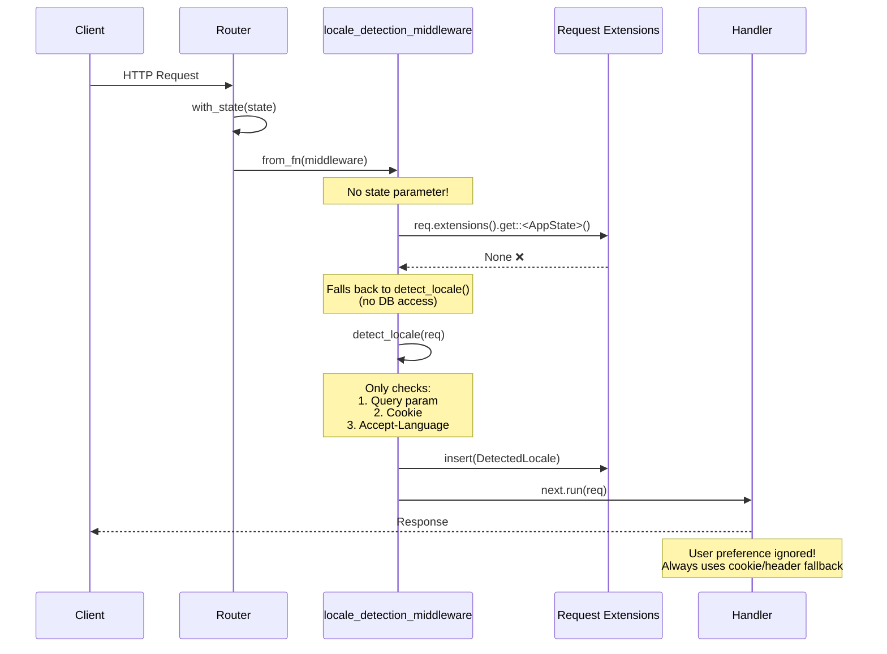
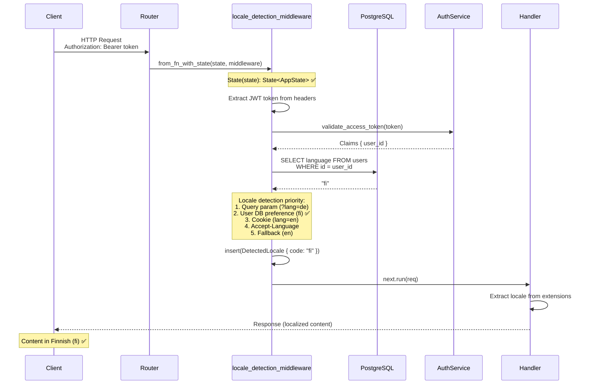
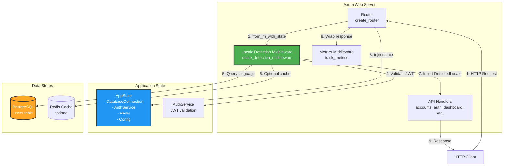
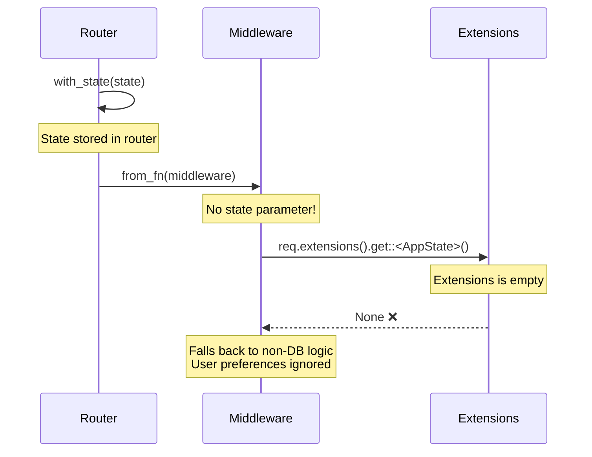
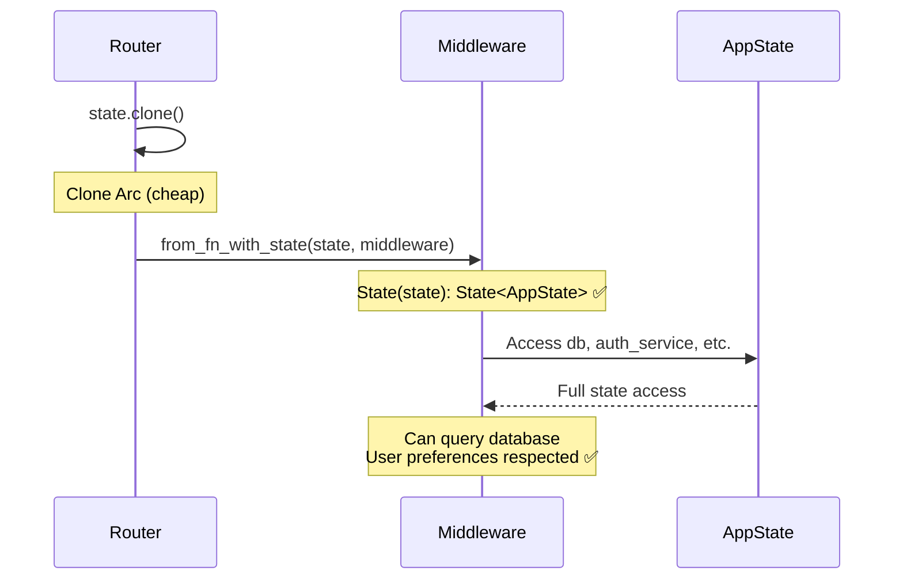
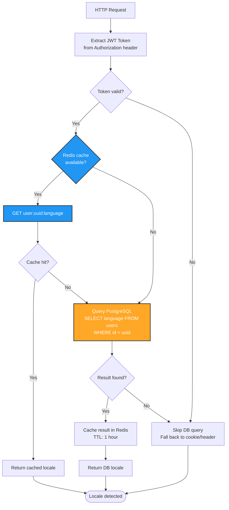
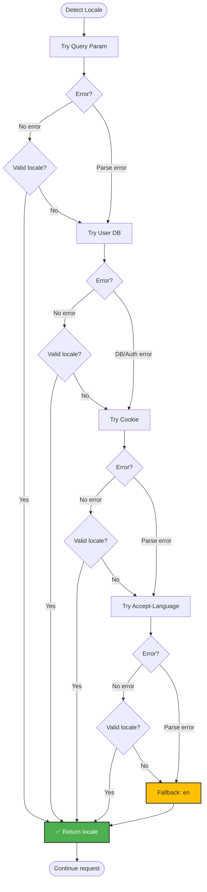
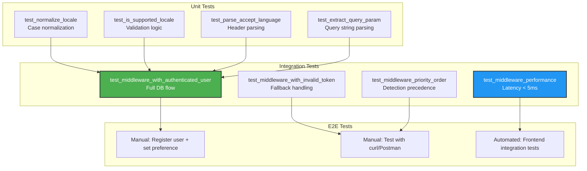

# Locale Detection Middleware Flow Diagrams

## Current Architecture (Broken - Axum 0.7)



## Proposed Architecture (Fixed - from_fn_with_state)



## Component Interaction (C4 - Container Level)



## Middleware Execution Order

```mermaid
flowchart LR
    Request[HTTP Request] --> Router

    Router --> LocaleMiddleware
    LocaleMiddleware -->|"✅ Detect locale<br/>Insert DetectedLocale"| MetricsMiddleware

    MetricsMiddleware -->|"✅ Record metrics<br/>Track latency"| Handler

    Handler -->|"✅ Use locale<br/>Extension(DetectedLocale)"| Response

    Response --> Client[HTTP Response]

    style LocaleMiddleware fill:#4CAF50,stroke:#333,stroke-width:2px,color:#fff
    style MetricsMiddleware fill:#2196F3,stroke:#333,stroke-width:2px,color:#fff
    style Handler fill:#FF9800,stroke:#333,stroke-width:2px,color:#fff
```



**Key Points**:

- Middleware executes in **registration order** (first registered = outermost layer)
- Locale detection runs **before** metrics (so metrics can record locale)
- Both middleware layers wrap handlers (**onion model**)

## Locale Detection Priority Flow

```mermaid
flowchart TD
    Start([Incoming Request]) --> CheckQuery

    CheckQuery{Query param<br/>?lang=xx}
    CheckQuery -->|Yes + Valid| ReturnQuery[Return Query Locale]
    CheckQuery -->|No / Invalid| CheckAuth

    CheckAuth{Authenticated?<br/>JWT token valid}
    CheckAuth -->|Yes| CheckDB
    CheckAuth -->|No| CheckCookie

    CheckDB{User has<br/>language pref?}
    CheckDB -->|Yes + Valid| ReturnDB[Return DB Locale]
    CheckDB -->|No / Invalid| CheckCookie

    CheckCookie{Cookie<br/>lang=xx}
    CheckCookie -->|Yes + Valid| ReturnCookie[Return Cookie Locale]
    CheckCookie -->|No / Invalid| CheckHeader

    CheckHeader{Accept-Language<br/>header}
    CheckHeader -->|Yes + Valid| ReturnHeader[Return Header Locale]
    CheckHeader -->|No / Invalid| ReturnDefault[Return Default: en]

    ReturnQuery --> Insert[Insert DetectedLocale<br/>into request extensions]
    ReturnDB --> Insert
    ReturnCookie --> Insert
    ReturnHeader --> Insert
    ReturnDefault --> Insert

    Insert --> Next[next.run(req)]
    Next --> End([Response])

    style ReturnQuery fill:#4CAF50,stroke:#333,stroke-width:2px,color:#fff
    style ReturnDB fill:#4CAF50,stroke:#333,stroke-width:2px,color:#fff
    style ReturnCookie fill:#FFC107,stroke:#333,stroke-width:2px,color:#333
    style ReturnHeader fill:#FFC107,stroke:#333,stroke-width:2px,color:#333
    style ReturnDefault fill:#F44336,stroke:#333,stroke-width:2px,color:#fff
```

**Priority Levels**:

1. **Query param** (highest) - Explicit user override
2. **User DB preference** - Persistent user choice
3. **Cookie** - Session-based preference
4. **Accept-Language** - Browser default
5. **Default (en)** (lowest) - Fallback

## State Access Pattern Comparison

### ❌ Broken Pattern (Request Extensions)



### ✅ Correct Pattern (from_fn_with_state)



## Database Query Optimization



**Performance Notes**:

- **Redis cache hit**: < 1ms
- **PostgreSQL query**: < 5ms (indexed primary key)
- **Cache miss fallback**: < 20ms total
- **No auth token**: 0ms (skip DB entirely)

## Error Handling Flow



**Error Philosophy**:

- **No panics** - all errors are caught and handled
- **Graceful degradation** - fall back to next source
- **Always succeed** - worst case returns "en"
- **No user impact** - errors are transparent

---

## Testing Strategy Diagram



---

## Migration Path

```mermaid
flowchart LR
    Current[Current State<br/>❌ Broken middleware<br/>No DB access]

    Current -->|Step 1| UpdateSig[Update Middleware Signature<br/>Add State parameter<br/>5 min]

    UpdateSig -->|Step 2| UpdateRouter[Update Router Registration<br/>from_fn_with_state<br/>2 min]

    UpdateRouter -->|Step 3| AddTests[Add Integration Tests<br/>Test with mock DB<br/>10 min]

    AddTests -->|Step 4| RunTests[Run Test Suite<br/>make test-backend<br/>5 min]

    RunTests -->|Step 5| UpdateDocs[Update Documentation<br/>Developer guide<br/>5 min]

    UpdateDocs --> Complete[✅ Complete<br/>DB-aware locale detection<br/>Total: 30 min]

    style Current fill:#F44336,stroke:#333,stroke-width:2px,color:#fff
    style Complete fill:#4CAF50,stroke:#333,stroke-width:2px,color:#fff
```



**Rollback Plan**: If issues arise, revert to simple detection (no DB) in < 5 minutes.

---

## Architecture Principles

### 1. Fail-Safe Design

- **Multiple fallbacks**: Query → DB → Cookie → Header → Default
- **No panics**: All errors caught and handled gracefully
- **Always succeeds**: Worst case returns "en"

### 2. Performance First

- **Minimal overhead**: Single DB query for authenticated users
- **Optional caching**: Redis cache for frequent lookups
- **Early exits**: Skip DB if not authenticated

### 3. Type Safety

- **Compile-time guarantees**: State parameter enforced by compiler
- **No runtime surprises**: Can't forget to pass state
- **Clear dependencies**: Signature shows what middleware needs

### 4. Testability

- **Unit tests**: Test helper functions in isolation
- **Integration tests**: Test with mock database
- **E2E tests**: Test with real API calls

### 5. Maintainability

- **Clear code**: Simple, linear flow
- **Good docs**: Architecture decision records
- **Easy rollback**: Can revert in < 5 minutes

---

## References

- Main Architecture Document: [LOCALE_MIDDLEWARE_DESIGN.md](./LOCALE_MIDDLEWARE_DESIGN.md)
- Localization Spec: [docs/localization/SPECIFICATION.md](../localization/SPECIFICATION.md)
- Axum Middleware Guide: https://docs.rs/axum/0.7/axum/middleware/
- Tower Service Trait: https://docs.rs/tower/latest/tower/trait.Service.html
