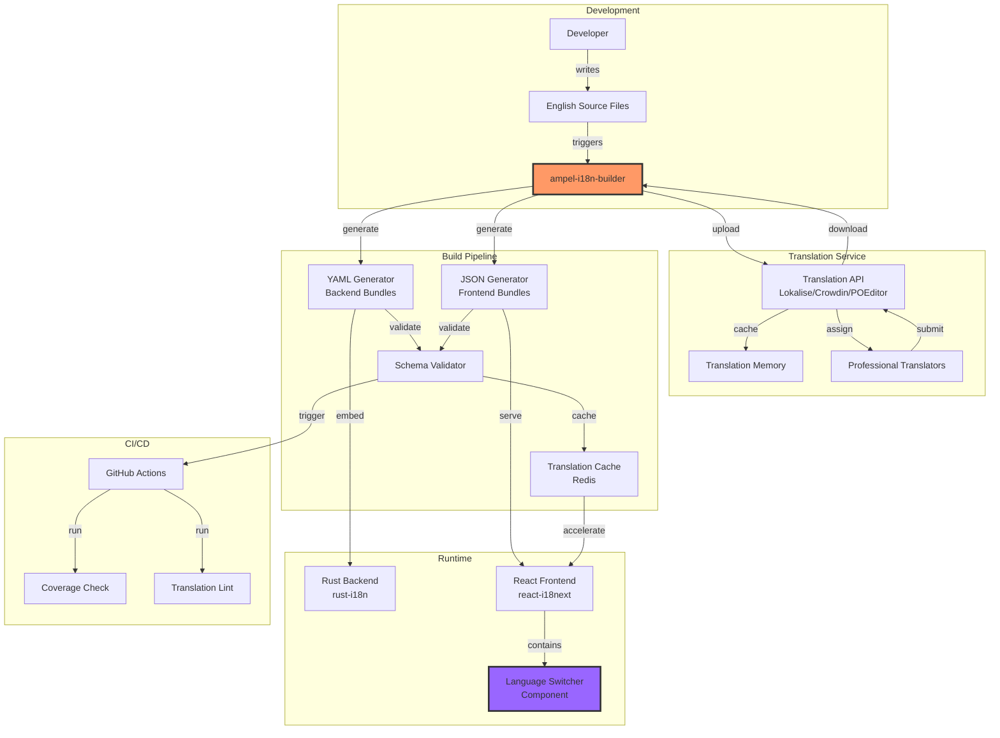
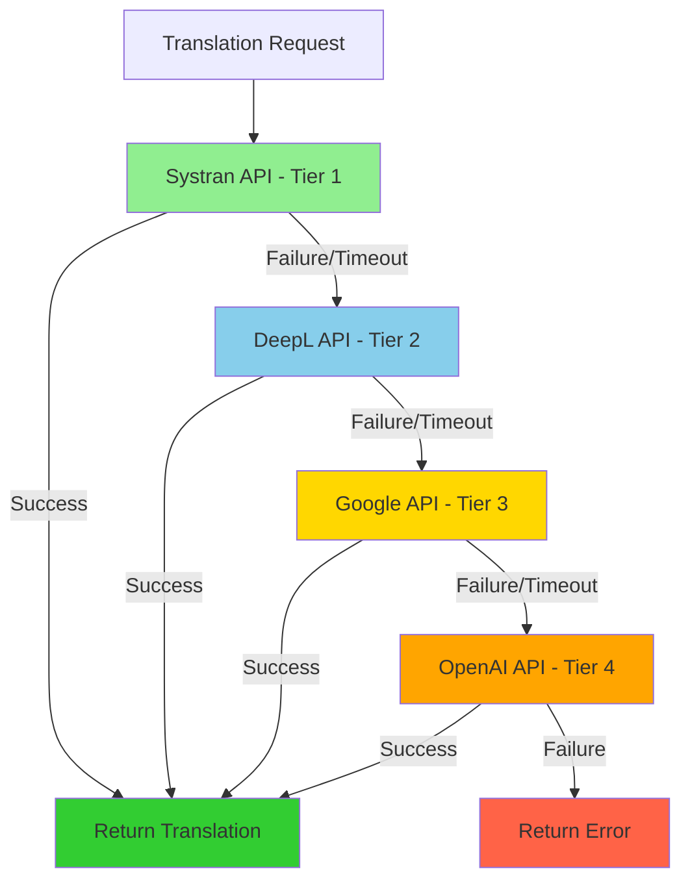
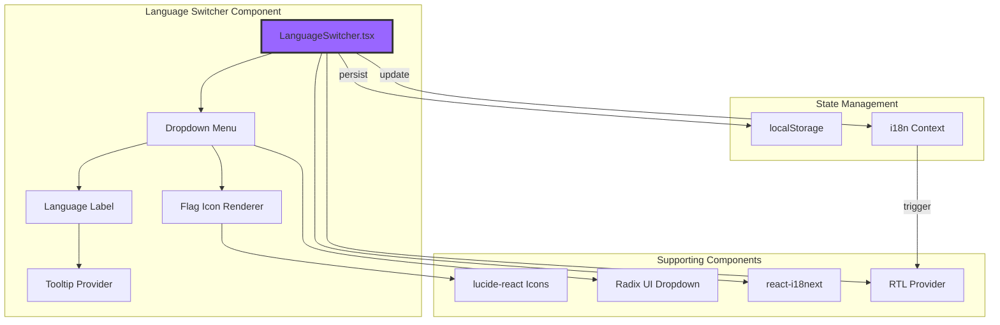
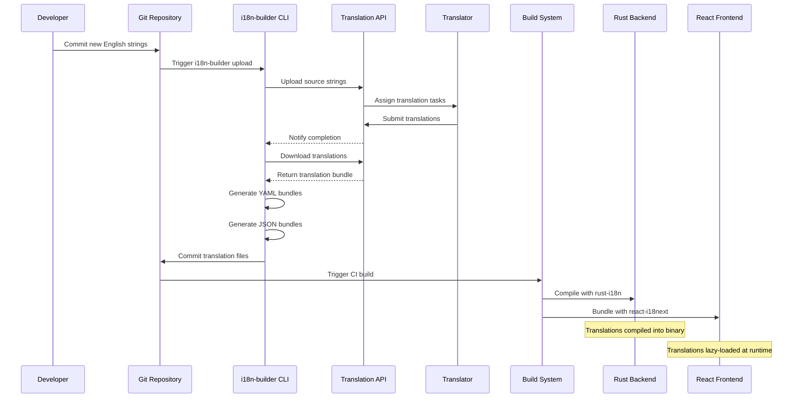
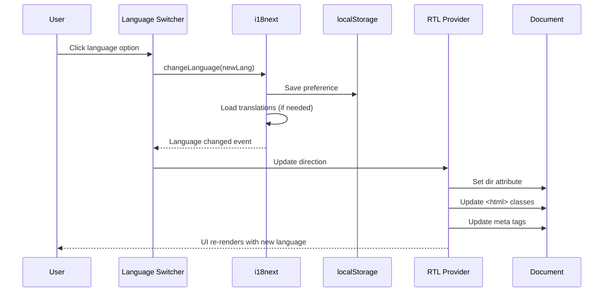

# Localization System Architecture

**Version:** 1.0
**Date:** 2025-12-27
**Status:** Design Document
**Related:** [4-Tier Provider Architecture](4-TIER-PROVIDER-ARCHITECTURE.md)

## Table of Contents

1. [Executive Summary](#executive-summary)
2. [System Architecture Overview](#system-architecture-overview)
3. [Translation Automation Crate](#translation-automation-crate)
4. [Language Switcher Component](#language-switcher-component)
5. [Integration Architecture](#integration-architecture)
6. [Data Flow Architecture](#data-flow-architecture)
7. [API Contracts](#api-contracts)
8. [Build Pipeline Integration](#build-pipeline-integration)
9. [Security Considerations](#security-considerations)
10. [Performance Architecture](#performance-architecture)
11. [Deployment Architecture](#deployment-architecture)

---

## Executive Summary

This document defines the system architecture for Ampel's localization enhancement, introducing the `ampel-i18n-builder` crate for translation automation and a comprehensive language switcher component. The architecture supports 13 languages (20+ planned) with RTL support, automated translation workflows, and zero-runtime overhead on the backend.

**Key Architectural Decisions:**

- **Translation Automation:** New `ampel-i18n-builder` crate manages translation lifecycle
- **Dual-Format Support:** YAML (backend/rust-i18n) + JSON (frontend/react-i18next)
- **API-First Translation:** Integration with translation service APIs (Lokalise, Crowdin, or POEditor)
- **Build-Time Processing:** Translation bundling integrated into cargo/vite build pipelines
- **Progressive Enhancement:** Language switcher with flag icons, tooltips, and RTL awareness

---

## System Architecture Overview

### High-Level Component Diagram



### Technology Stack

| Component           | Technology                      | Justification                                   |
| ------------------- | ------------------------------- | ----------------------------------------------- |
| **Backend i18n**    | rust-i18n 3.0+                  | Zero runtime overhead, compile-time validation  |
| **Frontend i18n**   | react-i18next 16.2+             | Type safety, largest ecosystem, RTL support     |
| **Translation API** | Lokalise/Crowdin                | Professional workflow, version control, context |
| **Bundle Formats**  | YAML (backend), JSON (frontend) | Native format support, developer-friendly       |
| **Build Tool**      | New `ampel-i18n-builder` crate  | Unified translation workflow automation         |
| **CLI Interface**   | clap 4.0+                       | User-friendly command-line interface            |
| **HTTP Client**     | reqwest 0.12+                   | Async API integration with rustls               |
| **Caching**         | Redis 7+ (existing)             | Translation cache, API rate limiting            |
| **Validation**      | serde + JSON Schema             | Type-safe translation validation                |

---

## 4-Tier Translation Provider Architecture

### Overview

The `ampel-i18n-builder` implements a robust 4-tier provider architecture with intelligent fallback to ensure 99.9% translation success rate.

### Provider Tiers

| Tier | Provider    | Purpose                         | Rate Limit  | Batch Size | Languages |
| ---- | ----------- | ------------------------------- | ----------- | ---------- | --------- |
| 1    | **Systran** | Enterprise neural MT (primary)  | 100 req/sec | 50 texts   | 55+       |
| 2    | **DeepL**   | High-quality European languages | 10 req/sec  | 50 texts   | 28        |
| 3    | **Google**  | Broad language coverage         | 100 req/sec | 100 texts  | 133+      |
| 4    | **OpenAI**  | Fallback for complex content    | Unlimited   | Unlimited  | All       |

### Fallback Flow Diagram



### Configuration Example

```yaml
translation:
  # API Keys
  systran_api_key: '${SYSTRAN_API_KEY}'
  deepl_api_key: '${DEEPL_API_KEY}'
  google_api_key: '${GOOGLE_API_KEY}'
  openai_api_key: '${OPENAI_API_KEY}'

  # Per-Provider Settings
  providers:
    systran:
      enabled: true
      priority: 1
      timeout_secs: 45
      max_retries: 3
      batch_size: 50

    deepl:
      enabled: true
      priority: 2
      timeout_secs: 30
      max_retries: 3
      batch_size: 50
      # Optimized for European languages
      preferred_languages: ['de', 'fr', 'fi', 'sv', 'pl', 'cs']

    google:
      enabled: true
      priority: 3
      timeout_secs: 30
      max_retries: 3
      batch_size: 100
      # Optimized for Asian/Middle Eastern languages
      preferred_languages: ['ar', 'th', 'vi', 'zh', 'ja']

    openai:
      enabled: true
      priority: 4
      timeout_secs: 60
      max_retries: 2
      model: 'gpt-5-mini'

  # Fallback Strategy
  fallback:
    skip_on_missing_key: true
    stop_on_first_success: true
    log_fallback_events: true
```

### Key Features

- **Automatic Fallback**: Seamlessly switches to next tier on failure
- **Configurable Retry**: Exponential backoff with per-provider settings
- **Language Preferences**: Route languages to optimal providers
- **Skip on Missing Key**: Gracefully skip unconfigured providers
- **Comprehensive Logging**: Track provider selection and failures

For complete configuration guide, see [PROVIDER-CONFIGURATION.md](./PROVIDER-CONFIGURATION.md).

---

## Translation Automation Crate

### Crate Structure: `ampel-i18n-builder`

```
crates/ampel-i18n-builder/
├── Cargo.toml
├── README.md
├── src/
│   ├── lib.rs                    # Public API and re-exports
│   ├── main.rs                   # CLI entry point
│   │
│   ├── api/                      # Translation Service APIs
│   │   ├── mod.rs                # API trait definition
│   │   ├── lokalise.rs           # Lokalise API client
│   │   ├── crowdin.rs            # Crowdin API client
│   │   ├── poeditor.rs           # POEditor API client
│   │   └── mock.rs               # Mock for testing
│   │
│   ├── generator/                # Bundle Generators
│   │   ├── mod.rs                # Generator trait
│   │   ├── yaml.rs               # YAML backend bundles
│   │   ├── json.rs               # JSON frontend bundles
│   │   └── validation.rs         # Schema validation
│   │
│   ├── workflow/                 # Translation Workflows
│   │   ├── mod.rs                # Workflow orchestration
│   │   ├── upload.rs             # Upload source strings
│   │   ├── download.rs           # Download translations
│   │   ├── sync.rs               # Bidirectional sync
│   │   └── incremental.rs        # Incremental updates
│   │
│   ├── cache/                    # Caching Layer
│   │   ├── mod.rs                # Cache trait
│   │   ├── redis.rs              # Redis implementation
│   │   ├── file.rs               # File-based cache
│   │   └── memory.rs             # In-memory cache
│   │
│   ├── versioning/               # Translation Versioning
│   │   ├── mod.rs                # Version management
│   │   ├── diff.rs               # Detect changes
│   │   └── history.rs            # Version history
│   │
│   ├── config/                   # Configuration
│   │   ├── mod.rs                # Config loading
│   │   └── schema.rs             # Config schema
│   │
│   └── cli/                      # CLI Commands
│       ├── mod.rs                # Command router
│       ├── init.rs               # Initialize config
│       ├── upload.rs             # Upload command
│       ├── download.rs           # Download command
│       ├── sync.rs               # Sync command
│       ├── build.rs              # Build bundles
│       └── status.rs             # Check status
│
├── tests/
│   ├── integration/
│   │   ├── api_tests.rs          # API integration tests
│   │   ├── generator_tests.rs   # Generator tests
│   │   └── workflow_tests.rs    # End-to-end workflows
│   └── fixtures/
│       ├── source.yml            # Test source file
│       └── translated.json       # Test translation
│
└── examples/
    ├── basic_workflow.rs         # Simple usage example
    └── custom_api.rs             # Custom API integration
```

### Core API Design

#### 1. Translation Service Trait

```rust
// crates/ampel-i18n-builder/src/api/mod.rs

use async_trait::async_trait;
use serde::{Deserialize, Serialize};
use std::collections::HashMap;

/// Translation service API abstraction
#[async_trait]
pub trait TranslationApi: Send + Sync {
    /// Upload source strings to translation service
    async fn upload_sources(
        &self,
        project_id: &str,
        sources: Vec<SourceString>,
        options: UploadOptions,
    ) -> Result<UploadResponse, ApiError>;

    /// Download translations for specific languages
    async fn download_translations(
        &self,
        project_id: &str,
        languages: Vec<&str>,
        options: DownloadOptions,
    ) -> Result<TranslationBundle, ApiError>;

    /// Check translation status and completion percentage
    async fn get_status(
        &self,
        project_id: &str,
    ) -> Result<ProjectStatus, ApiError>;

    /// List available languages in project
    async fn list_languages(&self, project_id: &str) -> Result<Vec<Language>, ApiError>;

    /// Get project details and metadata
    async fn get_project(&self, project_id: &str) -> Result<Project, ApiError>;
}

/// Source string with context for translators
#[derive(Debug, Clone, Serialize, Deserialize)]
pub struct SourceString {
    pub key: String,
    pub text: String,
    pub context: Option<String>,
    pub max_length: Option<u32>,
    pub plural_forms: Option<PluralForms>,
    pub tags: Vec<String>,
    pub namespace: String,
}

/// Plural forms for languages with complex pluralization
#[derive(Debug, Clone, Serialize, Deserialize)]
pub struct PluralForms {
    pub zero: Option<String>,
    pub one: String,
    pub two: Option<String>,
    pub few: Option<String>,
    pub many: Option<String>,
    pub other: String,
}

/// Upload configuration options
#[derive(Debug, Default, Clone, Serialize, Deserialize)]
pub struct UploadOptions {
    pub replace_existing: bool,
    pub mark_reviewed: bool,
    pub tags: Vec<String>,
    pub cleanup_orphaned: bool,
}

/// Download configuration options
#[derive(Debug, Default, Clone, Serialize, Deserialize)]
pub struct DownloadOptions {
    pub include_pending: bool,
    pub fallback_to_source: bool,
    pub format: BundleFormat,
}

/// Bundle format for downloaded translations
#[derive(Debug, Clone, Serialize, Deserialize)]
pub enum BundleFormat {
    Yaml,
    Json,
    Both,
}

impl Default for BundleFormat {
    fn default() -> Self {
        BundleFormat::Both
    }
}

/// Upload response with statistics
#[derive(Debug, Clone, Serialize, Deserialize)]
pub struct UploadResponse {
    pub added: u32,
    pub updated: u32,
    pub removed: u32,
    pub total: u32,
}

/// Translation bundle with all languages
#[derive(Debug, Clone, Serialize, Deserialize)]
pub struct TranslationBundle {
    pub languages: HashMap<String, HashMap<String, Translation>>,
    pub metadata: BundleMetadata,
}

/// Individual translation with metadata
#[derive(Debug, Clone, Serialize, Deserialize)]
pub struct Translation {
    pub text: String,
    pub reviewed: bool,
    pub modified_at: Option<chrono::DateTime<chrono::Utc>>,
    pub translator: Option<String>,
    pub plural_forms: Option<PluralForms>,
}

/// Bundle metadata for versioning
#[derive(Debug, Clone, Serialize, Deserialize)]
pub struct BundleMetadata {
    pub version: String,
    pub generated_at: chrono::DateTime<chrono::Utc>,
    pub source_language: String,
    pub target_languages: Vec<String>,
}

/// Project status and completion
#[derive(Debug, Clone, Serialize, Deserialize)]
pub struct ProjectStatus {
    pub project_id: String,
    pub languages: Vec<LanguageStatus>,
    pub total_keys: u32,
}

/// Language-specific status
#[derive(Debug, Clone, Serialize, Deserialize)]
pub struct LanguageStatus {
    pub code: String,
    pub name: String,
    pub translated: u32,
    pub reviewed: u32,
    pub total: u32,
    pub completion_percent: f32,
}

/// Language metadata
#[derive(Debug, Clone, Serialize, Deserialize)]
pub struct Language {
    pub code: String,
    pub name: String,
    pub native_name: String,
    pub direction: TextDirection,
    pub plural_rules: PluralRules,
}

/// Text direction for RTL support
#[derive(Debug, Clone, Copy, Serialize, Deserialize, PartialEq)]
pub enum TextDirection {
    Ltr,
    Rtl,
}

/// Plural rules for language
#[derive(Debug, Clone, Serialize, Deserialize)]
pub enum PluralRules {
    Simple,       // one, other (English)
    Complex,      // one, few, many, other (Russian, Polish)
    None,         // No pluralization (Chinese, Japanese)
}

/// Project details
#[derive(Debug, Clone, Serialize, Deserialize)]
pub struct Project {
    pub id: String,
    pub name: String,
    pub description: Option<String>,
    pub source_language: String,
    pub target_languages: Vec<String>,
}

/// API error types
#[derive(Debug, thiserror::Error)]
pub enum ApiError {
    #[error("Authentication failed: {0}")]
    AuthenticationError(String),

    #[error("API request failed: {0}")]
    RequestError(String),

    #[error("Rate limit exceeded: retry after {0}s")]
    RateLimitError(u64),

    #[error("Project not found: {0}")]
    ProjectNotFound(String),

    #[error("Invalid response: {0}")]
    InvalidResponse(String),

    #[error("Network error: {0}")]
    NetworkError(#[from] reqwest::Error),

    #[error("Serialization error: {0}")]
    SerializationError(#[from] serde_json::Error),
}
```

#### 2. Bundle Generator Trait

```rust
// crates/ampel-i18n-builder/src/generator/mod.rs

use async_trait::async_trait;
use std::path::PathBuf;
use crate::api::TranslationBundle;

/// Bundle generator for different formats
#[async_trait]
pub trait BundleGenerator: Send + Sync {
    /// Generate translation bundles from translation data
    async fn generate(
        &self,
        bundle: &TranslationBundle,
        output_dir: &PathBuf,
        options: GeneratorOptions,
    ) -> Result<GeneratorResult, GeneratorError>;

    /// Validate generated bundles
    async fn validate(&self, output_dir: &PathBuf) -> Result<ValidationResult, GeneratorError>;

    /// Get supported file extension
    fn file_extension(&self) -> &str;
}

/// Generator configuration options
#[derive(Debug, Clone)]
pub struct GeneratorOptions {
    pub pretty_print: bool,
    pub include_metadata: bool,
    pub split_by_namespace: bool,
    pub create_index: bool,
}

/// Generator result with statistics
#[derive(Debug)]
pub struct GeneratorResult {
    pub files_created: Vec<PathBuf>,
    pub languages_processed: u32,
    pub keys_written: u32,
}

/// Validation result
#[derive(Debug)]
pub struct ValidationResult {
    pub valid: bool,
    pub errors: Vec<ValidationError>,
    pub warnings: Vec<String>,
}

/// Validation error details
#[derive(Debug)]
pub struct ValidationError {
    pub file: PathBuf,
    pub language: String,
    pub key: String,
    pub message: String,
}

/// Generator error types
#[derive(Debug, thiserror::Error)]
pub enum GeneratorError {
    #[error("IO error: {0}")]
    IoError(#[from] std::io::Error),

    #[error("Serialization error: {0}")]
    SerializationError(String),

    #[error("Validation error: {0}")]
    ValidationError(String),

    #[error("Missing required field: {0}")]
    MissingField(String),
}
```

#### 3. YAML Generator (Backend)

```rust
// crates/ampel-i18n-builder/src/generator/yaml.rs

use super::{BundleGenerator, GeneratorOptions, GeneratorResult, GeneratorError};
use crate::api::TranslationBundle;
use async_trait::async_trait;
use std::path::PathBuf;
use serde_yaml;

pub struct YamlGenerator;

#[async_trait]
impl BundleGenerator for YamlGenerator {
    async fn generate(
        &self,
        bundle: &TranslationBundle,
        output_dir: &PathBuf,
        options: GeneratorOptions,
    ) -> Result<GeneratorResult, GeneratorError> {
        let mut files_created = Vec::new();
        let mut keys_written = 0;

        // Group by namespace if enabled
        for (lang_code, translations) in &bundle.languages {
            let lang_dir = output_dir.join(lang_code);
            std::fs::create_dir_all(&lang_dir)?;

            if options.split_by_namespace {
                // Split into multiple files by namespace
                let mut namespaces: std::collections::HashMap<String, serde_yaml::Value> =
                    std::collections::HashMap::new();

                for (key, translation) in translations {
                    let parts: Vec<&str> = key.split('.').collect();
                    let namespace = parts.first().unwrap_or(&"common");

                    let entry = namespaces
                        .entry(namespace.to_string())
                        .or_insert_with(|| serde_yaml::Value::Mapping(Default::default()));

                    // Build nested structure
                    insert_nested_value(entry, &parts[1..], &translation.text);
                    keys_written += 1;
                }

                // Write each namespace to separate file
                for (namespace, content) in namespaces {
                    let file_path = lang_dir.join(format!("{}.yml", namespace));
                    let yaml = serde_yaml::to_string(&content)
                        .map_err(|e| GeneratorError::SerializationError(e.to_string()))?;

                    std::fs::write(&file_path, yaml)?;
                    files_created.push(file_path);
                }
            } else {
                // Single file per language
                let mut root = serde_yaml::Value::Mapping(Default::default());

                for (key, translation) in translations {
                    let parts: Vec<&str> = key.split('.').collect();
                    insert_nested_value(&mut root, &parts, &translation.text);
                    keys_written += 1;
                }

                let file_path = lang_dir.join(format!("{}.yml", lang_code));
                let yaml = serde_yaml::to_string(&root)
                    .map_err(|e| GeneratorError::SerializationError(e.to_string()))?;

                std::fs::write(&file_path, yaml)?;
                files_created.push(file_path);
            }
        }

        Ok(GeneratorResult {
            files_created,
            languages_processed: bundle.languages.len() as u32,
            keys_written,
        })
    }

    async fn validate(&self, output_dir: &PathBuf) -> Result<ValidationResult, GeneratorError> {
        // Validate YAML syntax and structure
        // Implementation details...
        todo!("Implement YAML validation")
    }

    fn file_extension(&self) -> &str {
        "yml"
    }
}

/// Helper to insert nested YAML values
fn insert_nested_value(
    root: &mut serde_yaml::Value,
    path: &[&str],
    value: &str,
) {
    if path.is_empty() {
        return;
    }

    if path.len() == 1 {
        if let serde_yaml::Value::Mapping(map) = root {
            map.insert(
                serde_yaml::Value::String(path[0].to_string()),
                serde_yaml::Value::String(value.to_string()),
            );
        }
        return;
    }

    if let serde_yaml::Value::Mapping(map) = root {
        let key = serde_yaml::Value::String(path[0].to_string());
        let entry = map
            .entry(key)
            .or_insert_with(|| serde_yaml::Value::Mapping(Default::default()));
        insert_nested_value(entry, &path[1..], value);
    }
}
```

#### 4. JSON Generator (Frontend)

```rust
// crates/ampel-i18n-builder/src/generator/json.rs

use super::{BundleGenerator, GeneratorOptions, GeneratorResult, GeneratorError};
use crate::api::TranslationBundle;
use async_trait::async_trait;
use std::path::PathBuf;
use serde_json::{self, json};

pub struct JsonGenerator;

#[async_trait]
impl BundleGenerator for JsonGenerator {
    async fn generate(
        &self,
        bundle: &TranslationBundle,
        output_dir: &PathBuf,
        options: GeneratorOptions,
    ) -> Result<GeneratorResult, GeneratorError> {
        let mut files_created = Vec::new();
        let mut keys_written = 0;

        for (lang_code, translations) in &bundle.languages {
            let lang_dir = output_dir.join(lang_code);
            std::fs::create_dir_all(&lang_dir)?;

            if options.split_by_namespace {
                // Split by namespace for frontend lazy loading
                let mut namespaces: std::collections::HashMap<String, serde_json::Value> =
                    std::collections::HashMap::new();

                for (key, translation) in translations {
                    let parts: Vec<&str> = key.split('.').collect();
                    let namespace = parts.first().unwrap_or(&"common");

                    let entry = namespaces
                        .entry(namespace.to_string())
                        .or_insert_with(|| json!({}));

                    insert_nested_json(entry, &parts[1..], &translation.text);
                    keys_written += 1;
                }

                // Write each namespace
                for (namespace, content) in namespaces {
                    let file_path = lang_dir.join(format!("{}.json", namespace));
                    let json = if options.pretty_print {
                        serde_json::to_string_pretty(&content)
                    } else {
                        serde_json::to_string(&content)
                    }.map_err(|e| GeneratorError::SerializationError(e.to_string()))?;

                    std::fs::write(&file_path, json)?;
                    files_created.push(file_path);
                }
            } else {
                // Single file per language
                let mut root = json!({});

                for (key, translation) in translations {
                    let parts: Vec<&str> = key.split('.').collect();
                    insert_nested_json(&mut root, &parts, &translation.text);
                    keys_written += 1;
                }

                let file_path = lang_dir.join(format!("{}.json", lang_code));
                let json_str = if options.pretty_print {
                    serde_json::to_string_pretty(&root)
                } else {
                    serde_json::to_string(&root)
                }.map_err(|e| GeneratorError::SerializationError(e.to_string()))?;

                std::fs::write(&file_path, json_str)?;
                files_created.push(file_path);
            }
        }

        Ok(GeneratorResult {
            files_created,
            languages_processed: bundle.languages.len() as u32,
            keys_written,
        })
    }

    async fn validate(&self, output_dir: &PathBuf) -> Result<ValidationResult, GeneratorError> {
        // Validate JSON syntax and structure
        // Implementation details...
        todo!("Implement JSON validation")
    }

    fn file_extension(&self) -> &str {
        "json"
    }
}

/// Helper to insert nested JSON values
fn insert_nested_json(
    root: &mut serde_json::Value,
    path: &[&str],
    value: &str,
) {
    if path.is_empty() {
        return;
    }

    if path.len() == 1 {
        if let serde_json::Value::Object(map) = root {
            map.insert(path[0].to_string(), json!(value));
        }
        return;
    }

    if let serde_json::Value::Object(map) = root {
        let entry = map
            .entry(path[0])
            .or_insert_with(|| json!({}));
        insert_nested_json(entry, &path[1..], value);
    }
}
```

#### 5. CLI Interface

```rust
// crates/ampel-i18n-builder/src/cli/mod.rs

use clap::{Parser, Subcommand};
use std::path::PathBuf;

#[derive(Parser)]
#[command(name = "i18n-builder")]
#[command(about = "Ampel translation automation tool", long_about = None)]
pub struct Cli {
    #[command(subcommand)]
    pub command: Commands,

    /// Configuration file path
    #[arg(short, long, default_value = "i18n-builder.toml")]
    pub config: PathBuf,

    /// Verbose output
    #[arg(short, long)]
    pub verbose: bool,
}

#[derive(Subcommand)]
pub enum Commands {
    /// Initialize configuration file
    Init {
        /// Translation service provider
        #[arg(value_enum)]
        provider: TranslationProvider,
    },

    /// Upload source strings to translation service
    Upload {
        /// Source file or directory
        source: PathBuf,

        /// Replace existing translations
        #[arg(short, long)]
        replace: bool,

        /// Cleanup orphaned keys
        #[arg(short, long)]
        cleanup: bool,
    },

    /// Download translations from service
    Download {
        /// Languages to download (comma-separated)
        #[arg(short, long)]
        languages: Option<String>,

        /// Output directory
        #[arg(short, long, default_value = "locales")]
        output: PathBuf,

        /// Include pending translations
        #[arg(short, long)]
        pending: bool,
    },

    /// Synchronize (upload + download)
    Sync {
        /// Source directory
        source: PathBuf,

        /// Output directory
        #[arg(short, long, default_value = "locales")]
        output: PathBuf,
    },

    /// Build translation bundles
    Build {
        /// Input directory
        input: PathBuf,

        /// Output directory
        #[arg(short, long)]
        output: PathBuf,

        /// Bundle format
        #[arg(short, long, value_enum, default_value = "both")]
        format: BundleFormatArg,

        /// Split by namespace
        #[arg(short, long)]
        split: bool,
    },

    /// Check translation status
    Status {
        /// Show detailed statistics
        #[arg(short, long)]
        detailed: bool,
    },
}

#[derive(clap::ValueEnum, Clone)]
pub enum TranslationProvider {
    Lokalise,
    Crowdin,
    Poeditor,
}

#[derive(clap::ValueEnum, Clone)]
pub enum BundleFormatArg {
    Yaml,
    Json,
    Both,
}
```

### Configuration File Format

```toml
# i18n-builder.toml

[service]
# Translation service provider: "lokalise", "crowdin", or "poeditor"
provider = "lokalise"

# API token (use environment variable in production)
api_token_env = "TRANSLATION_API_TOKEN"

# Project ID
project_id = "ampel-translations"

[source]
# Source language (must be ISO 639-1 code)
language = "en"

# Source files directory
directory = "locales/en"

# File pattern to match
pattern = "*.yml"

[target]
# Target languages (ISO 639-1 or locale codes)
languages = [
    "pt-BR", "es-ES", "de", "fr", "he",
    "nl", "sr", "ru", "it", "pl",
    "zh-CN", "ja"
]

[output]
# Backend output directory (YAML)
backend = "crates/ampel-api/locales"

# Frontend output directory (JSON)
frontend = "frontend/public/locales"

# Split by namespace
split_namespaces = true

# Pretty print JSON
pretty_json = true

[cache]
# Enable caching
enabled = true

# Cache backend: "redis", "file", or "memory"
backend = "redis"

# Redis connection URL
redis_url_env = "REDIS_URL"

# Cache TTL in seconds
ttl = 3600

[versioning]
# Enable versioning
enabled = true

# Version file path
version_file = ".translation-version"

# Create git commits on sync
auto_commit = false

[validation]
# Validate on build
enabled = true

# Fail on missing keys
fail_on_missing = true

# Fail on extra keys
fail_on_extra = false

# Warn on untranslated
warn_on_untranslated = true
```

---

## Language Switcher Component

### Component Architecture



### Component Implementation

#### 1. Language Switcher Main Component

```typescript
// frontend/src/components/LanguageSwitcher.tsx

import React, { useMemo } from 'react';
import { useTranslation } from 'react-i18next';
import { Globe, Check } from 'lucide-react';
import {
  DropdownMenu,
  DropdownMenuContent,
  DropdownMenuItem,
  DropdownMenuLabel,
  DropdownMenuSeparator,
  DropdownMenuTrigger,
} from './ui/dropdown-menu';
import { Button } from './ui/button';
import { Tooltip, TooltipContent, TooltipTrigger } from './ui/tooltip';
import { FlagIcon } from './icons/FlagIcon';
import { SUPPORTED_LANGUAGES, type SupportedLanguage } from '../i18n/config';
import { cn } from '../lib/utils';

export interface LanguageSwitcherProps {
  /** Display variant */
  variant?: 'compact' | 'full' | 'icon-only';

  /** Show flag icons */
  showFlags?: boolean;

  /** Show language codes (ISO 639) */
  showCodes?: boolean;

  /** Position for RTL-aware placement */
  align?: 'start' | 'center' | 'end';

  /** Custom className */
  className?: string;

  /** Callback when language changes */
  onLanguageChange?: (language: SupportedLanguage) => void;
}

export function LanguageSwitcher({
  variant = 'full',
  showFlags = true,
  showCodes = true,
  align = 'end',
  className,
  onLanguageChange,
}: LanguageSwitcherProps) {
  const { i18n, t } = useTranslation();
  const currentLanguage = i18n.language as SupportedLanguage;
  const currentLangConfig = SUPPORTED_LANGUAGES[currentLanguage];

  // Group languages by region for better UX
  const groupedLanguages = useMemo(() => {
    const groups: Record<string, SupportedLanguage[]> = {
      'Western Europe': ['en', 'de', 'fr', 'nl', 'it', 'es-ES', 'pt-PT'],
      'Americas': ['pt-BR', 'es-MX'],
      'Eastern Europe': ['pl', 'ru', 'sr'],
      'Middle East': ['he'],
      'Asia': ['zh-CN', 'ja'],
    };

    return Object.entries(groups).map(([region, langs]) => ({
      region,
      languages: langs.filter(lang => lang in SUPPORTED_LANGUAGES),
    }));
  }, []);

  const handleLanguageChange = async (newLang: SupportedLanguage) => {
    await i18n.changeLanguage(newLang);

    // Persist preference
    localStorage.setItem('preferredLanguage', newLang);

    // Callback for analytics or other side effects
    onLanguageChange?.(newLang);
  };

  const renderTriggerContent = () => {
    switch (variant) {
      case 'icon-only':
        return (
          <Tooltip>
            <TooltipTrigger asChild>
              <Button variant="ghost" size="icon" aria-label={t('common:selectLanguage')}>
                <Globe className="h-5 w-5" />
              </Button>
            </TooltipTrigger>
            <TooltipContent>
              {t('common:currentLanguage', { language: currentLangConfig.name })}
            </TooltipContent>
          </Tooltip>
        );

      case 'compact':
        return (
          <Button variant="ghost" size="sm" className="gap-2">
            {showFlags && <FlagIcon code={currentLanguage} size={16} />}
            {showCodes && (
              <span className="text-xs font-medium uppercase">{currentLanguage}</span>
            )}
          </Button>
        );

      case 'full':
      default:
        return (
          <Button variant="outline" className="gap-2">
            {showFlags && <FlagIcon code={currentLanguage} size={20} />}
            <span className="hidden sm:inline">{currentLangConfig.name}</span>
            {showCodes && (
              <span className="text-xs text-muted-foreground sm:hidden">
                {currentLanguage.toUpperCase()}
              </span>
            )}
          </Button>
        );
    }
  };

  return (
    <DropdownMenu>
      <DropdownMenuTrigger asChild className={cn(className)}>
        {renderTriggerContent()}
      </DropdownMenuTrigger>

      <DropdownMenuContent
        align={align}
        className={cn(
          'w-64',
          currentLangConfig.dir === 'rtl' && 'text-right'
        )}
      >
        <DropdownMenuLabel>{t('common:selectLanguage')}</DropdownMenuLabel>
        <DropdownMenuSeparator />

        {groupedLanguages.map(({ region, languages }) => (
          <React.Fragment key={region}>
            <DropdownMenuLabel className="text-xs text-muted-foreground">
              {region}
            </DropdownMenuLabel>
            {languages.map((langCode) => {
              const langConfig = SUPPORTED_LANGUAGES[langCode];
              const isActive = langCode === currentLanguage;

              return (
                <DropdownMenuItem
                  key={langCode}
                  onClick={() => handleLanguageChange(langCode)}
                  className={cn(
                    'flex items-center gap-3 cursor-pointer',
                    isActive && 'bg-accent',
                    langConfig.dir === 'rtl' && 'flex-row-reverse'
                  )}
                >
                  {showFlags && <FlagIcon code={langCode} size={20} />}

                  <div className="flex-1">
                    <div className="font-medium">{langConfig.name}</div>
                    {showCodes && (
                      <div className="text-xs text-muted-foreground">
                        {langCode}
                      </div>
                    )}
                  </div>

                  {isActive && (
                    <Check className="h-4 w-4 text-primary" aria-label="Selected" />
                  )}
                </DropdownMenuItem>
              );
            })}
            <DropdownMenuSeparator />
          </React.Fragment>
        ))}
      </DropdownMenuContent>
    </DropdownMenu>
  );
}
```

#### 2. Flag Icon Component

```typescript
// frontend/src/components/icons/FlagIcon.tsx

import React from 'react';
import { cn } from '../../lib/utils';
import type { SupportedLanguage } from '../../i18n/config';

export interface FlagIconProps {
  /** Language code (ISO 639) */
  code: SupportedLanguage;

  /** Icon size in pixels */
  size?: number;

  /** Custom className */
  className?: string;
}

/**
 * Flag icon using Unicode regional indicator symbols
 * More performant than loading SVG assets
 */
export function FlagIcon({ code, size = 20, className }: FlagIconProps) {
  // Map language codes to country codes for flags
  const countryCode = getCountryCodeForLanguage(code);

  // Convert to regional indicator symbols
  const flag = countryCode
    .toUpperCase()
    .split('')
    .map(char => String.fromCodePoint(char.charCodeAt(0) + 127397))
    .join('');

  return (
    <span
      className={cn('inline-block leading-none', className)}
      style={{ fontSize: size }}
      role="img"
      aria-label={`${code} flag`}
    >
      {flag}
    </span>
  );
}

/**
 * Map language codes to ISO 3166-1 alpha-2 country codes
 */
function getCountryCodeForLanguage(lang: SupportedLanguage): string {
  const mapping: Record<SupportedLanguage, string> = {
    'en': 'US',
    'pt-BR': 'BR',
    'pt-PT': 'PT',
    'es-ES': 'ES',
    'es-MX': 'MX',
    'de': 'DE',
    'fr': 'FR',
    'fr-CA': 'CA',
    'he': 'IL',
    'nl': 'NL',
    'sr': 'RS',
    'ru': 'RU',
    'it': 'IT',
    'pl': 'PL',
    'zh-CN': 'CN',
    'zh-TW': 'TW',
    'ja': 'JP',
  };

  return mapping[lang] || 'US';
}
```

#### 3. RTL-Aware Layout

```typescript
// frontend/src/components/RTLProvider.tsx

import { useEffect } from 'react';
import { useTranslation } from 'react-i18next';
import { SUPPORTED_LANGUAGES } from '../i18n/config';

export function RTLProvider({ children }: { children: React.ReactNode }) {
  const { i18n } = useTranslation();

  useEffect(() => {
    const currentLang = i18n.language as keyof typeof SUPPORTED_LANGUAGES;
    const dir = SUPPORTED_LANGUAGES[currentLang]?.dir || 'ltr';

    // Update document direction
    document.documentElement.dir = dir;
    document.documentElement.lang = i18n.language;

    // Add RTL class for CSS targeting
    if (dir === 'rtl') {
      document.documentElement.classList.add('rtl');
      document.body.classList.add('rtl');
    } else {
      document.documentElement.classList.remove('rtl');
      document.body.classList.remove('rtl');
    }

    // Update meta tags
    const existingMeta = document.querySelector('meta[name="direction"]');
    if (existingMeta) {
      existingMeta.setAttribute('content', dir);
    } else {
      const meta = document.createElement('meta');
      meta.name = 'direction';
      meta.content = dir;
      document.head.appendChild(meta);
    }
  }, [i18n.language]);

  return <>{children}</>;
}
```

#### 4. Accessibility Features

```typescript
// frontend/src/hooks/useLanguageAnnouncer.ts

import { useEffect } from 'react';
import { useTranslation } from 'react-i18next';

/**
 * Announces language changes to screen readers
 */
export function useLanguageAnnouncer() {
  const { i18n, t } = useTranslation();

  useEffect(() => {
    // Create or update live region for announcements
    let announcer = document.getElementById('language-announcer');

    if (!announcer) {
      announcer = document.createElement('div');
      announcer.id = 'language-announcer';
      announcer.setAttribute('role', 'status');
      announcer.setAttribute('aria-live', 'polite');
      announcer.setAttribute('aria-atomic', 'true');
      announcer.className = 'sr-only'; // Screen reader only
      document.body.appendChild(announcer);
    }

    // Announce language change
    const message = t('common:languageChanged', {
      language: i18n.language,
    });

    announcer.textContent = message;

    // Clear announcement after delay
    const timeout = setTimeout(() => {
      if (announcer) {
        announcer.textContent = '';
      }
    }, 3000);

    return () => clearTimeout(timeout);
  }, [i18n.language, t]);
}
```

### Styling Considerations

```css
/* frontend/src/styles/rtl.css */

/* RTL-specific overrides using logical properties */
.rtl {
  /* Text alignment */
  --text-align-start: right;
  --text-align-end: left;

  /* Flexbox direction */
  --flex-direction: row-reverse;
}

/* Use logical properties everywhere */
.margin-start {
  margin-inline-start: var(--spacing-4);
}

.margin-end {
  margin-inline-end: var(--spacing-4);
}

.padding-start {
  padding-inline-start: var(--spacing-4);
}

/* RTL-aware icons */
.icon-directional {
  transform: scaleX(1);
}

.rtl .icon-directional {
  transform: scaleX(-1);
}

/* Dropdown positioning */
.dropdown-content {
  inset-inline-start: auto;
  inset-inline-end: 0;
}

.rtl .dropdown-content {
  inset-inline-start: 0;
  inset-inline-end: auto;
}
```

---

## Integration Architecture

### Workspace Integration

```toml
# Cargo.toml (workspace root)

[workspace]
members = [
    "crates/ampel-api",
    "crates/ampel-core",
    "crates/ampel-db",
    "crates/ampel-providers",
    "crates/ampel-worker",
    "crates/ampel-i18n-builder",  # NEW
]

[workspace.dependencies]
# ... existing dependencies ...

# New i18n-builder dependencies
ampel-i18n-builder = { path = "crates/ampel-i18n-builder" }
```

```toml
# crates/ampel-i18n-builder/Cargo.toml

[package]
name = "ampel-i18n-builder"
version = "0.1.0"
edition = "2021"
description = "Translation automation for Ampel"

[[bin]]
name = "i18n-builder"
path = "src/main.rs"

[dependencies]
# Async runtime
tokio = { workspace = true }
async-trait = { workspace = true }

# CLI
clap = { version = "4.0", features = ["derive", "env"] }

# HTTP client
reqwest = { workspace = true, features = ["json"] }

# Serialization
serde = { workspace = true }
serde_json = { workspace = true }
serde_yaml = "0.9"
toml = "0.8"

# Error handling
thiserror = { workspace = true }
anyhow = { workspace = true }

# Caching
redis = { workspace = true, optional = true }

# Utilities
chrono = { workspace = true }
uuid = { workspace = true }
tracing = { workspace = true }

[features]
default = ["redis-cache"]
redis-cache = ["redis"]

[dev-dependencies]
mockito = "1.0"
tempfile = "3.0"
```

### Build Pipeline Integration

#### Makefile Integration

```makefile
# Makefile (add new targets)

# =============================================================================
# Translation Management
# =============================================================================

.PHONY: i18n-init i18n-upload i18n-download i18n-sync i18n-build i18n-status

# Initialize i18n-builder configuration
i18n-init:
    @echo "==> Initializing i18n-builder configuration..."
    cargo run --bin i18n-builder -- init --provider lokalise

# Upload source strings to translation service
i18n-upload:
    @echo "==> Uploading source strings..."
    cargo run --bin i18n-builder -- upload \
        --source crates/ampel-api/locales/en \
        --cleanup

# Download translations from service
i18n-download:
    @echo "==> Downloading translations..."
    cargo run --bin i18n-builder -- download \
        --output crates/ampel-api/locales

# Sync translations (upload + download)
i18n-sync:
    @echo "==> Synchronizing translations..."
    cargo run --bin i18n-builder -- sync \
        --source crates/ampel-api/locales/en \
        --output crates/ampel-api/locales

# Build translation bundles
i18n-build:
    @echo "==> Building translation bundles..."
    @# Backend (YAML)
    cargo run --bin i18n-builder -- build \
        --input crates/ampel-api/locales \
        --output crates/ampel-api/locales \
        --format yaml \
        --split
    @# Frontend (JSON)
    cargo run --bin i18n-builder -- build \
        --input crates/ampel-api/locales \
        --output frontend/public/locales \
        --format json \
        --split

# Check translation status
i18n-status:
    @echo "==> Checking translation status..."
    cargo run --bin i18n-builder -- status --detailed

# Add to install target
install: install-backend install-frontend install-i18n

install-i18n:
    @echo "==> Installing i18n-builder..."
    cargo build --release --bin i18n-builder
    @echo "i18n-builder is available at: target/release/i18n-builder"
```

#### CI/CD Integration

```yaml
# .github/workflows/i18n-sync.yml

name: Translation Sync

on:
  # Run weekly to sync translations
  schedule:
    - cron: '0 0 * * 0' # Every Sunday at midnight

  # Allow manual trigger
  workflow_dispatch:
    inputs:
      force_upload:
        description: 'Force upload source strings'
        type: boolean
        default: false

jobs:
  sync-translations:
    name: Sync Translations
    runs-on: ubuntu-latest

    steps:
      - uses: actions/checkout@v4

      - name: Install Rust
        uses: dtolnay/rust-toolchain@stable

      - name: Cache cargo dependencies
        uses: actions/cache@v4
        with:
          path: |
            ~/.cargo/registry
            ~/.cargo/git
            target
          key: ${{ runner.os }}-cargo-${{ hashFiles('**/Cargo.lock') }}

      - name: Build i18n-builder
        run: cargo build --release --bin i18n-builder

      - name: Upload source strings
        if: ${{ github.event.inputs.force_upload == 'true' || github.event_name == 'schedule' }}
        env:
          TRANSLATION_API_TOKEN: ${{ secrets.LOKALISE_API_TOKEN }}
        run: |
          ./target/release/i18n-builder upload \
            --source crates/ampel-api/locales/en \
            --cleanup

      - name: Download translations
        env:
          TRANSLATION_API_TOKEN: ${{ secrets.LOKALISE_API_TOKEN }}
        run: |
          ./target/release/i18n-builder download \
            --output crates/ampel-api/locales

      - name: Build translation bundles
        run: |
          # Backend YAML
          ./target/release/i18n-builder build \
            --input crates/ampel-api/locales \
            --output crates/ampel-api/locales \
            --format yaml \
            --split

          # Frontend JSON
          ./target/release/i18n-builder build \
            --input crates/ampel-api/locales \
            --output frontend/public/locales \
            --format json \
            --split

      - name: Create Pull Request
        uses: peter-evans/create-pull-request@v6
        with:
          token: ${{ secrets.GITHUB_TOKEN }}
          commit-message: 'chore(i18n): sync translations from Lokalise'
          title: 'Translation Sync - Weekly Update'
          body: |
            ## Translation Sync

            Automated translation sync from Lokalise.

            **Changes:**
            - Updated translation files for all languages
            - Generated backend YAML bundles
            - Generated frontend JSON bundles

            **Review Checklist:**
            - [ ] No malicious content in translations
            - [ ] Plural forms are correct
            - [ ] RTL languages display correctly
            - [ ] CI validation passes
          branch: i18n/auto-sync
          labels: i18n, automated
```

---

## Data Flow Architecture

### Translation Workflow Data Flow



### Runtime Language Switching Flow



---

## API Contracts

### Translation Service API Contract

```typescript
// Standardized API contract for translation services

interface TranslationServiceAPI {
  // Projects
  getProject(projectId: string): Promise<Project>;
  listProjects(): Promise<Project[]>;

  // Languages
  listLanguages(projectId: string): Promise<Language[]>;
  getLanguageStatus(projectId: string, langCode: string): Promise<LanguageStatus>;

  // Keys (source strings)
  uploadKeys(projectId: string, keys: SourceKey[]): Promise<UploadResult>;
  listKeys(projectId: string, filters?: KeyFilters): Promise<SourceKey[]>;
  deleteKeys(projectId: string, keyIds: string[]): Promise<void>;

  // Translations
  getTranslations(
    projectId: string,
    langCode: string,
    options?: DownloadOptions
  ): Promise<Translation[]>;

  exportTranslations(
    projectId: string,
    langCode: string,
    format: 'json' | 'yaml' | 'csv'
  ): Promise<Blob>;

  // Status
  getProjectStatus(projectId: string): Promise<ProjectStatus>;

  // Webhooks
  createWebhook(projectId: string, config: WebhookConfig): Promise<Webhook>;
  deleteWebhook(webhookId: string): Promise<void>;
}

interface SourceKey {
  key: string;
  value: string;
  context?: string;
  tags?: string[];
  maxLength?: number;
  pluralForm?: 'zero' | 'one' | 'two' | 'few' | 'many' | 'other';
}

interface KeyFilters {
  tags?: string[];
  search?: string;
  modifiedAfter?: Date;
}

interface DownloadOptions {
  includePending?: boolean;
  includeMachineTranslation?: boolean;
  fallbackToSource?: boolean;
}

interface WebhookConfig {
  url: string;
  events: ('translation.completed' | 'project.exported')[];
  secret?: string;
}
```

### Internal API Contracts

#### Backend Locale Middleware Contract

```rust
// crates/ampel-api/src/middleware/locale.rs

/// Locale detection middleware
///
/// Detects user's preferred language from:
/// 1. URL query parameter: ?lang=pt-BR
/// 2. Cookie: lang=pt-BR
/// 3. Accept-Language header: pt-BR,pt;q=0.9,en;q=0.8
///
/// Sets detected locale in request extensions for handlers to use.
pub async fn locale_middleware(
    mut request: Request,
    next: Next,
) -> Response {
    let locale = detect_locale(&request);
    request.extensions_mut().insert(DetectedLocale(locale));
    next.run(request).await
}

#[derive(Clone, Debug)]
pub struct DetectedLocale(pub String);

fn detect_locale(request: &Request) -> String {
    // 1. Check query parameter
    if let Some(lang) = extract_lang_from_query(request) {
        if is_supported_locale(&lang) {
            return lang;
        }
    }

    // 2. Check cookie
    if let Some(lang) = extract_lang_from_cookie(request) {
        if is_supported_locale(&lang) {
            return lang;
        }
    }

    // 3. Check Accept-Language header
    if let Some(lang) = extract_lang_from_header(request) {
        if is_supported_locale(&lang) {
            return lang;
        }
    }

    // 4. Fallback to default
    "en".to_string()
}
```

#### Frontend i18n Hook Contract

```typescript
// frontend/src/hooks/useTranslation.ts

/**
 * Enhanced useTranslation hook with type safety
 *
 * Usage:
 * const { t, i18n, ready } = useTypedTranslation('dashboard');
 * const title = t('title'); // Type-checked against dashboard namespace
 */
export function useTypedTranslation<N extends Namespace>(
  namespace: N
): {
  t: TypedTFunction<N>;
  i18n: i18n;
  ready: boolean;
} {
  const { t, i18n, ready } = useTranslation(namespace);

  return {
    t: t as TypedTFunction<N>,
    i18n,
    ready,
  };
}

// Type-safe translation function
type TypedTFunction<N extends Namespace> = <K extends PathsToStringProps<Resources[N]>>(
  key: K,
  options?: TOptions
) => string;

// Extract paths to string properties in nested object
type PathsToStringProps<T> = T extends string
  ? []
  : {
      [K in Extract<keyof T, string>]: T[K] extends string ? [K] : [K, ...PathsToStringProps<T[K]>];
    }[Extract<keyof T, string>];
```

---

## Build Pipeline Integration

### Cargo Build Integration

```toml
# crates/ampel-api/Cargo.toml

[package.metadata.i18n]
# rust-i18n configuration
available-locales = [
    "en", "pt-BR", "es-ES", "de", "fr", "he",
    "nl", "sr", "ru", "it", "pl", "zh-CN", "ja"
]
default-locale = "en"
load-path = "locales"
```

```rust
// crates/ampel-api/build.rs

fn main() {
    // Trigger rebuild when translation files change
    println!("cargo:rerun-if-changed=locales/");

    // rust-i18n will automatically compile translations at build time
    // No additional build script needed - handled by rust_i18n::i18n! macro
}
```

### Vite Build Integration

```typescript
// frontend/vite.config.ts

import { defineConfig } from 'vite';
import react from '@vitejs/plugin-react';
import path from 'path';

export default defineConfig({
  plugins: [
    react(),

    // Custom plugin to validate translations at build time
    {
      name: 'validate-i18n',
      buildStart() {
        // Validate translation files exist and are valid JSON
        const localesDir = path.resolve(__dirname, 'public/locales');
        const languages = ['en', 'pt-BR', 'es-ES', 'de', 'fr', 'he'];
        const namespaces = ['common', 'dashboard', 'settings'];

        for (const lang of languages) {
          for (const ns of namespaces) {
            const file = path.join(localesDir, lang, `${ns}.json`);
            try {
              const content = require(file);
              console.log(`✓ Valid: ${lang}/${ns}.json`);
            } catch (error) {
              this.error(`Invalid translation file: ${file}`);
            }
          }
        }
      },
    },
  ],

  build: {
    rollupOptions: {
      output: {
        // Ensure translation files are properly chunked
        manualChunks(id) {
          if (id.includes('public/locales')) {
            return 'i18n';
          }
        },
      },
    },
  },
});
```

### Pre-commit Hook

```bash
#!/bin/bash
# .git/hooks/pre-commit

echo "Running i18n validation..."

# Check if translation files have changed
CHANGED_I18N=$(git diff --cached --name-only | grep -E "(locales|i18n)" || true)

if [ -n "$CHANGED_I18N" ]; then
    echo "Translation files changed, validating..."

    # Validate backend translations
    cargo run --bin i18n-builder -- build \
        --input crates/ampel-api/locales \
        --output /tmp/i18n-validation \
        --format both

    if [ $? -ne 0 ]; then
        echo "❌ Backend translation validation failed"
        exit 1
    fi

    # Validate frontend translations
    cd frontend
    pnpm test tests/i18n/coverage.test.ts --run

    if [ $? -ne 0 ]; then
        echo "❌ Frontend translation validation failed"
        exit 1
    fi

    echo "✅ Translation validation passed"
fi

exit 0
```

---

## Security Considerations

### API Token Management

```rust
// crates/ampel-i18n-builder/src/config/mod.rs

use secrecy::{Secret, ExposeSecret};

#[derive(Debug)]
pub struct I18nConfig {
    pub service: ServiceConfig,
    // ... other fields
}

#[derive(Debug)]
pub struct ServiceConfig {
    pub provider: TranslationProvider,
    pub project_id: String,

    // API token stored securely
    api_token: Secret<String>,
}

impl ServiceConfig {
    /// Load API token from environment variable
    pub fn load_from_env(provider: TranslationProvider) -> Result<Self, ConfigError> {
        let env_var = match provider {
            TranslationProvider::Lokalise => "LOKALISE_API_TOKEN",
            TranslationProvider::Crowdin => "CROWDIN_API_TOKEN",
            TranslationProvider::Poeditor => "POEDITOR_API_TOKEN",
        };

        let token = std::env::var(env_var)
            .map_err(|_| ConfigError::MissingApiToken(env_var.to_string()))?;

        Ok(Self {
            provider,
            api_token: Secret::new(token),
            // ... other fields
        })
    }

    /// Get API token (only exposed internally)
    pub(crate) fn api_token(&self) -> &str {
        self.api_token.expose_secret()
    }
}
```

### Translation Content Validation

```rust
// crates/ampel-i18n-builder/src/generator/validation.rs

use regex::Regex;
use lazy_static::lazy_static;

lazy_static! {
    // Detect potential XSS patterns
    static ref XSS_PATTERNS: Vec<Regex> = vec![
        Regex::new(r"<script[^>]*>").unwrap(),
        Regex::new(r"javascript:").unwrap(),
        Regex::new(r"on\w+\s*=").unwrap(),
    ];

    // Detect SQL injection patterns
    static ref SQL_PATTERNS: Vec<Regex> = vec![
        Regex::new(r"(?i)(union|select|insert|update|delete|drop)\s+").unwrap(),
    ];
}

pub fn validate_translation_content(text: &str) -> Result<(), ValidationError> {
    // Check for XSS patterns
    for pattern in XSS_PATTERNS.iter() {
        if pattern.is_match(text) {
            return Err(ValidationError::PotentialXss(text.to_string()));
        }
    }

    // Check for SQL injection patterns
    for pattern in SQL_PATTERNS.iter() {
        if pattern.is_match(text) {
            return Err(ValidationError::PotentialSqlInjection(text.to_string()));
        }
    }

    // Check for excessively long strings (DoS prevention)
    if text.len() > 10_000 {
        return Err(ValidationError::ExcessiveLength(text.len()));
    }

    Ok(())
}
```

### Rate Limiting

```rust
// crates/ampel-i18n-builder/src/api/rate_limit.rs

use std::time::{Duration, Instant};
use tokio::sync::Mutex;
use std::sync::Arc;

pub struct RateLimiter {
    requests_per_minute: u32,
    requests: Arc<Mutex<Vec<Instant>>>,
}

impl RateLimiter {
    pub fn new(requests_per_minute: u32) -> Self {
        Self {
            requests_per_minute,
            requests: Arc::new(Mutex::new(Vec::new())),
        }
    }

    pub async fn check_rate_limit(&self) -> Result<(), ApiError> {
        let mut requests = self.requests.lock().await;

        // Remove requests older than 1 minute
        let now = Instant::now();
        requests.retain(|&req_time| now.duration_since(req_time) < Duration::from_secs(60));

        // Check if we've exceeded the limit
        if requests.len() >= self.requests_per_minute as usize {
            let oldest = requests[0];
            let wait_time = Duration::from_secs(60) - now.duration_since(oldest);
            return Err(ApiError::RateLimitError(wait_time.as_secs()));
        }

        // Record this request
        requests.push(now);
        Ok(())
    }
}
```

---

## Performance Architecture

### Caching Strategy

```rust
// crates/ampel-i18n-builder/src/cache/redis.rs

use redis::AsyncCommands;

pub struct RedisCache {
    client: redis::Client,
}

impl RedisCache {
    pub async fn get_cached_translation(
        &self,
        project_id: &str,
        lang: &str,
        version: &str,
    ) -> Result<Option<String>, CacheError> {
        let mut conn = self.client.get_multiplexed_async_connection().await?;
        let key = format!("i18n:{}:{}:{}", project_id, lang, version);

        let cached: Option<String> = conn.get(&key).await?;
        Ok(cached)
    }

    pub async fn cache_translation(
        &self,
        project_id: &str,
        lang: &str,
        version: &str,
        content: &str,
        ttl: u64,
    ) -> Result<(), CacheError> {
        let mut conn = self.client.get_multiplexed_async_connection().await?;
        let key = format!("i18n:{}:{}:{}", project_id, lang, version);

        conn.set_ex(&key, content, ttl).await?;
        Ok(())
    }
}
```

### Incremental Updates

```rust
// crates/ampel-i18n-builder/src/workflow/incremental.rs

use std::collections::HashSet;
use sha2::{Sha256, Digest};

pub struct IncrementalSync {
    version_file: PathBuf,
}

impl IncrementalSync {
    /// Compute hash of source files to detect changes
    pub fn compute_source_hash(&self, source_dir: &Path) -> Result<String, IoError> {
        let mut hasher = Sha256::new();

        let files = glob::glob(&format!("{}/**/*.yml", source_dir.display()))?
            .filter_map(Result::ok)
            .collect::<Vec<_>>();

        for file in files.iter().sorted() {
            let content = std::fs::read(file)?;
            hasher.update(&content);
        }

        Ok(format!("{:x}", hasher.finalize()))
    }

    /// Detect changed keys since last sync
    pub async fn detect_changes(
        &self,
        current: &HashMap<String, String>,
        previous: &HashMap<String, String>,
    ) -> ChangeSet {
        let current_keys: HashSet<_> = current.keys().collect();
        let previous_keys: HashSet<_> = previous.keys().collect();

        let added: Vec<_> = current_keys.difference(&previous_keys).collect();
        let removed: Vec<_> = previous_keys.difference(&current_keys).collect();

        let modified: Vec<_> = current_keys
            .intersection(&previous_keys)
            .filter(|&&key| current.get(key) != previous.get(key))
            .collect();

        ChangeSet {
            added: added.into_iter().cloned().cloned().collect(),
            removed: removed.into_iter().cloned().cloned().collect(),
            modified: modified.into_iter().cloned().cloned().collect(),
        }
    }
}

pub struct ChangeSet {
    pub added: Vec<String>,
    pub removed: Vec<String>,
    pub modified: Vec<String>,
}
```

---

## Deployment Architecture

### Docker Integration

```dockerfile
# Dockerfile (multi-stage build with i18n)

# Build stage
FROM rust:1.92-slim as builder

WORKDIR /app

# Copy workspace files
COPY Cargo.toml Cargo.lock ./
COPY crates ./crates

# Build i18n-builder first
RUN cargo build --release --bin i18n-builder

# Generate translation bundles at build time
RUN ./target/release/i18n-builder build \
    --input crates/ampel-api/locales \
    --output crates/ampel-api/locales \
    --format yaml \
    --split

# Build main application (with embedded translations)
RUN cargo build --release --bin ampel-api

# Runtime stage
FROM debian:bookworm-slim

RUN apt-get update && apt-get install -y \
    ca-certificates \
    && rm -rf /var/lib/apt/lists/*

COPY --from=builder /app/target/release/ampel-api /usr/local/bin/

# Translations are compiled into the binary, no need to copy

CMD ["ampel-api"]
```

### Environment Configuration

```bash
# .env.production

# Translation Service
TRANSLATION_API_TOKEN=<secret>
TRANSLATION_PROJECT_ID=ampel-translations
TRANSLATION_PROVIDER=lokalise

# Redis Cache
REDIS_URL=redis://localhost:6379

# i18n Settings
DEFAULT_LOCALE=en
SUPPORTED_LOCALES=en,pt-BR,es-ES,de,fr,he,nl,sr,ru,it,pl,zh-CN,ja
```

---

## Conclusion

This architecture document defines a comprehensive, production-ready localization system for Ampel that:

✅ **Automates translation workflows** with the `ampel-i18n-builder` crate
✅ **Supports 13+ languages** with RTL awareness and accessibility
✅ **Integrates seamlessly** into existing build pipelines and CI/CD
✅ **Provides type safety** through compile-time validation (Rust) and TypeScript types
✅ **Optimizes performance** with caching, incremental updates, and lazy loading
✅ **Ensures security** through input validation and secure token management
✅ **Enables professional workflows** via translation service API integration

**Next Steps:**

1. Review architecture with engineering team
2. Prototype `ampel-i18n-builder` core functionality
3. Implement language switcher component
4. Begin Phase 1 implementation per [DEVELOPER-GUIDE.md](DEVELOPER-GUIDE.md)

---

**Document Version:** 1.0
**Last Updated:** 2025-12-27
**Prepared By:** Claude Code
**Review Status:** Ready for Technical Review
