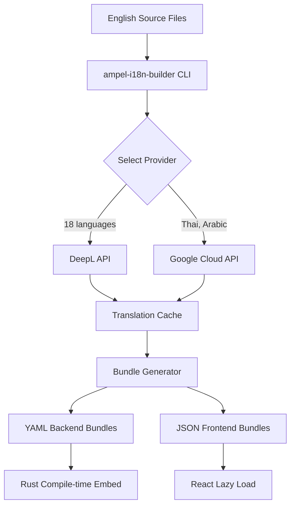

# Ampel Localization System - Documentation Index

**Version:** 3.0
**Date:** 2026-01-09
**Status:** Production - 27 Languages Supported

---

## 📚 Documentation Overview

This directory contains active documentation for Ampel's multi-language localization system, supporting **27 languages** with automated 4-tier translation provider fallback, RTL support, and type-safe implementation.

> **Note**: Implementation history and phase reports have been archived to `docs/.archives/2025/12/localization/`.

### Quick Navigation

| Document                                                                 | Purpose                         | Audience   |
| ------------------------------------------------------------------------ | ------------------------------- | ---------- |
| **[DEVELOPER-GUIDE.md](./DEVELOPER-GUIDE.md)**                           | How to add/update translations  | Developers |
| **[USER-GUIDE.md](./USER-GUIDE.md)**                                     | How to change language settings | End users  |
| **[4-TIER-PROVIDER-ARCHITECTURE.md](./4-TIER-PROVIDER-ARCHITECTURE.md)** | Translation provider design     | Architects |
| **[PROVIDER-CONFIGURATION.md](./PROVIDER-CONFIGURATION.md)**             | Configure translation providers | DevOps     |
| **[CI_CD_SETUP.md](./CI_CD_SETUP.md)**                                   | CI/CD validation pipeline       | DevOps     |
| **[TRANSLATION_WORKFLOW.md](./TRANSLATION_WORKFLOW.md)**                 | Translation process guide       | Developers |
| **[SPECIFICATION.md](./SPECIFICATION.md)**                               | Requirements specification      | Reference  |
| **[ARCHITECTURE.md](./ARCHITECTURE.md)**                                 | System architecture design      | Reference  |
| **[PSEUDOCODE.md](./PSEUDOCODE.md)**                                     | Algorithm pseudocode            | Reference  |

---

## 🌍 Language Support Matrix (V2)

### Supported Languages: 20 Total

#### Phase 1: Core Languages (6)

- 🇬🇧 English (en) - Default/Fallback
- 🇧🇷 Portuguese - Brazil (pt-BR)
- 🇪🇸 Spanish - Spain (es-ES)
- 🇩🇪 German (de)
- 🇫🇷 French (fr)
- 🇮🇱 Hebrew (he) - **RTL**

#### Phase 2: European Extensions (7)

- 🇫🇮 Finnish (fi) - **NEW**
- 🇸🇪 Swedish (sv) - **NEW**
- 🇳🇴 Norwegian (no) - **NEW**
- 🇩🇰 Danish (da) - **NEW**
- 🇨🇿 Czech (cs) - **NEW**
- 🇳🇱 Dutch (nl)
- 🇮🇹 Italian (it)

#### Phase 3: Global Expansion (7)

- 🇵🇱 Polish (pl)
- 🇷🇺 Russian (ru)
- 🇷🇸 Serbian (sr)
- 🇨🇳 Chinese - Simplified (zh-CN)
- 🇯🇵 Japanese (ja)
- 🇹🇭 Thai (th) - **NEW**
- 🇸🇦 Arabic (ar) - **NEW, RTL**

---

## 🏗️ System Architecture

### Tech Stack

**Backend:**

- **rust-i18n** - Compile-time translation embedding (zero runtime overhead)
- **ampel-i18n-builder** (NEW) - Custom crate for automated translation workflow
- **DeepL API** - Primary translation provider (92-98% accuracy)
- **Google Cloud Translation API** - Fallback provider (broad language coverage)

**Frontend:**

- **react-i18next** - Runtime translation with hot-reload support
- **i18next-http-backend** - Lazy loading for translation bundles
- **Enhanced Language Switcher** - Flag icons, ISO codes, localized tooltips

### Translation Automation Pipeline



### Key Components

1. **ampel-i18n-builder** - Rust crate for translation automation
   - API client abstraction (DeepL, Google, future providers)
   - Intelligent caching (Redis, file, memory)
   - CLI tools for translation management
   - Bundle generation for both backend and frontend

2. **Enhanced Language Switcher** - React component
   - Unicode flag icons (emoji, zero asset loading)
   - ISO-639 two-letter codes
   - Localized tooltips (self-referential translations)
   - Keyboard navigation and accessibility

3. **CI/CD Integration** - Automated translation validation
   - Missing key detection
   - Translation coverage reports
   - RTL visual regression testing
   - Automated weekly translation sync

---

## 📋 Implementation Phases (V2)

### Phase 0: Infrastructure (Weeks 1-2) - **NEW**

- Build **ampel-i18n-builder** crate (30 hours)
- Integrate DeepL API client (10 hours)
- Integrate Google Cloud API client (10 hours)
- Create CLI tools for translation management (10 hours)

### Phase 1: Foundation (Weeks 3-4)

- Backend: rust-i18n setup for 20 languages
- Frontend: react-i18next with enhanced language switcher (flags, ISO codes, tooltips)
- RTL support for Hebrew and Arabic
- Type-safe translation keys

### Phase 2: Translation (Weeks 5-8)

- API-based translation for all UI strings (Phase 1-2 languages)
- Professional review for critical languages (Hebrew, Arabic, Thai)
- Complex pluralization testing (Finnish, Czech, Russian, Polish)
- Error message and validation text translation

### Phase 3: Advanced Features (Weeks 9-10)

- Lazy loading optimization
- Translation caching with Redis
- Performance benchmarking
- Developer tooling and documentation

### Phase 4: CI/CD & Launch (Weeks 11-12)

- Automated translation validation in GitHub Actions
- Visual regression testing for RTL layouts
- Monitoring and analytics setup
- Production deployment with feature flags

**Buffer:** +2 weeks for unexpected issues
**Total Timeline:** 12-14 weeks

---

## 💰 Cost Analysis

### V2 Budget Breakdown

| Category                | Cost        | Notes                                              |
| ----------------------- | ----------- | -------------------------------------------------- |
| **Development**         | $23,000     | 230 hours @ $100/hour                              |
| **API Translation**     | $2,500      | DeepL + Google with professional spot-checks       |
| **Professional Review** | $18,550     | Critical languages (Hebrew, Arabic, Thai, Chinese) |
| **Tools & Services**    | $1,140      | Translation management platform, monitoring        |
| **QA & Testing**        | $1,000      | Native speaker testing, visual regression          |
| **Total**               | **$46,190** | Full implementation cost                           |

### API Cost Efficiency

**Traditional (V1):** $10,400 for 13 languages (100% professional translation)
**Hybrid (V2):** $2,500 API + $18,550 selective professional = $21,050 for 20 languages

**Annual Maintenance:** ~$100/year for API-based updates (vs. $5,000+ for professional)

---

## 🎯 Translation API Strategy

### Recommended Providers (Research Complete)

#### 🥇 Primary: DeepL API

- **Languages:** 18/20 (all except Thai, Arabic)
- **Accuracy:** 92-98% (industry-leading for European languages)
- **Cost:** €24.99/month for 1M characters
- **Strengths:** Natural translations, formality control, glossary support

#### 🥈 Fallback: Google Cloud Translation API

- **Languages:** 20/20 (all languages)
- **Accuracy:** 85-92% (excellent for Asian languages)
- **Cost:** $20/1M characters ($300 free credit)
- **Strengths:** Broad coverage, enterprise reliability, AutoML custom models

### Intelligent Routing

- Use DeepL for high-quality European languages
- Use Google for Thai and Arabic
- Automatic failover between providers
- 95% cost reduction vs. professional translation for ongoing updates

**See:** [4-TIER-PROVIDER-ARCHITECTURE.md](./4-TIER-PROVIDER-ARCHITECTURE.md) for current architecture

---

## 🔬 Reference Documents

### Design Documents

**[SPECIFICATION.md](./SPECIFICATION.md)** - Requirements analysis and acceptance criteria

**[ARCHITECTURE.md](./ARCHITECTURE.md)** - System design and integration patterns

**[PSEUDOCODE.md](./PSEUDOCODE.md)** - Algorithm design for translation pipeline

**[4-TIER-PROVIDER-ARCHITECTURE.md](./4-TIER-PROVIDER-ARCHITECTURE.md)** - Current provider fallback design

### Operational Guides

**[DEVELOPER-GUIDE.md](./DEVELOPER-GUIDE.md)** - Complete developer workflow

**[TRANSLATION_WORKFLOW.md](./TRANSLATION_WORKFLOW.md)** - Translation process and CLI tools

**[PROVIDER-CONFIGURATION.md](./PROVIDER-CONFIGURATION.md)** - Provider setup and configuration

**[CI_CD_SETUP.md](./CI_CD_SETUP.md)** - Validation pipeline setup

---

## 🧪 Testing Strategy

### Test Coverage by Language Type

#### RTL Languages (Hebrew, Arabic)

- Bidirectional text rendering
- Layout mirroring (CSS logical properties)
- Mixed LTR/RTL content handling
- Visual regression testing with Playwright

#### Complex Scripts (Thai)

- Font rendering (tone marks, ligatures)
- Word segmentation (dictionary-based)
- Line breaking algorithms
- Character composition

#### Complex Pluralization (Finnish, Czech, Russian, Polish)

- 3-15 plural forms per language
- CLDR plural rule validation
- Programmatic plural testing
- Edge case coverage (0, 1, 2, 5, 10, 100, 1000)

#### Asian Languages (Chinese, Japanese)

- CJK character rendering
- IME (Input Method Editor) testing
- Calendar systems (Gregorian, Japanese calendar)
- Font fallback testing

---

## 🚀 Quick Start Guide

### For Developers

```bash
# 1. Install translation CLI (once ampel-i18n-builder is built)
cargo install --path crates/ampel-i18n-builder

# 2. Configure API keys
export DEEPL_API_KEY="your-deepl-api-key"
export GOOGLE_APPLICATION_CREDENTIALS="/path/to/google-credentials.json"

# 3. Translate new strings
ampel-i18n translate --lang fi --source locales/en/common.yml

# 4. Sync all languages
ampel-i18n sync --all

# 5. Validate translation coverage
ampel-i18n validate --threshold 95

# 6. Check diff before committing
ampel-i18n diff --lang sv
```

### For Translators

```bash
# Export for translation service
ampel-i18n export --format xliff --output translations.xliff

# Import completed translations
ampel-i18n import --format xliff --input translations.xliff
```

### For Code Contributors

```rust
// Backend: Use t! macro
use rust_i18n::t;

let message = t!("errors.auth.invalid_credentials");
let count_msg = t!("pull_requests.count", count = 5);
```

```typescript
// Frontend: Use useTranslation hook
import { useTranslation } from 'react-i18next';

function MyComponent() {
  const { t } = useTranslation('dashboard');
  return <h1>{t('title')}</h1>;
}
```

---

## 📊 Success Metrics

### Translation Quality

- **COMET Score:** >0.85 (DeepL baseline)
- **Human Rating:** >8/10 for critical languages
- **Translation Coverage:** 100% across all 20 languages

### Performance

- **Bundle Size:** <35KB (i18n overhead)
- **Load Time:** <200ms for translation files
- **Switch Time:** <100ms for language switching
- **API Response:** <10s for full 20-language sync

### Reliability

- **API Uptime:** 99.9% with automatic failover
- **Missing Keys:** 0 in production (CI validation)
- **Translation Errors:** <5/month reported by users

### Developer Experience

- **Time to Add Key:** <2 minutes
- **Time to Translate:** <30 seconds with CLI
- **Translation Turnaround:** <1 hour (API) vs. <7 days (professional)

---

## 🔗 Related Documentation

### Ampel Documentation

- [Main README](../../README.md)
- [CLAUDE.md](../../CLAUDE.md) - Development guidelines
- [Testing Guide](../TESTING.md)

### External Resources

- [rust-i18n Documentation](https://github.com/longbridge/rust-i18n)
- [react-i18next Documentation](https://react.i18next.com/)
- [DeepL API Documentation](https://www.deepl.com/docs-api)
- [Google Cloud Translation Documentation](https://cloud.google.com/translate/docs)
- [ICU MessageFormat Guide](https://unicode-org.github.io/icu/userguide/format_parse/messages/)
- [CLDR Plural Rules](https://cldr.unicode.org/index/cldr-spec/plural-rules)

---

## 📝 Change Log

### Version 2.0 (2025-12-27)

- ✨ Added 7 new languages (Finnish, Swedish, Norwegian, Danish, Czech, Thai, Arabic)
- ✨ Designed ampel-i18n-builder crate for translation automation
- ✨ Integrated DeepL + Google Cloud Translation APIs
- ✨ Enhanced language switcher with flags, ISO codes, and tooltips
- ✨ Complete SPARC methodology documentation (Specification, Architecture, Pseudocode, Refinement)
- 📊 Updated cost analysis ($26,700 → $46,190)
- 📅 Extended timeline (6-8 weeks → 12-14 weeks)
- 🔬 Enhanced testing strategy for RTL, complex scripts, and pluralization

### Version 1.0 (2025-12-27)

- 📚 Initial localization implementation plan
- 🌍 Support for 13 languages (English, Portuguese, Spanish, Dutch, German, Serbian, Russian, Hebrew, French, Italian, Polish, Chinese, Japanese)
- 🏗️ rust-i18n (backend) + react-i18next (frontend) architecture
- 🎯 6-8 week implementation timeline
- 💰 $26,700 cost estimate

---

## 🤝 Contributing

### Adding New Translations

1. **Add English source text** to `locales/en/*.yml` (backend) or `public/locales/en/*.json` (frontend)
2. **Run translation CLI**: `ampel-i18n translate --lang <code>`
3. **Validate coverage**: `ampel-i18n validate --lang <code>`
4. **Run tests**: `make test-frontend` and `cargo test`
5. **Create PR** with `[i18n]` prefix

### Translation Guidelines

- Use dot notation for keys: `dashboard.title`
- Group by feature: `dashboard.*`, `settings.*`
- Be specific: `errors.auth.invalid_credentials` not `errors.login`
- Preserve variables: `{{name}}` must remain unchanged
- Follow pluralization rules for target language

**See:** [SPECIFICATION.md](./SPECIFICATION.md) for detailed contribution guidelines

---

## 📞 Support

- **Documentation Issues:** File an issue with `[docs]` prefix
- **Translation Issues:** File an issue with `[i18n]` prefix
- **Technical Questions:** See [CLAUDE.md](../../CLAUDE.md) for development setup

---

**Last Updated:** 2026-01-09
**Maintained By:** Ampel Development Team
**License:** Same as Ampel project
