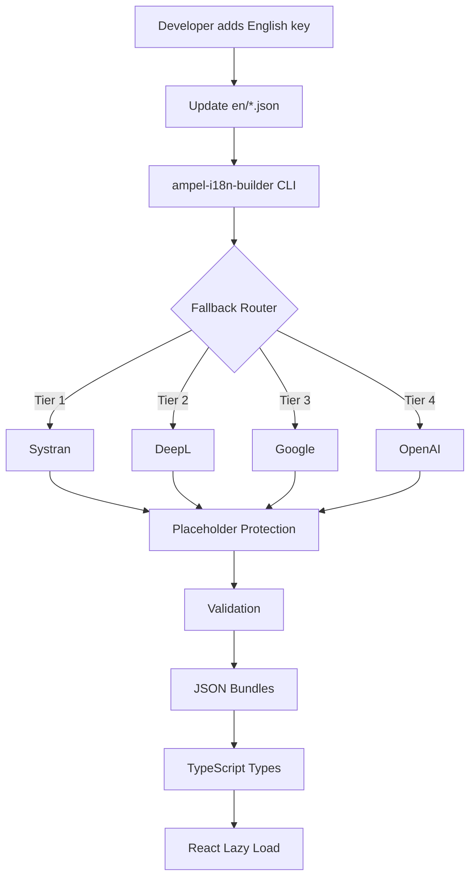

# Translation Workflow Guide

**Version:** 2.0
**Date:** 2026-01-10
**Status:** Production Ready

## Table of Contents

1. [Overview](#overview)
2. [Adding New Translation Keys](#adding-new-translation-keys)
3. [Using the CLI Tools](#using-the-cli-tools)
4. [Translation Service Integration](#translation-service-integration)
5. [Placeholder Handling](#placeholder-handling)
6. [Validation and Quality Assurance](#validation-and-quality-assurance)
7. [Common Pitfalls and Solutions](#common-pitfalls-and-solutions)
8. [CI/CD Automation](#cicd-automation)
9. [Troubleshooting](#troubleshooting)
10. [Reference Commands](#reference-commands)

---

## Overview

The Ampel i18n workflow uses `ampel-i18n-builder` for automated translation management. The system supports:

- **4 Translation Providers**: Systran (Tier 1), DeepL (Tier 2), Google (Tier 3), OpenAI (Tier 4)
- **27 Languages**: Including RTL support for Hebrew and Arabic
- **Dual Format**: YAML (backend/rust-i18n) + JSON (frontend/react-i18next)
- **Automated Translation**: API-based translation with fallback and caching
- **Placeholder Protection**: Automatic preservation of `{{variable}}` placeholders
- **Type Safety**: Code generation for TypeScript and Rust

### Supported Languages (27 total)

| Code  | Language              | Script     | Direction | Recommended Provider |
| ----- | --------------------- | ---------- | --------- | -------------------- |
| en    | English (US)          | Latin      | LTR       | (source)             |
| en-GB | English (UK)          | Latin      | LTR       | DeepL                |
| de    | German                | Latin      | LTR       | DeepL                |
| fr    | French                | Latin      | LTR       | DeepL                |
| it    | Italian               | Latin      | LTR       | DeepL                |
| es-ES | Spanish (Spain)       | Latin      | LTR       | DeepL                |
| es-MX | Spanish (Mexico)      | Latin      | LTR       | DeepL                |
| pt-BR | Portuguese (Brazil)   | Latin      | LTR       | DeepL                |
| nl    | Dutch                 | Latin      | LTR       | DeepL                |
| da    | Danish                | Latin      | LTR       | DeepL                |
| sv    | Swedish               | Latin      | LTR       | DeepL                |
| no    | Norwegian             | Latin      | LTR       | DeepL                |
| fi    | Finnish               | Latin      | LTR       | DeepL                |
| pl    | Polish                | Latin      | LTR       | DeepL                |
| cs    | Czech                 | Latin      | LTR       | DeepL                |
| ru    | Russian               | Cyrillic   | LTR       | DeepL                |
| sr    | Serbian               | Cyrillic   | LTR       | Google               |
| tr    | Turkish               | Latin      | LTR       | Google               |
| ja    | Japanese              | CJK        | LTR       | Google               |
| ko    | Korean                | Hangul     | LTR       | Google               |
| zh-CN | Chinese (Simplified)  | CJK        | LTR       | Google               |
| zh-TW | Chinese (Traditional) | CJK        | LTR       | Google               |
| th    | Thai                  | Thai       | LTR       | Google               |
| vi    | Vietnamese            | Latin      | LTR       | Google               |
| hi    | Hindi                 | Devanagari | LTR       | Google               |
| ar    | Arabic                | Arabic     | **RTL**   | Google               |
| he    | Hebrew                | Hebrew     | **RTL**   | Google               |

### Architecture Flow



### File Structure

```
frontend/public/locales/
├── en/                          # Source language (English US)
│   ├── common.json             # Shared UI strings
│   ├── dashboard.json          # Dashboard-specific strings
│   ├── settings.json           # Settings page strings
│   ├── errors.json             # Error messages
│   └── validation.json         # Form validation messages
├── de/                          # German translations
│   ├── common.json
│   ├── dashboard.json
│   └── ...
├── fr/                          # French translations
└── ... (25 other languages)

frontend/src/i18n/
└── types.ts                     # Auto-generated TypeScript types
```

---

## Adding New Translation Keys

### Step 1: Add Keys to English Source File

Edit the appropriate JSON file in `frontend/public/locales/en/`:

```json
// settings.json - Example: Adding language preference keys
{
  "language": {
    "title": "Language",
    "description": "Choose your preferred language for the interface"
  }
}
```

**Key Naming Conventions:**

- Use **camelCase** for key names: `displayName`, not `display-name`
- Group related keys under **nested objects**
- Use **descriptive names** that indicate purpose
- **Preserve placeholder format**: `{{variable}}` (double braces for i18next)

### Step 2: Integrate in React Components

Use the `useTranslation` hook with namespace:

```tsx
import { useTranslation } from 'react-i18next';

function LanguageSettings() {
  const { t } = useTranslation(['settings']);

  return (
    <div>
      <label>{t('settings:language.title')}</label>
      <p>{t('settings:language.description')}</p>
    </div>
  );
}
```

**Namespace Pattern:** `namespace:key.path`

- `settings:language.title` → `settings.json` → `language.title`
- `common:app.loading` → `common.json` → `app.loading`

### Step 3: Verify Missing Keys

Before translation, check which languages are missing the new keys:

```bash
cd crates/ampel-i18n-builder
cargo run --bin ampel-i18n -- missing --translation-dir ../../frontend/public/locales
```

Output shows missing keys per language:

```
✓ Source language (en): 327 key(s)
✗ de: 2 missing key(s)
  - settings.language.description
  - settings.language.title
✗ fr: 2 missing key(s)
  ...
```

### Step 4: Run Translation

Translate each language one-by-one (recommended for control):

```bash
cd crates/ampel-i18n-builder

# Translate only missing keys in settings namespace for German
cargo run --bin ampel-i18n -- translate \
  --lang de \
  --namespace settings \
  --translation-dir ../../frontend/public/locales
```

### Step 5: Regenerate TypeScript Types

```bash
cargo run --bin ampel-i18n -- generate-types \
  --translation-dir ../../frontend/public/locales
```

This reads all English locale files and generates `frontend/src/i18n/types.ts`.

**Important:** The types file has a header:

```typescript
// Auto-generated by ampel-i18n-builder
// Do not edit manually
```

### Step 6: Validate

```bash
cd ../..  # Back to project root
node scripts/validate-translations.js
node scripts/i18n-coverage-report.js --format text
```

---

## Using the CLI Tools

### Installation

Build from source (not yet published as binary):

```bash
# Build the CLI
cargo build --release --bin ampel-i18n --package ampel-i18n-builder

# Or use via cargo run
cargo run --package ampel-i18n-builder --bin ampel-i18n -- --help
```

### Configuration

**Option 1: Environment File (Recommended)**

Create `crates/ampel-i18n-builder/.env`:

```bash
# Tier 1 - Systran (Enterprise, highest quality)
SYSTRAN_API_KEY=your-systran-key

# Tier 2 - DeepL (Best for European languages)
DEEPL_API_KEY=your-deepl-key

# Tier 3 - Google Translate (Broad coverage)
GOOGLE_API_KEY=your-google-key

# Tier 4 - OpenAI (Fallback, context-aware)
OPENAI_API_KEY=your-openai-key
```

**Critical:** Run CLI from `crates/ampel-i18n-builder/` directory to auto-load `.env`, OR specify full paths.

**Option 2: YAML Configuration**

Create `.ampel-i18n.yaml` in the project root:

```yaml
translation_dir: 'frontend/public/locales'

translation:
  systran_api_key: '${SYSTRAN_API_KEY}'
  deepl_api_key: '${DEEPL_API_KEY}'
  google_api_key: '${GOOGLE_API_KEY}'
  openai_api_key: '${OPENAI_API_KEY}'

  default_timeout_secs: 30
  default_batch_size: 50
  default_max_retries: 3
```

### CLI Commands

| Command          | Description                                 |
| ---------------- | ------------------------------------------- |
| `translate`      | Translate missing keys using AI translation |
| `sync`           | Sync all languages from source language     |
| `missing`        | List missing translation keys per language  |
| `coverage`       | Check translation coverage statistics       |
| `validate`       | Validate translation files for errors       |
| `export`         | Export translations (XLIFF, CSV, JSON)      |
| `import`         | Import translations from external service   |
| `report`         | Generate coverage reports                   |
| `generate-types` | Generate TypeScript type definitions        |

#### Translate Command Options

```bash
cargo run --bin ampel-i18n -- translate --help

Options:
  --lang <LANG>              Target language code (required)
  --namespace <NS>           Only translate specific namespace
  --provider <PROVIDER>      Provider hint (systran, deepl, google, openai)
  --no-fallback             Disable fallback, use only primary provider
  --force                    Retranslate ALL keys, ignoring existing
  --detect-untranslated     Retranslate keys with English values
  --dry-run                 Preview changes without writing files
  --translation-dir <PATH>   Path to translation directory
  --timeout <SECS>          Override timeout (seconds)
  --batch-size <SIZE>       Override batch size
```

---

## Translation Service Integration

### 4-Tier Provider Architecture

The CLI uses a tiered provider system with automatic fallback:

```
Tier 1: Systran → Fails? → Tier 2: DeepL → Fails? → Tier 3: Google → Fails? → Tier 4: OpenAI
```

| Provider | Tier | Rate Limit  | Batch Size | Best For                                  |
| -------- | ---- | ----------- | ---------- | ----------------------------------------- |
| Systran  | 1    | 100 req/sec | 50         | Enterprise, all languages                 |
| DeepL    | 2    | 10 req/sec  | 50         | European languages (de, fr, fi, sv, etc.) |
| Google   | 3    | 100 req/sec | 100        | Asian/Middle Eastern (ar, ja, zh, etc.)   |
| OpenAI   | 4    | Token-based | Unlimited  | Complex/technical content                 |

### Provider Selection

**Automatic (Recommended):**

```bash
cargo run --bin ampel-i18n -- translate --lang de
# Uses first available provider, falls back on failure
```

**Explicit Provider (No Fallback):**

```bash
cargo run --bin ampel-i18n -- translate --lang de --provider deepl --no-fallback
```

### Translation Output Example

```
→ Fallback mode enabled: Translating to de
✓ Found 1 namespace(s): settings
  → settings - 2 missing key(s)
INFO: Attempting translation with Systran (Tier 1)... [1/3]
ERROR: Systran (Tier 1) failed: API error 401 Unauthorized
INFO: Attempting translation with Google (Tier 3)... [2/3]
INFO: ✓ Translation successful with Google (Tier 3)
WARN: Used fallback provider Google (Tier 3) after 1 failure(s)
    ✓ Wrote 2 translations to ../../frontend/public/locales/de/settings.json
✓ Translation complete!
```

---

## Placeholder Handling

### The Placeholder Problem

i18next uses double-brace placeholders for variable interpolation:

```json
{
  "greeting": "Hello, {{name}}!",
  "items": "{{count}} items in cart",
  "pr": {
    "number": "#{{number}}"
  }
}
```

**The Problem:** Translation APIs like Google Translate will translate placeholder names:

- `{{number}}` → `{{Nummer}}` (German)
- `{{number}}` → `{{número}}` (Spanish)
- `{{count}}` → `{{数量}}` (Chinese)

**The Impact:** i18next looks for exact placeholder names. When you call:

```tsx
t('pr.number', { number: 123 });
```

It expects `{{number}}` in the translation. If the translation has `{{Nummer}}`, it renders literally as `#{{Nummer}}` instead of `#123`.

### The Solution: PlaceholderProtector

The Google translator includes automatic placeholder protection (`crates/ampel-i18n-builder/src/translator/google.rs`):

```rust
struct PlaceholderProtector {
    placeholders: Vec<String>,
}

impl PlaceholderProtector {
    /// Protect placeholders by replacing with XML markers
    fn protect(text: &str) -> (String, Self) {
        // "Hello {{name}}!" → "Hello <x id="0"/>!"
        // Placeholders stored: ["{{name}}"]
    }

    /// Restore original placeholders from markers
    fn restore(&self, text: &str) -> String {
        // "Hallo <x id="0"/>!" → "Hallo {{name}}!"
    }
}
```

**How It Works:**

1. **Before Translation:** `"#{{number}}"` → `"#<x id="0"/>"`
2. **API Translates:** `"#<x id="0"/>"` → `"Nr.<x id="0"/>"` (German)
3. **After Translation:** `"Nr.<x id="0"/>"` → `"Nr.{{number}}"`

### Manual Placeholder Fixes

If you encounter translations with incorrect placeholders (from before the fix), correct them:

```bash
# Using Python for safe JSON manipulation
python3 -c "
import json
with open('frontend/public/locales/de/dashboard.json', 'r') as f:
    data = json.load(f)
data['pr']['number'] = '#{{number}}'
with open('frontend/public/locales/de/dashboard.json', 'w') as f:
    json.dump(data, f, ensure_ascii=False, indent=2)
"
```

### Placeholder Best Practices

1. **Keep placeholder names simple and English:** `{{count}}`, `{{name}}`, `{{field}}`
2. **Avoid special characters** in placeholder names
3. **Document placeholder usage** in comments or companion docs
4. **Always validate after translation** to catch placeholder issues

### Arabic Singular Forms (Special Case)

Arabic singular forms may lose `{{count}}` placeholder intentionally:

```json
// English
"pullRequests_one": "{{count}} pull request"

// Arabic (after translation)
"pullRequests_one": "pull request واحد"  // "واحد" means "one"
```

This is **linguistically correct** for Arabic - the word "واحد" (one) replaces the numeral. The `_other` form retains `{{count}}` for plural amounts.

---

## Validation and Quality Assurance

### Available Validation Scripts

#### 1. Main Validation Script

```bash
./scripts/i18n-validate.sh --frontend
```

Checks:

- JSON syntax validity
- Coverage threshold (default 95%)
- Missing keys detection

#### 2. Advanced Quality Validator

```bash
node scripts/validate-translations.js
node scripts/validate-translations.js de    # Single language
```

Checks:

- Completeness (missing keys/files)
- **Placeholder preservation** (critical - flags mismatches)
- Untranslated content detection (English text in non-English files)
- Empty translation detection
- Character set analysis

**Quality Tiers:**

- **Excellent (95%+):** Production ready
- **Good (80-94%):** Acceptable with minor issues
- **Acceptable (60-79%):** Needs review
- **Poor (<60%):** Requires attention

#### 3. Coverage Report

```bash
node scripts/i18n-coverage-report.js --format text
node scripts/i18n-coverage-report.js --format json --output report.json
node scripts/i18n-coverage-report.js --format markdown
```

### Post-Translation Checklist

1. **Check for missing keys:**

   ```bash
   cargo run --bin ampel-i18n -- missing
   ```

   Expected: `✓ All translations complete - no missing keys`

2. **Run quality validation:**

   ```bash
   node scripts/validate-translations.js
   ```

   Watch for: `Placeholder mismatch` errors (critical)

3. **Generate coverage report:**

   ```bash
   node scripts/i18n-coverage-report.js --format text
   ```

   Expected: 100% coverage for all languages

4. **Regenerate types:**
   ```bash
   cargo run --bin ampel-i18n -- generate-types
   ```

---

## Common Pitfalls and Solutions

### Pitfall 1: Running from Wrong Directory

**Problem:** API keys not loaded, translations fail with "No translation providers available."

**Solution:** Run from `crates/ampel-i18n-builder/` to auto-load `.env`, or use explicit paths:

```bash
# Option A: Run from i18n-builder directory
cd crates/ampel-i18n-builder
cargo run --bin ampel-i18n -- translate --lang de --translation-dir ../../frontend/public/locales

# Option B: Use --package flag from project root (env not loaded)
cargo run --package ampel-i18n-builder --bin ampel-i18n -- translate --lang de
```

### Pitfall 2: Translated Placeholders (Pre-Fix)

**Problem:** `{{number}}` becomes `{{Nummer}}` in German translations created before the PlaceholderProtector fix.

**Solution:**

1. New translations automatically protected (fix implemented 2026-01-10)
2. For existing bad translations, fix manually:
   ```bash
   python3 -c "
   import json
   with open('frontend/public/locales/de/dashboard.json', 'r') as f:
       data = json.load(f)
   data['pr']['number'] = '#{{number}}'
   with open('frontend/public/locales/de/dashboard.json', 'w') as f:
       json.dump(data, f, ensure_ascii=False, indent=2)
   "
   ```

### Pitfall 3: Forgetting to Regenerate Types

**Problem:** TypeScript errors after adding new keys - keys not recognized.

**Solution:** Always run after adding/modifying keys:

```bash
cargo run --bin ampel-i18n -- generate-types --translation-dir ../../frontend/public/locales
```

### Pitfall 4: API Rate Limits

**Problem:** Translation fails with "Rate limit exceeded."

**Solution:**

```bash
# DeepL free tier: 500,000 chars/month
# Check your usage:
curl -H "Authorization: DeepL-Auth-Key $DEEPL_API_KEY" \
  https://api-free.deepl.com/v2/usage

# Use --batch-size to reduce request frequency
cargo run --bin ampel-i18n -- translate --lang de --batch-size 25
```

### Pitfall 5: Full-Width Characters in CJK Translations

**Problem:** Japanese/Chinese may include full-width variants of ASCII characters (e.g., `＃` instead of `#`).

**Example:** `"＃{{番号}}"` instead of `"#{{number}}"`

**Solution:** Manually verify CJK translations and correct:

```bash
python3 -c "
import json
with open('frontend/public/locales/ja/dashboard.json', 'r') as f:
    data = json.load(f)
data['pr']['number'] = '#{{number}}'  # Use ASCII #
with open('frontend/public/locales/ja/dashboard.json', 'w') as f:
    json.dump(data, f, ensure_ascii=False, indent=2)
"
```

---

## CI/CD Automation

### GitHub Actions Workflow

The workflow runs on every PR that modifies translation files.

```yaml
# .github/workflows/i18n-validation.yml

name: i18n Validation

on:
  pull_request:
    paths:
      - 'frontend/public/locales/**'
      - 'crates/ampel-i18n-builder/**'

jobs:
  validate-translations:
    runs-on: ubuntu-latest
    steps:
      - uses: actions/checkout@v6
      - uses: dtolnay/rust-toolchain@stable
      - uses: actions/setup-node@v4
        with:
          node-version: '20'

      - name: Build i18n-builder
        run: cargo build --release --bin ampel-i18n --package ampel-i18n-builder

      - name: Check missing translations
        run: |
          ./target/release/ampel-i18n missing \
            --translation-dir frontend/public/locales

      - name: Validate translations
        run: node scripts/validate-translations.js

      - name: Generate coverage report
        run: node scripts/i18n-coverage-report.js --format markdown > coverage.md

      - name: Post coverage to PR
        uses: actions/github-script@v7
        with:
          script: |
            const fs = require('fs');
            const coverage = fs.readFileSync('coverage.md', 'utf8');
            github.rest.issues.createComment({
              issue_number: context.issue.number,
              owner: context.repo.owner,
              repo: context.repo.repo,
              body: coverage
            });
```

### Pre-commit Hooks

```bash
# Install hooks
./scripts/install-git-hooks.sh

# Runs automatically before commit:
# - Validates JSON syntax
# - Checks for placeholder mismatches
# - Verifies coverage threshold
```

---

## Troubleshooting

### API Key Not Found

```
Error: Configuration error: No translation providers available. Configure at least one API key.
```

**Solution:**

```bash
# Ensure .env file exists in crates/ampel-i18n-builder/
cat crates/ampel-i18n-builder/.env

# Or set environment variables
export GOOGLE_API_KEY="your-key"
export OPENAI_API_KEY="your-key"
```

### Translation Failed - Unauthorized

```
ERROR: Systran (Tier 1) failed: API error 401 Unauthorized
```

**Solution:** This is normal if you don't have a Systran key. The system falls back to the next tier.

### Variable Mismatch Warning

```
⚠️ Warning: Placeholders mismatch in key 'pr.number'
   Original: ["{{number}}"]
   Translated: ["{{Nummer}}"]
```

**Solution:** This indicates a translation from before the PlaceholderProtector fix. Manually correct the placeholder.

### Coverage Below Threshold

```
Error: Coverage below threshold: 92.0% < 95.0%
```

**Solution:**

```bash
# Find missing translations
cargo run --bin ampel-i18n -- missing --translation-dir ../../frontend/public/locales

# Translate missing keys
cargo run --bin ampel-i18n -- translate --lang de --namespace settings
```

---

## Reference Commands

### Quick Reference

```bash
# Check missing translations
cargo run --bin ampel-i18n -- missing

# Translate specific language/namespace
cargo run --bin ampel-i18n -- translate --lang de --namespace settings

# Force re-translate all keys
cargo run --bin ampel-i18n -- translate --lang de --force

# Generate TypeScript types
cargo run --bin ampel-i18n -- generate-types

# Check coverage
cargo run --bin ampel-i18n -- coverage --min-coverage 95

# Validate translations
node scripts/validate-translations.js

# Generate coverage report
node scripts/i18n-coverage-report.js --format text
```

### Full Translation Workflow (Copy-Paste Ready)

```bash
# 1. Add keys to English source file (manual edit)
# Edit: frontend/public/locales/en/settings.json

# 2. Navigate to i18n-builder directory
cd crates/ampel-i18n-builder

# 3. Verify missing keys
cargo run --bin ampel-i18n -- missing --translation-dir ../../frontend/public/locales

# 4. Translate all languages
for lang in ar cs da de en-GB es-ES es-MX fi fr he hi it ja ko nl no pl pt-BR ru sr sv th tr vi zh-CN zh-TW; do
  cargo run --bin ampel-i18n -- translate \
    --lang "$lang" \
    --namespace settings \
    --translation-dir ../../frontend/public/locales
done

# 5. Regenerate types
cargo run --bin ampel-i18n -- generate-types --translation-dir ../../frontend/public/locales

# 6. Validate
cd ../..
node scripts/validate-translations.js

# 7. Check coverage
node scripts/i18n-coverage-report.js --format text
```

---

## Best Practices

### 1. Write Clear Source Text

```json
// ❌ Bad: Ambiguous
{ "button": "OK" }

// ✅ Good: Clear context
{
  "dialog": {
    "confirmButton": "Confirm changes",
    "cancelButton": "Cancel"
  }
}
```

### 2. Use Consistent Terminology

```json
// ✅ Consistent
{
  "pullRequest": {
    "title": "Pull Request",
    "create": "Create Pull Request",
    "list": "Pull Requests"
  }
}

// ❌ Inconsistent
{
  "pullRequest": {
    "title": "PR",
    "create": "Create Merge Request",
    "list": "Code Reviews"
  }
}
```

### 3. Test RTL Languages

```bash
# Test Hebrew/Arabic layout
# Navigate to Settings > Language > Hebrew/Arabic
# Check for:
# - Text alignment
# - Icon direction
# - Modal positioning
# - Form field alignment
```

### 4. Validate Before Committing

```bash
# Run full validation suite
./scripts/i18n-validate.sh --frontend

# Check coverage
node scripts/i18n-coverage-report.js --check --min-coverage 95
```

---

## Appendix: Session History

### Changes Made (2026-01-10)

**Translation Files (26 languages):**

- Added `language.title` and `language.description` to all `*/settings.json`
- Fixed `pr.number` placeholder in all `*/dashboard.json` (24 languages)

**Code Changes:**

- `crates/ampel-i18n-builder/src/translator/google.rs` - Added `PlaceholderProtector` struct
- Added 5 unit tests for placeholder protection

**Documentation:**

- Updated this file from v1.0 to v2.0 with placeholder handling section

---

**Last Updated:** 2026-01-10
**Maintained By:** Ampel Development Team
