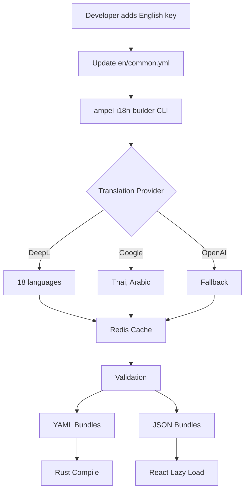

# Translation Workflow Guide

**Version:** 1.0
**Date:** 2025-12-27
**Status:** Production Ready

## Table of Contents

1. [Overview](#overview)
2. [Adding New Translation Keys](#adding-new-translation-keys)
3. [Using the CLI Tools](#using-the-cli-tools)
4. [Translation Service Integration](#translation-service-integration)
5. [CI/CD Automation](#cicd-automation)
6. [Troubleshooting](#troubleshooting)

---

## Overview

The Ampel i18n workflow uses `ampel-i18n-builder` for automated translation management. The system supports:

- **3 Translation Providers**: DeepL (primary), Google Cloud Translation (fallback), OpenAI
- **20 Languages**: Including RTL support for Hebrew and Arabic
- **Dual Format**: YAML (backend/rust-i18n) + JSON (frontend/react-i18next)
- **Automated Translation**: API-based translation with caching
- **Type Safety**: Code generation for TypeScript and Rust

### Architecture Flow



---

## Adding New Translation Keys

### 1. Backend Translations (Rust)

Backend translations are stored in `crates/ampel-api/locales/` and embedded at compile-time.

#### Add to English Source File

```yaml
# crates/ampel-api/locales/en/common.yml
dashboard:
  title: 'Pull Request Dashboard'
  subtitle: 'Unified view across all repositories'

errors:
  auth:
    invalid_credentials: 'Invalid email or password'
    token_expired: 'Your session has expired. Please login again.'

pull_requests:
  count:
    one: '1 pull request'
    other: '{{count}} pull requests'
```

#### Key Naming Conventions

- Use **dot notation**: `dashboard.title`, not `dashboard-title`
- **Group by feature**: `dashboard.*`, `settings.*`, `errors.*`
- **Be specific**: `errors.auth.invalid_credentials`, not `errors.login`
- **Preserve variables**: `{{variable}}` format (rust-i18n)

#### Using in Rust Code

```rust
use rust_i18n::t;

// Simple translation
let title = t!("dashboard.title");

// With variables
let count_msg = t!("pull_requests.count", count = 5);

// With locale override
let msg = t!("errors.auth.token_expired", locale = "pt-BR");
```

### 2. Frontend Translations (React)

Frontend translations are stored in `frontend/public/locales/` and lazy-loaded at runtime.

#### Add to English Source File

```json
// frontend/public/locales/en/dashboard.json
{
  "title": "Pull Request Dashboard",
  "subtitle": "Unified view across all repositories",
  "filters": {
    "status": "Filter by status",
    "assignee": "Filter by assignee"
  },
  "empty": {
    "title": "No pull requests found",
    "description": "Create your first PR to get started"
  }
}
```

#### Key Naming Conventions

- Use **nested objects** for organization
- **camelCase** for keys: `emptyState`, not `empty-state`
- **Preserve variables**: `{variable}` or `{{variable}}` format (i18next)

#### Using in React Code

```typescript
import { useTranslation } from 'react-i18next';

function Dashboard() {
  const { t } = useTranslation('dashboard');

  return (
    <div>
      <h1>{t('title')}</h1>
      <p>{t('subtitle')}</p>

      {/* With variables */}
      <p>{t('filters.status', { count: 5 })}</p>

      {/* Nested keys */}
      <p>{t('empty.title')}</p>
    </div>
  );
}
```

### 3. Pluralization

Different languages have different plural rules. Use CLDR plural forms.

#### Backend (YAML)

```yaml
# crates/ampel-api/locales/en/common.yml
items:
  one: "1 item"
  other: "{{count}} items"

# For languages with complex plurals (Russian, Polish, Finnish)
# locales/ru/common.yml
items:
  one: "{{count}} элемент"      # 1, 21, 31, ...
  few: "{{count}} элемента"     # 2-4, 22-24, ...
  many: "{{count}} элементов"   # 0, 5-20, 25-30, ...
  other: "{{count}} элементов"
```

#### Frontend (JSON)

```json
// frontend/public/locales/en/dashboard.json
{
  "pull_requests": "{{count}} pull request",
  "pull_requests_plural": "{{count}} pull requests"
}
```

```typescript
const { t } = useTranslation('dashboard');

// Automatic plural selection
t('pull_requests', { count: 1 }); // "1 pull request"
t('pull_requests', { count: 5 }); // "5 pull requests"
```

---

## Using the CLI Tools

### Installation

The CLI is not yet published as a binary. Build from source:

```bash
# Build the CLI
cargo build --release --bin i18n-builder

# Or use via cargo run
cargo run --bin i18n-builder -- --help
```

### Configuration

Create `.ampel-i18n.yaml` in the project root:

```yaml
translation_dir: 'frontend/public/locales'

translation:
  # API keys (can also use environment variables)
  deepl_api_key: null # Use DEEPL_API_KEY env var
  google_api_key: null # Use GOOGLE_API_KEY env var
  openai_api_key: null # Use OPENAI_API_KEY env var

  # Request timeout in seconds
  timeout_secs: 30

  # Batch size for translation requests
  batch_size: 50
```

### Environment Variables

```bash
# DeepL API key (primary provider)
export DEEPL_API_KEY="your-deepl-api-key"

# Google Cloud Translation API key (fallback for Thai, Arabic)
export GOOGLE_API_KEY="your-google-api-key"

# OpenAI API key (optional fallback)
export OPENAI_API_KEY="your-openai-api-key"
```

### CLI Commands

#### Translate Files

```bash
# Translate a single file to Finnish
cargo run --bin i18n-builder -- translate \
  --provider deepl \
  --input crates/ampel-api/locales/en/common.yml \
  --output crates/ampel-api/locales/fi/common.yml \
  --target-lang fi

# Translate frontend JSON
cargo run --bin i18n-builder -- translate \
  --provider deepl \
  --input frontend/public/locales/en/dashboard.json \
  --output frontend/public/locales/fi/dashboard.json \
  --target-lang fi
```

#### Validate Translations

```bash
# Validate coverage (requires ≥95%)
cargo run --bin i18n-builder -- validate \
  --input-dir crates/ampel-api/locales \
  --base-locale en \
  --min-coverage 95

# Check for missing keys
cargo run --bin i18n-builder -- validate \
  --input-dir frontend/public/locales \
  --base-locale en \
  --check missing

# Check for variable mismatches
cargo run --bin i18n-builder -- validate \
  --input-dir crates/ampel-api/locales \
  --check variables
```

#### Generate Type Definitions

```bash
# Generate TypeScript types from JSON translations
cargo run --bin i18n-builder -- codegen \
  --input frontend/public/locales/en/dashboard.json \
  --output frontend/src/types/i18n.generated.ts \
  --language typescript

# Generate Rust types (future feature)
cargo run --bin i18n-builder -- codegen \
  --input crates/ampel-api/locales/en/common.yml \
  --output crates/ampel-api/src/i18n.generated.rs \
  --language rust
```

---

## Translation Service Integration

### Provider Selection

The CLI automatically selects the best provider based on language:

| Provider   | Languages                     | Use Case                  |
| ---------- | ----------------------------- | ------------------------- |
| **DeepL**  | 18/20 (excludes Thai, Arabic) | Primary - highest quality |
| **Google** | 20/20 (all languages)         | Fallback - broad coverage |
| **OpenAI** | All languages                 | Emergency fallback        |

### DeepL Integration

DeepL provides the highest translation quality (92-98% accuracy).

#### Supported Languages

```rust
// Automatically uses DeepL for these languages
const DEEPL_LANGUAGES: &[&str] = &[
    "en", "pt-BR", "es-ES", "de", "fr", "he",
    "nl", "sr", "ru", "it", "pl", "zh-CN", "ja",
    "fi", "sv", "no", "da", "cs"
];
```

#### API Usage

```rust
use ampel_i18n_builder::translator::{Translator, TranslationProvider};
use ampel_i18n_builder::config::Config;

#[tokio::main]
async fn main() -> anyhow::Result<()> {
    let config = Config::load()?;
    let translator = Translator::new(TranslationProvider::DeepL, &config)?;

    let mut texts = HashMap::new();
    texts.insert("greeting".to_string(), json!("Hello, world!"));

    let translations = translator.translate_batch(&texts, "fi").await?;
    println!("Finnish: {}", translations["greeting"]);

    Ok(())
}
```

### Google Cloud Translation

Used for Thai and Arabic, which DeepL doesn't support.

#### Setup

1. Create a Google Cloud project
2. Enable Cloud Translation API
3. Create API key or service account credentials
4. Set `GOOGLE_API_KEY` environment variable

#### API Usage

```bash
# Translate Thai content
cargo run --bin i18n-builder -- translate \
  --provider google \
  --input crates/ampel-api/locales/en/common.yml \
  --output crates/ampel-api/locales/th/common.yml \
  --target-lang th
```

### Caching Strategy

Translations are cached to reduce API costs:

1. **Redis Cache** (production): 1-hour TTL
2. **File Cache** (development): Indefinite
3. **Memory Cache** (testing): Session-only

---

## CI/CD Automation

### GitHub Actions Workflow

The workflow runs on every PR that modifies translation files.

#### Workflow Jobs

```yaml
# .github/workflows/i18n-validation.yml

name: i18n Validation

on:
  pull_request:
    paths:
      - 'crates/ampel-api/locales/**'
      - 'frontend/public/locales/**'
      - 'crates/ampel-i18n-builder/**'

jobs:
  validate-backend:
    runs-on: ubuntu-latest
    steps:
      - uses: actions/checkout@v4
      - uses: dtolnay/rust-toolchain@stable

      - name: Build i18n-builder
        run: cargo build --release --bin i18n-builder

      - name: Validate backend translations
        run: |
          ./target/release/i18n-builder validate \
            --input-dir crates/ampel-api/locales \
            --base-locale en \
            --min-coverage 95
```

#### Coverage Report

The CI generates a coverage report and posts it to the PR:

```markdown
## Translation Coverage Report

**Overall Coverage:** 96.5%

| Language | Coverage | Translated | Missing | Status |
| -------- | -------- | ---------- | ------- | ------ |
| en       | 100.0%   | 150        | 0       | ✅     |
| es       | 98.0%    | 147        | 3       | ✅     |
| fi       | 97.3%    | 146        | 4       | ✅     |
| ar       | 92.0%    | 138        | 12      | ❌     |
```

### Pre-commit Hooks

Install local validation hooks:

```bash
# Install hooks
./scripts/install-git-hooks.sh

# Hooks installed:
# - pre-commit: Validates translation files (<5s)
# - commit-msg: Enforces i18n commit conventions
```

#### Pre-commit Validation

```bash
# Runs automatically before commit
git add crates/ampel-api/locales/en/common.yml
git commit -m "feat(i18n): add new dashboard keys"

# Output:
# ✓ Backend YAML validation passed
# ✓ Coverage check passed (96.5% >= 95%)
# ✓ No missing translations
```

#### Bypass Hook (Emergency Only)

```bash
# Skip validation for urgent commits
git commit --no-verify

# ⚠️ Warning: CI will still validate on PR
```

---

## Troubleshooting

### Common Issues

#### 1. API Key Not Found

```
Error: Config("DeepL API key not found. Set DEEPL_API_KEY env var or config")
```

**Solution:**

```bash
# Set environment variable
export DEEPL_API_KEY="your-api-key"

# Or add to .ampel-i18n.yaml
translation:
  deepl_api_key: "your-api-key"  # Not recommended for production
```

#### 2. Translation Failed

```
Error: Translation failed for language 'fi': Rate limit exceeded
```

**Solution:**

```bash
# DeepL free tier: 500,000 chars/month
# Upgrade to paid plan or wait for rate limit reset

# Check your usage:
curl -H "Authorization: DeepL-Auth-Key $DEEPL_API_KEY" \
  https://api-free.deepl.com/v2/usage
```

#### 3. Validation Failed

```
Error: Coverage below threshold: 92.0% < 95.0%
```

**Solution:**

```bash
# Find missing translations
cargo run --bin i18n-builder -- validate \
  --input-dir crates/ampel-api/locales \
  --check missing \
  --verbose

# Output shows which keys are missing
# Missing in 'fi': dashboard.new_feature, settings.advanced
```

#### 4. Variable Mismatch

```
Error: Variable mismatch in key 'pull_requests.count':
  source has ["count"], translation has []
```

**Solution:**

```yaml
# Fix the translation to include {{count}}
# Before:
pull_requests:
  count:
    other: "Pull requests"  # Missing {{count}}

# After:
pull_requests:
  count:
    other: "{{count}} pull requests"  # ✓ Correct
```

#### 5. Invalid YAML Syntax

```
Error: Failed to parse YAML: invalid type at line 5
```

**Solution:**

```bash
# Validate YAML syntax
yamllint -c .yamllint.yml crates/ampel-api/locales/fi/common.yml

# Common issues:
# - Wrong indentation (use 2 spaces)
# - Missing quotes around special characters
# - Trailing whitespace
```

### Getting Help

1. **Check the logs**: Run CLI with `--verbose` flag
2. **Validate locally**: Use `validate` command before committing
3. **Review documentation**: See [DEVELOPER-GUIDE.md](DEVELOPER-GUIDE.md)
4. **Open an issue**: Include error output and relevant files

---

## Best Practices

### 1. Write Clear Source Text

```yaml
# ❌ Bad: Ambiguous
button: 'OK'

# ✅ Good: Clear context
dialog:
  confirm_button: 'Confirm changes'
  cancel_button: 'Cancel'
```

### 2. Provide Context

```yaml
# Add comments for translators
# Context: Button label for submitting a form
submit: 'Submit'

# Context: Status indicator for completed tasks
status:
  completed: 'Completed'
```

### 3. Use Consistent Terminology

```yaml
# ✅ Consistent
pull_request:
  title: "Pull Request"
  create: "Create Pull Request"
  list: "Pull Requests"

# ❌ Inconsistent
pull_request:
  title: "PR"
  create: "Create Merge Request"
  list: "Code Reviews"
```

### 4. Test RTL Languages

```bash
# Test Hebrew/Arabic layout
REACT_APP_I18N_DEBUG=true npm run dev

# Navigate to Settings > Language > Hebrew
# Check for layout issues:
# - Text alignment
# - Icon direction
# - Modal positioning
```

### 5. Validate Before Committing

```bash
# Run full validation suite
./scripts/i18n-validate.sh --all

# Check coverage
node frontend/scripts/i18n-coverage-report.js --check --min-coverage 95
```

---

## Next Steps

- **[DEVELOPER-GUIDE.md](DEVELOPER-GUIDE.md)** - Quick start for developers
- **[ARCHITECTURE.md](ARCHITECTURE.md)** - System architecture details
- **[CI_CD_SETUP.md](CI_CD_SETUP.md)** - CI/CD configuration guide

---

**Last Updated:** 2025-12-27
**Maintained By:** Ampel Development Team
