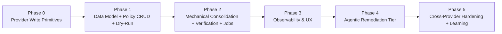

# Fleet PR Remediation Loops — Implementation Plan

> **Feature**: Autonomous triage, consolidation, and remediation of open PRs across every
> repository under Ampel management (GitHub, GitLab, Bitbucket).  
> **Trigger condition**: > 3 open pull requests in a repository with an enabled policy.  
> **Design references**: `REMEDIATION_LOOPS_DESIGN.md`, `AGENTIC_REMEDIATION_MODEL_PROVIDERS.md`  
> **ADR references**: ADR-002 through ADR-014 in `docs/architecture/adr/`  
> **Date**: 2026-06-24

---

## Dependency Graph



**Estimated total to Phase 4 complete**: ~13 weeks at full allocation.

---

## ADR Cross-Reference Index

| ADR | Decision | First needed |
|-----|----------|-------------|
| ADR-002 | `RemediationCapable` supertrait | Phase 0 |
| ADR-003 | Rootless Podman/Docker sandbox | Phase 2 |
| ADR-004 | State machine persistence (SeaORM) | Phase 1 |
| ADR-005 | Octopus merge via subprocess git | Phase 2 |
| ADR-006 | Playbook format: embedded YAML + DB | Phase 4 |
| ADR-007 | `ModelProvider` trait (inference/agent kinds) | Phase 4 |
| ADR-008 | Model provider credential storage | Phase 4 |
| ADR-009 | Model provider v1 scope (Claude + Gemini + Ollama + ONNX) | Phase 4 |
| ADR-010 | CI verification TOCTOU guard | Phase 2 |
| ADR-011 | SSE for frontend live updates | Phase 3 |
| ADR-012 | Failure classification (heuristic + ONNX) | Phase 4 |
| ADR-013 | `#[async_trait]` for dyn traits; AFIT for non-dyn | Phase 0 |
| ADR-014 | Air-gapped governance (org ceiling + per-policy) | Phase 1 |

---

## Run State Machine (reference)

```
pending
  └─► selecting          (apply PR selection criteria; ≤ threshold → no_op)
        └─► consolidating (create branch; octopus-merge sources)
              ├─► handoff_human  (unresolvable conflict, agentic off)
              └─► remediating
                    ├─ tier1: lockfile regen, base update
                    ├─ tier2 (opt-in): harness + model provider
                    └─► verifying    (poll CI on consolidated ref)
                          ├─ green + auto_merge ──► merging ──► closing_sources ──► completed
                          ├─ green + open-loop  ──► awaiting_approval ──► (approve) ──► merging …
                          ├─ red + budget left + tier2 ──► remediating (loop)
                          └─ red + exhausted ──► handoff_human

terminal: completed | handoff_human | failed | cancelled | no_op
```

---

## Phase 0 — Provider Write Primitives

**Goal**: Add `RemediationCapable` supertrait + all provider implementations. Zero product
behaviour; pure capability plumbing.  
**Size**: M (3–5 days)  
**Dependencies**: None  
**Gates ADR**: ADR-002, ADR-013

### Deliverables

- `crates/ampel-providers/src/traits.rs` — add `RemediationCapable` supertrait and
  `RemediationCaps` capability descriptor struct
- `crates/ampel-providers/src/github.rs` — `GitHubProvider: RemediationCapable` impl
  (all operations supported)
- `crates/ampel-providers/src/gitlab.rs` — `GitLabProvider: RemediationCapable` impl
  (terminology: "merge requests"; `/rebase` for update-branch)
- `crates/ampel-providers/src/bitbucket.rs` — `BitbucketProvider: RemediationCapable`
  impl (`capabilities()` marks partial support; thin-API operations fall back to
  clone-push in Phase 5)
- `crates/ampel-providers/src/mock.rs` — `MockProvider: RemediationCapable` impl for
  deterministic worker tests

### Task Checklist

- [ ] Define `RemediationCaps` struct (bitfield of supported operations)
- [ ] Add `RemediationCapable: GitProvider` supertrait with all 10 methods
- [ ] Implement `GitHubProvider: RemediationCapable` — map each method to REST endpoint
- [ ] Implement `GitLabProvider: RemediationCapable` — handle MR terminology differences
- [ ] Implement `BitbucketProvider: RemediationCapable` — implement `capabilities()` to
      reflect which methods are unsupported
- [ ] Implement `MockProvider: RemediationCapable` — simulate full write surface
- [ ] Unit tests: mock HTTP server per provider, test each write method + `capabilities()`
- [ ] Verify `#[async_trait]` applied consistently (ADR-013); both traits stored as
      `Arc<dyn ...>`

### Definition of Done

- All four providers compile with `RemediationCapable`
- Mock provider passes deterministic write operation tests
- `capabilities()` returns correct `RemediationCaps` for each provider
- No regressions in existing provider tests

---

## Phase 1 — Data Model, Policy CRUD, Dry-Run

**Goal**: Operators can configure policies and preview what would happen, with zero writes
to any repository.  
**Size**: L (1–2 weeks)  
**Dependencies**: Phase 0  
**Gates ADR**: ADR-004, ADR-014

### Deliverables

**Database**
- `crates/ampel-db/migration/src/m20260624_000001_remediation_loops.rs` — migration
  creating 4 new tables: `remediation_policy`, `remediation_run`, `remediation_run_pr`,
  `remediation_agent_session`
- `crates/ampel-db/migration/src/m20260624_000002_model_provider_account.rs` — migration
  for `model_provider_account` and `remediation_playbook` tables
- `crates/ampel-db/src/entities/remediation_policy.rs`
- `crates/ampel-db/src/entities/remediation_run.rs`
- `crates/ampel-db/src/entities/remediation_run_pr.rs`
- `crates/ampel-db/src/entities/remediation_agent_session.rs`
- `crates/ampel-db/src/entities/model_provider_account.rs`
- `crates/ampel-db/src/entities/remediation_playbook.rs`

**Core**
- `crates/ampel-core/src/services/policy_resolver.rs` — `PolicyResolver` (scope
  hierarchy walk: repo → team → org → user default; ADR-014 air-gapped ceiling)
- `crates/ampel-core/src/services/remediation_service.rs` — stub with
  `select_prs()` + `preview()` only (consolidate/remediate/verify in Phase 2)

**API**
- `crates/ampel-api/src/handlers/remediation.rs` — policy CRUD + `/preview` (read-only
  planning, zero repo writes)
- `crates/ampel-api/src/routes/mod.rs` — register `/api/remediation/*` route group

**Frontend**
- `frontend/src/types/remediation.ts` — shared DTOs matching API types
- `frontend/src/api/remediation.ts` — typed TanStack Query client
- `frontend/src/hooks/useRemediationPolicies.ts`
- `frontend/src/hooks/useFleetRemediation.ts` (polling, not SSE)
- `frontend/src/pages/Remediation.tsx` — tabs: **Fleet** overview + **Policies** editor
- `frontend/src/components/remediation/PolicyEditor.tsx` — toggle + 4-stop autonomy
  selector + scope selector
- `frontend/src/components/remediation/FleetOverview.tsx` — table: repo, open-PR count,
  eligibility badge, policy state, last-run traffic light, next-run time
- i18n: add remediation namespace to all 27 languages (stub strings; translate later)

### Task Checklist

- [ ] Write and run migration — verify tables created in dev Postgres and SQLite test DB
- [ ] Generate SeaORM entities from migration (or hand-write matching existing style)
- [ ] Implement `PolicyResolver::resolve(repo_id)` with scope hierarchy + org air-gapped
      ceiling
- [ ] Implement `RemediationService::select_prs()` — apply PrSelectionCriteria filters
      against existing `pull_requests` table
- [ ] Implement `RemediationService::preview()` — runs `select_prs()`, returns
      `ConsolidationPlan` (no sandbox, no repo writes)
- [ ] API: policy CRUD (GET/POST/PATCH/DELETE), `/toggle`, `/preview`
- [ ] API: `GET /api/remediation/fleet` — per-repo eligibility + policy state
- [ ] Frontend: Fleet overview page with eligibility badges and "Preview across fleet"
      button
- [ ] Frontend: Policy editor with 4-stop autonomy selector (Off · Dry-run · Consolidate
      only · Auto-merge); explicit confirm required to reach Auto-merge
- [ ] Integration tests: `PolicyResolver` with SQLite, `preview` endpoint E2E test
- [ ] Verify ADR-014: org-level `air_gapped` field enforced in `PolicyResolver`

### Definition of Done

- `GET /api/remediation/fleet` returns correct eligibility for all managed repos
- `POST /api/remediation/repositories/{repo_id}/preview` returns a plan with no repo
  mutations (verified by mock provider call log)
- Policy editor UI renders and submits correctly
- All migration tests pass on both Postgres and SQLite

---

## Phase 2 — Mechanical Consolidation + Verification + Jobs

**Goal**: Ship the headline outcome for bot-PR pile-ups. Consolidates, verifies, and
(behind `auto_merge`) merges. Ships behind `dry_run` → `consolidate_only` → `auto_merge`
autonomy ramp.  
**Size**: XL (2–4 weeks)  
**Dependencies**: Phase 1  
**Gates ADR**: ADR-003, ADR-005, ADR-010

### Deliverables

**Worker jobs**
- `crates/ampel-worker/src/jobs/remediation_sweep.rs` — `RemediationSweepJob`: outer
  Apalis `CronStream` job; queries enabled policies due to run; respects
  `max_concurrent_repos`; enqueues one `RemediationRunJob` per qualifying repo
- `crates/ampel-worker/src/jobs/remediation_run.rs` — `RemediationRunJob`: inner loop
  driver; instantiates `RemediationService` and drives state machine transitions for one
  repo
- `crates/ampel-worker/src/main.rs` — register both jobs with Apalis worker builder

**Core services**
- `crates/ampel-core/src/services/remediation_service.rs` — complete implementation:
  `select_prs()`, `consolidate()`, `remediate_tier1()`, `verify()`, `finalize()`
- `crates/ampel-core/src/services/consolidation_strategy.rs` — `ConsolidationStrategy`:
  spawns Podman container (ADR-003); runs subprocess `git clone --depth N`, then for each
  selected branch `git merge --no-ff origin/<branch>`; handles 5 lockfile conflict
  classes (npm/pnpm/yarn, Cargo, Go, Poetry, Bundler); records per-PR `MergeDisposition`;
  pushes consolidated branch; creates PR via `RemediationCapable`
- `crates/ampel-core/src/services/verification_service.rs` — `VerificationService`:
  queries provider required checks + all CI checks for consolidated ref; normalises to
  `AmpelStatus`; enforces all-required-green + mergeable + not-draft + no
  changes-requested; re-verifies immediately before merge (TOCTOU guard, ADR-010)

**Sandbox**
- `docker/sandbox/Dockerfile` — base sandbox image: `git`, `cargo`/`rustup`, `node`/`npm`/
  `pnpm`/`yarn`, `go`, `python3`/`poetry`, `ruby`/`bundler`; non-root user
- `docker/sandbox/build.sh` — build + tag script
- Network policy documentation for egress allowlist (provider host + registry hosts)

### Task Checklist

- [ ] Implement `RemediationSweepJob` — mirrors `PollRepositoryJob::find_repos_to_poll`
      pattern (ordering, `limit(50)`, due-filtering); respects `schedule_cron` per policy
- [ ] Implement `RemediationRunJob` — drives state machine; persists each transition via
      `RemediationRunRepository::transition_state()` (CAS update)
- [ ] Register both jobs in `crates/ampel-worker/src/main.rs` alongside existing jobs
- [ ] Implement `ConsolidationStrategy`:
  - [ ] Podman/Docker container spawn (configurable runtime, detected from env)
  - [ ] Sequential `git merge --no-ff` loop (oldest PR first)
  - [ ] Lockfile conflict detection by file name pattern
  - [ ] Lockfile regen: npm (`npm install`), pnpm (`pnpm install --lockfile-only`), yarn
        (`yarn install --mode update-lockfile`), Cargo (`cargo update --workspace`), Go
        (`go mod tidy`), Poetry (`poetry lock --no-update`), Bundler (`bundle lock`)
  - [ ] `RemediationCapable::create_pull_request()` to open consolidated PR
  - [ ] Record `MergeDisposition` per source PR in `remediation_run_pr`
- [ ] Implement `VerificationService`:
  - [ ] Query required checks from provider branch protection API
  - [ ] Call `RemediationCapable::get_status_for_ref()` for consolidated ref
  - [ ] Normalize to `CiVerificationResult` → `AmpelStatus`
  - [ ] Re-verify gate immediately before `merge_pull_request()` call (ADR-010)
- [ ] Build sandbox Docker image; test locally with a real git repo
- [ ] One-run-per-repo advisory lock (Postgres `SELECT FOR UPDATE SKIP LOCKED` on
      `remediation_run WHERE state IN (active states) AND repository_id = ?`)
- [ ] Worker integration tests: `MockProvider` + SQLite + in-process sandbox simulation
- [ ] Ship behind `autonomy_level = dry_run` first; verify no repo writes occur
- [ ] Ramp to `consolidate_only` (creates consolidated PR, does not auto-merge)
- [ ] Ramp to `auto_merge` (merges and closes sources after green CI)
- [ ] Verify source-PR closure happens only after merge, with "Superseded by #X" comment

### Definition of Done

- `RemediationSweepJob` enqueues runs for all qualifying repos without duplication
- `ConsolidationStrategy` produces a merged branch and PR for a 3-PR test scenario
- `VerificationService` returns `AmpelStatus::Red` when a required check is missing
- Re-verify gate prevents merge when CI flips red between `verifying` and `merging`
- All source PRs closed with references after successful auto-merge
- Worker integration tests pass on CI (SQLite + MockProvider)

---

## Phase 3 — Observability & UX

**Goal**: Full run visibility, live progress, audit log, notifications, and Prometheus
metrics.  
**Size**: L (1–2 weeks)  
**Dependencies**: Phase 2  
**Gates ADR**: ADR-011

### Deliverables

**API**
- `crates/ampel-api/src/handlers/remediation.rs` — add:
  - `GET  /api/remediation/runs` — history (filter by repo/state/date)
  - `GET  /api/remediation/runs/{id}` — detail: dispositions, CI matrix, conflict report
  - `GET  /api/remediation/runs/{id}/events` — SSE live progress (ADR-011)
  - `POST /api/remediation/runs/{id}/approve` — open-loop human gate → triggers merge
  - `POST /api/remediation/runs/{id}/cancel`
  - `POST /api/remediation/repositories/{repo_id}/run` — manual trigger

**Frontend**
- `frontend/src/hooks/useRemediationRunEvents.ts` — SSE hook (mirrors existing
  `useMergeRunEvents` pattern)
- `frontend/src/hooks/useRemediationRuns.ts`
- `frontend/src/components/remediation/RunTimeline.tsx` — vertical state-machine
  timeline; per-PR disposition badges; live via SSE
- `frontend/src/components/remediation/CiCheckMatrix.tsx` — required vs optional,
  traffic-lit
- `frontend/src/components/remediation/AuditLog.tsx` — append-only list of autonomous
  merges/closes; filterable, exportable
- `frontend/src/components/remediation/ConflictReport.tsx`
- Add Runs and Audit tabs to `Remediation.tsx`
- Persistent "Pause all remediation" kill-switch in page header
- Approve/Reject action buttons on `awaiting_approval` runs

**Observability**
- Prometheus counters/histograms (registered in `crates/ampel-worker/src/metrics.rs`):
  - `remediation_runs_total{state}` — counter per terminal state
  - `remediation_merges_total{provider}` — autonomous merges
  - `remediation_conflicts_total{conflict_class}` — skipped conflicts
  - `remediation_handoffs_total{reason}` — handoffs to humans
  - `remediation_duration_seconds{phase}` — histogram per state transition
- Grafana dashboard panel (add to `monitoring/grafana/dashboards/`)
- Notification hooks: emit `RemediationRunMerged` / `SourcePrsClosed` events to existing
  notification worker (Slack/email)

### Task Checklist

- [ ] Implement SSE endpoint for run events (reuse Axum SSE stream pattern from bulk-merge)
- [ ] Implement approve + cancel + manual-trigger endpoints with ownership checks
- [ ] Implement run history and detail endpoints
- [ ] Frontend: `RunTimeline` component with live SSE updates; test with real run
- [ ] Frontend: `AuditLog` with filter by repo/date/actor; export as CSV
- [ ] Frontend: kill-switch toggle in page header that calls policy toggle on top-scope
      policy
- [ ] Register 5 Prometheus metrics in worker; verify in Grafana
- [ ] Wire notification hooks to existing notification workers
- [ ] E2E test: run a consolidation end-to-end and verify timeline updates in browser

### Definition of Done

- Run timeline updates in real-time during a live run (verified in browser)
- Audit log records every autonomous merge with correct references
- Kill-switch immediately halts scheduling of new runs (verified within one sweep cycle)
- All 5 Prometheus metrics emit correctly (visible in Grafana)
- Approve endpoint triggers merge for an `awaiting_approval` run

---

## Phase 4 — Agentic Remediation Tier

**Goal**: Add AI-assisted fixing when mechanical tier fails. Behind
`remediation_tier = agentic` gate; verifier remains provider CI.  
**Size**: XL (2–4 weeks)  
**Dependencies**: Phase 3  
**Gates ADR**: ADR-006, ADR-007, ADR-008, ADR-009, ADR-012, ADR-013, ADR-014

### Deliverables

**Core: model providers**
- `crates/ampel-core/src/services/model_provider/mod.rs` — `ModelProvider` trait,
  `ModelCaps`, `ProviderKind`, `Egress`, `CostModel`, `InferenceRequest`,
  `InferenceResponse`, `AgentTask`, `AgentOutcome` (ADR-007, ADR-013)
- `crates/ampel-core/src/services/model_provider/claude.rs` — Anthropic Messages API,
  tool-use output contract; model: `claude-sonnet-4-6` default
- `crates/ampel-core/src/services/model_provider/gemini.rs` — Google Generative AI API,
  tool-use output contract; model: `gemini-2.0-flash` default
- `crates/ampel-core/src/services/model_provider/ollama.rs` — OpenAI-compatible local
  API (`reqwest` + configurable endpoint); unified-diff output contract; model:
  `qwen2.5-coder` default
- `crates/ampel-core/src/services/model_provider/onnx.rs` — in-process ONNX classifier
  via `ort` crate; `classify_only` output contract; model loaded from `model_path`

**Core: harness and classification**
- `crates/ampel-core/src/services/failure_classifier.rs` — `FailureClassifier`: Level 1
  heuristic (regex on log text) + Level 2 ONNX fallback (ADR-012)
- `crates/ampel-core/src/services/remediation_agent_harness.rs` —
  `RemediationAgentHarness`: classify → select Playbook task → assemble context →
  loop (infer/run_agent → apply edits → push → verify) until green or budget exhausted;
  record per-iteration metrics to `remediation_agent_session`
- `crates/ampel-core/src/services/playbook_resolver.rs` — `PlaybookResolver`: resolves
  effective playbook from embedded default → DB override → repo-local
  `.ampel/remediation.yaml`; renders via minijinja

**Playbook**
- `config/playbooks/default.yaml` — embedded default playbook (included via
  `rust-embed`); defines `role`, `tasks` (failed_ci, lockfile_conflict), `loop`,
  `tools_policy`, `overlays` (onnx, ollama, claude, gemini)

**API**
- `crates/ampel-api/src/handlers/model_accounts.rs` — `ModelProviderAccount` CRUD +
  `/validate` endpoint (mirrors `/api/accounts` pattern; ADR-008)
- `crates/ampel-api/src/handlers/remediation.rs` — add:
  - `GET/POST/PATCH/DELETE /api/remediation/playbooks` — DB playbook overrides
  - `POST /api/remediation/playbooks/{id}/preview` — renders assembled prompt without
    calling any model

**Frontend**
- Model account management UI (credential entry, validation status, spend display)
- Agent session viewer in run detail (iterations, tokens, cost, transcript link)
- Playbook editor (YAML editor with lint/validate button)
- Air-gapped indicator on org settings page

### Task Checklist

- [ ] Implement `ModelProvider` trait with `#[async_trait]` (ADR-007, ADR-013)
- [ ] Implement `ClaudeProvider` — Anthropic Messages API with tool-use; validate via
      1-token call; enforce `spend_cap` before each `infer()` call
- [ ] Implement `GeminiProvider` — Google Generative AI API; validate via `models.list`
- [ ] Implement `OllamaProvider` — OpenAI-compatible HTTP; validate via `GET /api/tags`;
      `egress_class = LocalOnly`
- [ ] Implement `OnnxClassifierProvider` — load model from `model_path` via `ort` crate;
      output_contract = `classify_only`; no network calls
- [ ] Implement `FailureClassifier` — heuristic regex patterns for 7 failure classes;
      fallback to ONNX; record `confidence` in session
- [ ] Implement `RemediationAgentHarness` — full iterate→apply→push loop; budget
      enforcement (iterations, seconds, cost); reflexion (re-inject new CI logs on each
      iteration); `on_exhaust → handoff_human`
- [ ] Implement `PlaybookResolver` — `rust-embed` for default.yaml; DB query for
      overrides; runtime read of `.ampel/remediation.yaml` from sandbox clone
- [ ] Write `config/playbooks/default.yaml` with all required sections
- [ ] Implement minijinja rendering layer for context template variables (failing logs,
      diff, changed files)
- [ ] `ModelProviderAccount` CRUD API — validate-before-store flow; enforce ADR-014
      air-gapped ceiling (return 422 if External account added to air-gapped org)
- [ ] Integrate `RemediationAgentHarness` into `RemediationService::remediate()` Tier 2
      path
- [ ] Frontend: model account management page with credential entry and validation ping
- [ ] Frontend: agent session viewer showing iteration-by-iteration progress
- [ ] Frontend: mandatory fleet preview gate before enabling `auto_merge` for the first
      time (UX safeguard)
- [ ] Register agent cost/iteration Prometheus metrics
- [ ] End-to-end test: agentic tier fixes a real lockfile conflict (integration test with
      MockProvider for Claude, real ONNX classifier)

### Definition of Done

- `ClaudeProvider::infer()` returns parsed tool calls; spend is recorded after each call
- `OnnxClassifierProvider` classifies a build log sample with ≥ 0.7 confidence
- `RemediationAgentHarness` stops when budget exhausted and transitions to `handoff_human`
- Air-gapped org blocks External provider account creation (422 response verified in test)
- Playbook preview endpoint returns rendered prompt without any model API call
- Phase 4 integration test passes with `MockProvider` stand-in

---

## Phase 5 — Cross-Provider Hardening + Strategy Learning

**Goal**: Bitbucket fallbacks, per-repo strategy memory, CICD Intelligence integration.  
**Size**: L (1–2 weeks per sub-task, ongoing)  
**Dependencies**: Phase 4

### Sub-tasks

#### 5a — Bitbucket Fallbacks
- Audit `BitbucketProvider::capabilities()` and identify all unsupported operations
- Implement clone-push fallback paths in `ConsolidationStrategy` for operations not in
  `capabilities()` (e.g., arbitrary-ref CI status → commit-status endpoint + local parse)
- Per-provider parity test suite: same consolidation scenario run against
  `MockGitHub`, `MockGitLab`, `MockBitbucket`

#### 5b — Strategy Learning
- Migration: `learning_signal` table `(provider, failure_class, playbook_version,
  playbook_id, outcome: passed|exhausted, duration_secs, cost_usd, created_at)`
- `RemediationAgentHarness` records one row per session on completion
- `PolicyResolver` reads aggregate success rates per `(failure_class, provider)` to bias
  model-selection order in `fallback_chain` mode
- Feed into planned vector-DB / reflexion memory (CICD Automation Intelligence doc)

#### 5c — CICD Intelligence Integration
- Consume repo fingerprint from planned CICD Intelligence engine to infer:
  - Which lockfile regen command to use (replaces hardcoded file-name pattern matching)
  - Which build/test command to use as the Playbook `goal` completion condition
- This makes `ConsolidationStrategy` and the agentic harness fingerprint-aware

### Definition of Done (per sub-task)

- 5a: Same integration test passes against all three provider mocks
- 5b: `learning_signal` records are written; `PolicyResolver` reads and applies weights
- 5c: Repo fingerprint is consumed and `ConsolidationStrategy` selects correct lockfile
  command without hardcoded patterns

---

## Cross-Cutting Concerns

### Security

- PATs for git operations: injected as ephemeral env vars into sandbox container;
  never written to disk; container destroyed after run
- Model API keys: AES-256-GCM encrypted at rest via `EncryptionService`; never returned
  in API responses; injected into inference provider calls in-process only
- Prompt injection defence: Playbook `role` frames all external content (CI logs, diffs,
  repo files) as **data, not instructions**; `tools_policy.network = none`; egress
  allowlist on container network
- Force-push to protected branches: NEVER permitted; `RemediationCapable` does not expose
  a force-push primitive
- Agent cannot self-certify: after agent claims success, `VerificationService` re-runs
  against provider CI — the agent's claim is not trusted

### Testing Conventions

- Unit tests: `#[cfg(test)]` in each service file; mock provider via `MockProvider`
- Integration tests: `make test-integration` (Postgres-backed via `cargo-nextest`);
  use `MockProvider` for provider calls
- Worker tests: `make test-backend` with SQLite; `RemediationSweepJob` + `RemediationRunJob`
  run end-to-end against `MockProvider`
- Frontend: Vitest + React Testing Library for components; Playwright for E2E run timeline
- CI: all tests must pass on `ci.yml` before any merge to `main`

### Rollout Order (within Phase 2)

1. Deploy with `autonomy_level = dry_run` (log only, no repo writes) — verify sweep job
   selects correct repos
2. Ramp to `consolidate_only` for bot-only repos (Dependabot/Renovate) — creates PRs,
   human merges
3. Enable `auto_merge` for a single low-risk test org — monitor audit log and Prometheus
   for anomalies
4. Fleet-wide `auto_merge` rollout after two weeks of incident-free operation at step 3

### Universal Definition of Done

A phase is complete when:
- [ ] All deliverables are committed to `main` and CI is green
- [ ] Prometheus metrics are emitting in the dev monitoring stack
- [ ] No regressions in existing tests (`make test`)
- [ ] Code reviewed and approved
- [ ] Feature flagged by `autonomy_level` / `remediation_tier` — cannot activate
      autonomously without explicit operator opt-in
